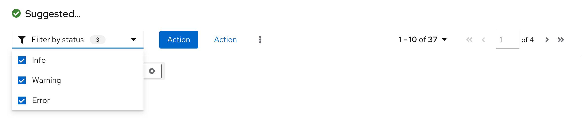

**Select lists** enable users to select one or more items from a list. Select lists should also be used when options are dynamic or variable. 

## Usage

PatternFly offers several variations of select lists:
* [Single select](#single-select)
* [Checkbox select](#checkbox-select)
* [Multiple select](#multiple-select)
* [Typeahead](#typeahead)

#### Single select 
Single select lists allow users to select a single, mutually exclusive option. When the user selects an option from the list, the selection appears in the toggle.

#### Checkbox select
Checkbox select lists allow users to select one or more options from a known list of options, using checkboxes as a selection method. You may choose to have a badge display in the toggle to show how many items have been selected. A common use case for checkbox select lists is in a toolbar filter for a table or page, for example. 

#### Multiple select 
Multiple select lists allow users to select one or more options from a list, with the selected options marked with a blue check. It differs from the checkbox select in that each option selected by the user appears in the top display area as chips. Once the number of selections reaches a certain number (the default is 3, but you may choose to change this based on your use case), the regular chips will be replaced by a gray chip indicating how many more items were selected (for example, 1 more). 

### When to use checkbox select versus multiple select 
Both the checkbox select and multiple select lists allow users to select multiple options from a list. However, there are some points to take into consideration when deciding which one to use.

**Use checkbox select when:**
* Horizontal space is limited.
* It is not crucial for the user to see their selections in the toggle itself.
* Using a select list inside a toolbar. Toolbars have limited space, and the user will already be able to see their selection as chips below the filter itself.  

**Use multiple select when:**
* Horizontal space is not limited.
* It is useful for the user to see their selections from the toggle itself.
* In a form, where a user may benefit from being able to quickly scan their inputs before submitting.

### Typeahead
Typeahead allows users to narrow a displayed list of options by typing into the input field. Type ahead is  recommended for lists with more than ten options and is available for single and multiple select lists. Although the typeahead within toggle functionality does not exist for the checkbox select, there is an option to add a typeahead capability within the menu of items if needed, as seen in this [grouped checkbox input with filtering](/components/select/react#grouped-checkbox-input-with-filtering) example.

When providing fewer than 5 options, you can use [radio buttons](/components/radio/react) or [checkboxes](/components/checkbox/react) to display all options to the user simultaneously if you don’t have any space constraints.

