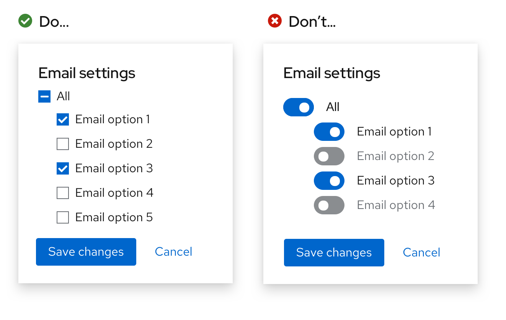

A **switch** toggles the state of a setting (between on and off). Switches and [checkboxes](/components/checkbox) can often be used interchangeably, but the switch provides a more explicit, visible representation on a setting.

## Usage

It is assumed that when a user toggles a switch, the change will save automatically without the need for additional action (like clicking a "Save" button).

1. **Form label:** Indicates what the switch turns on or off
2. **Switch label:** Indicates whether the switch itself is turned on or off
3. **Switch without label:** Indicates the state of a switch with a checkmark inside the switch itself, used in place of a switch label
4. **Switch with label and checkmark:** Indicates the state of a switch with a checkmark inside the switch itself and label with additional message 

All switch types display their state (on or off) through different methods and locations. A basic switch communicates its state with an exterior switch label added to its right, while a switch without a label uses a checkmark to communicate its state from inside the switch itself.

**General guidelines**

* Use a basic switch by default unless space is limited, then use a [switch without a label](/components/switch/react#without-label).
* Add a form label in front of your switch to specify what setting a switch turns on or off, such as *Wi-fi* or *Bluetooth*.
* If you're using a basic switch, add switch labels to clarify between toggled settings, such as *On* and *Off*.
* Don't include the state of a switch in a label if you're using a switch with a label and a checkmark. 
* Don’t use a switch if the options you’re presenting to the user are anything other than “on” or “off.” Instead, use [radio buttons](/components/radio/design-guidelines). 

### When to use switches versus checkboxes

A switch changes an option and saves it simultaneously, while checkboxes require a separate action to save the selection, such as pressing a “Submit” or “Save” button.

**Follow these guidelines for when to use a switch versus a checkbox:**

* Use checkboxes when options do not save automatically and require the user to perform an additional action to save changes (in this case, pressing the “Save changes” button).

    

* Use a switch for situations where you are turning a series of one or more independent options on or off.

    

* Use checkboxes when you may have an intermediate state where you can select all, none, or some actions.

    
