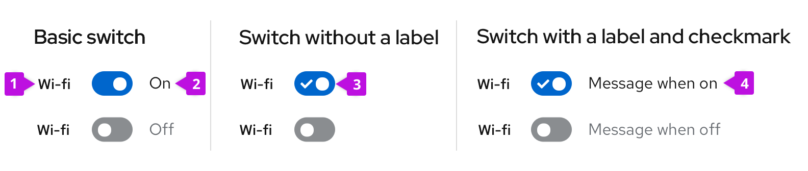

Use a **switch** to toggle the state of a setting (between on and off). Switches and [checkboxes](/components/checkbox) can often be used interchangeably, but the switch provides a more explicit, visible representation on a setting.

## Usage

It is assumed that when a user toggles a switch, the change will save automatically without the need for additional action (like clicking a “Save” button).

**General guidelines**

*  Add a label in front of your switch to specify what is being switched on or off (for example, wi-fi or bluetooth).
* Don’t use a switch if the options you’re presenting to the user are anything other than “on” or “off.” Instead, use radio buttons. 
* Depending on your use case, you may want to add labels to your switches for added clarity, like “on” and “off” to indicate to the user what setting they’ve switched to.

### When to use switches versus checkboxes

The main difference between a switch and a checkbox is that a switch changes an option and saves it simultaneously, while checkboxes require a separate action such as pressing a “Submit” or “Save” button to save the selection. 

**Here are some guidelines for when to use a switch versus a checkbox:**

* Use checkboxes when the options do not save automatically and require the user to perform an additional action to save changes (in this case, pressing the “Save changes” button).

    

* Use a switch for situations where you are turning a series of one or more independent options on or off.

    

* Use checkboxes when you may have an intermediate state where you can select all, none, or some actions.

    