The **Toolbar** component provides a flexible system for creating responsive toolbars that manage the data displayed in a list, table, or any other data view. Toolbar configurations can be customized to support a variety of use cases.

Toolbars can be included to allow a user to manage and manipulate a data set. Data can be presented in any valid presentation, a table, a list, or a data visualization (chart), for example. The PatternFly Toolbar component is a flexible layout system that accommodates a variety of configurations that can be adapted to your specific needs.

## Elements

The toolbar is a container for holding a variety of elements (toolbar items and groups) that are used to manipulate a set of data. All items should be centered vertically within the toolbar.

Toolbar items are individual components that can be placed inside of a toolbar. Often, it makes sense to group sets of like items to create desired associations and to enable items to respond together to changes in viewport width. The default spacing between items and groups is 16px, but this can be modified, if required. The following are some toolbar items and groups that come with special spacing considerations.

#### Bulk selector
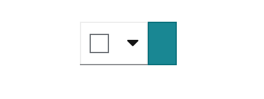

 A Bulk selector can be added when you want to give users the ability to select multiple items within a page. Besides allowing the user to select and deselect all items on a page, other application specific options can be added in the dropdown. Bulk selection allows the user to select or deselect all items on a page and provide an indeterminate state that notifies the user when only some items are selected. Bulk selectors should always be the left-most element in a toolbar and has a 24px spacer to its right.

 #### Filter group
 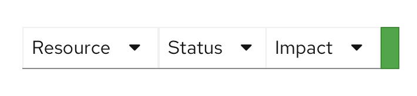

  A filter group combines multiple select filters into a single group. See [Filters](/design-guidelines/usage-and-behavior/filters) for more information about using filters.

#### Search filter
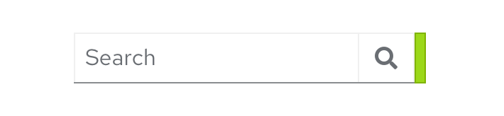

A search filter is intended to be used with a filter group as shown below when you want to include a single search field together with one or more select filters. It includes an 8px spacer to the right of the item to enforce association with other filters. See the [Filters](design-guidelines/usage-and-behavior/filters) documentation for more information about using filters.

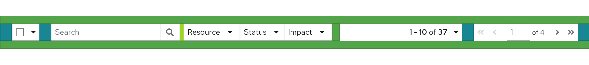

#### Icon button group

 Actions or settings that are represented by icons can be added in an Icon button group.

#### Button group
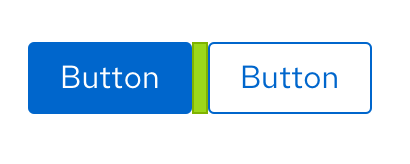

 Any global actions that apply to selected data items are included left-aligned following filter and icon buttons. No more than two items should be exposed as buttons. If you have more than two items, use an [overflow menu](#overflow-menu) component to save space.

 #### Overflow menu
 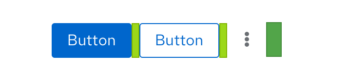

 An overflow menu is a component that can be used in a toolbar (or elsewhere) to group a number of actions that should be collapsed into a kebab at a certain breakpoint. In the toolbar, the overflow menu will commonly be used to group a set of actions that are intended to collapse into the kebab at smaller viewport sizes.

#### Pagination
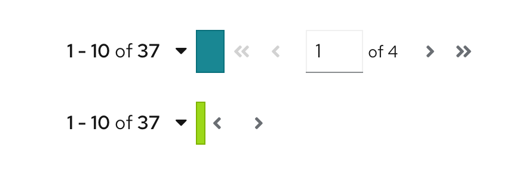

 When pagination is supported, a Pagination component will be included. Pagination will always be right aligned in the toolbar. If pagination is not used, substitute the item count for pagination control. For example, report “17 items” to represent the total number of items or “10 of 17 items” to indicate that 10 items were returned as the result of a filter event.

### Toggle groups
A toggle group can be used when you want to collapse a set of items into an overlay panel at a certain breakpoint. This allows complex toolbars with multiple items and groups of items to be responsive. A toggle group is useful for containing filter controls, for example. When the toolbar responds to adapt to a mobile viewport, the contents contained in a toggle group will collapse into an overlay panel that can be toggled by clicking the Filter icon.

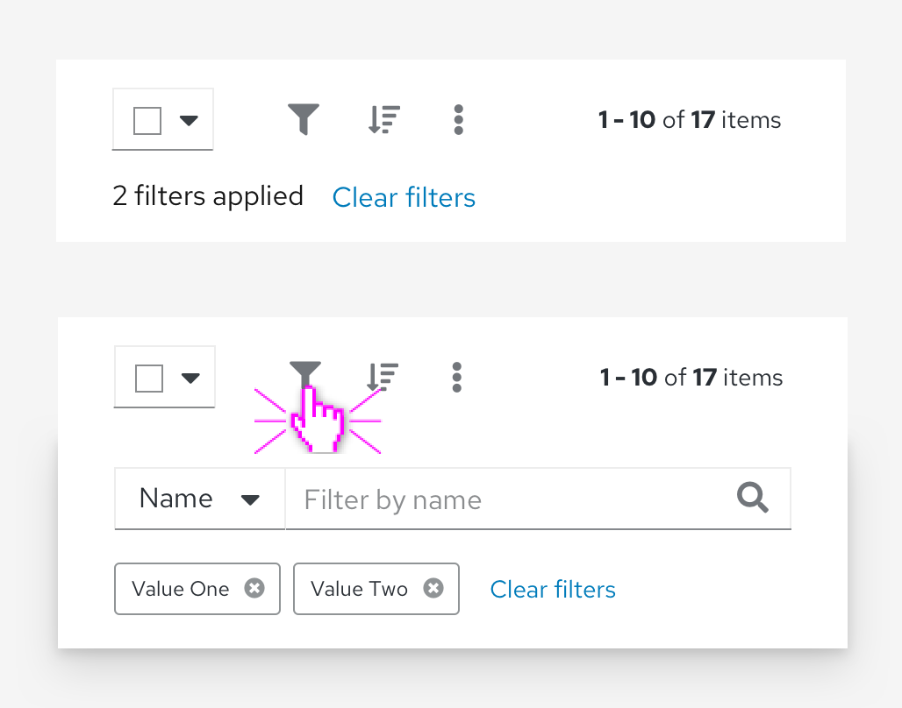

### Vertical dividers
When you have a large toolbar containing many groups of items, use a vertical divider to further separate the groups visually.

## Usage
The PatternFly toolbar is designed to be very flexible and allow a variety of combinations of items and groups as outlined above. The following are some guidelines that should be followed in laying out your toolbar.

* When used, bulk selection should be the left-most element.
* Filters and global actions may follow.
* When pagination is used, it should be the right-most element.
* When pagination is not used, the item count should be the right-most element.

### Examples
**Basic toolbar**
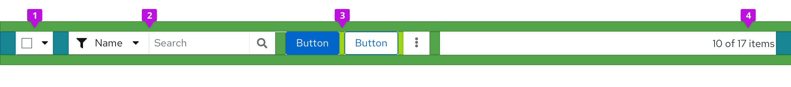

The basic toolbar is sufficient for most cases. The example above shows the toolbar with default spacing. It includes the following elements:
1. **Bulk selector:** The bulk selector supports selection of multiple items in a list, table, or card grid. It is always the leftmost item.
2. **Filter:** The example shows an attribute-value filter, but any supported filter can be used here. See [Filters](/design-guidelines/usage-and-behavior/filters) usage guidelines for more information.
3. **Overflow menu:** In this example an overflow menu is used to hold global actions. But a simple button group could also be used here if you have two or less actions.
4. **Item count**: When a filter is applied, the item count will be updated to represent the filtered subset of items. For example, “10 of 17 items.” The item count should be the right-most element.

**Toolbar with pagination**
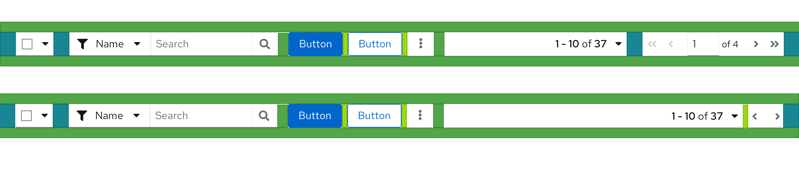

When pagination is used, the pagination component replaces the item count. It should be the right-most element. Here, the toolbar is shown with both full and compact pagination options. Compact pagination consumes less horizontal space and is the recommended choice unless your application requires more precise control over paging options (like the ability to navigate to a specific page).

**Toolbar with an icon group**
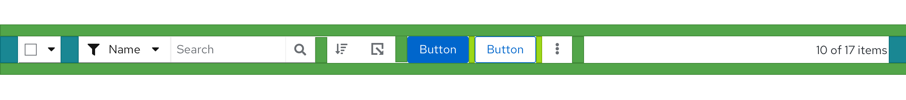

To save space, you may represent some actions as icons. Use an icon group to provide the proper spacing between icons. Here, sort and export actions are represented as icons. The icon group should always be placed after the filters and before any global actions represented by buttons, if they exist.

**Custom toolbar**
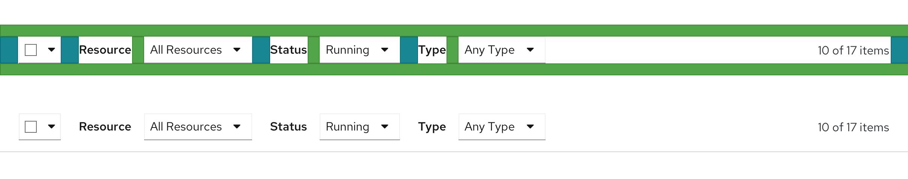

The Toolbar component is extremely flexible and you can create custom toolbar layouts by working with items, groups, and spacers. Here, a custom toolbar with three labeled filters is created by paring a text label and a Select component. Items are spaced by 16px by default but here the spacing to the right of each Select filter has been modified to 24px to help better group each filter with its related label.

### Placement in a page

The toolbar should live as close to possible to the content it controls. For a card view, the toolbar should be placed inside of the page header, above the card grid. This arrangement is also recommended if the user may switch between views (e.g. view as cards or as a list).

For simple list and table views that are placed inside of an enclosing card, the toolbar should always appear above the data set to which it applies. Toolbars should stretch to the width of the data view to which it applies, with the elements aligned in a horizontal row.

Note that there should be no spacers on the left and right edges of the toolbar as the toolbar provides its own padding.

## The toolbar on mobile

The toolbar adapts to smaller viewport sizes by collapsing or hiding elements that take significant space, including filters and actions. On mobile devices, when used, pagination will be available from the footer, only. When designing toolbars to be responsive:

* Place filter controls in a [Toggle group](#toggle-groups) so they will be hidden in a collapsible panel at mobile breakpoints.
* Use an [Overflow menu](#overflow-menu) to collapse actions into a kabob menu.

The following is an example of a complex toolbar optimized for mobile.

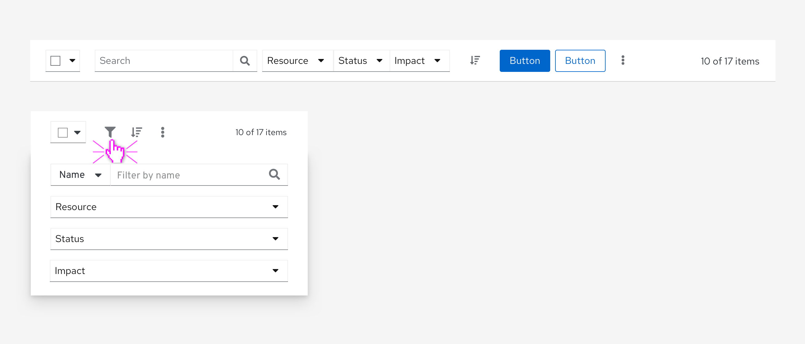

Here, the search filter and filter group containing three drop-down filters are placed in a toggle group that collapsed when the screen shrinks to mobile size. The two action buttons are part of an overflow menu that collapses to a single kabob menu. The bulk selector and sort icon button are implemented as toolbar items that remain visible at all breakpoints.

## Related components and demos
**Core HTML/CSS**
* [Toolbar](/documentation/core/components/toolbar)
* [Overflow menu](/documentation/core/components/overflowmenu)
* [Pagination](/documentation/core/components/pagination)

**React**
* [Toolbar](/documentation/react/components/toolbar)
* [Overflow menu](/documentation/react/components/overflowmenu)
* [Pagination](/documentation/react/components/pagination)
