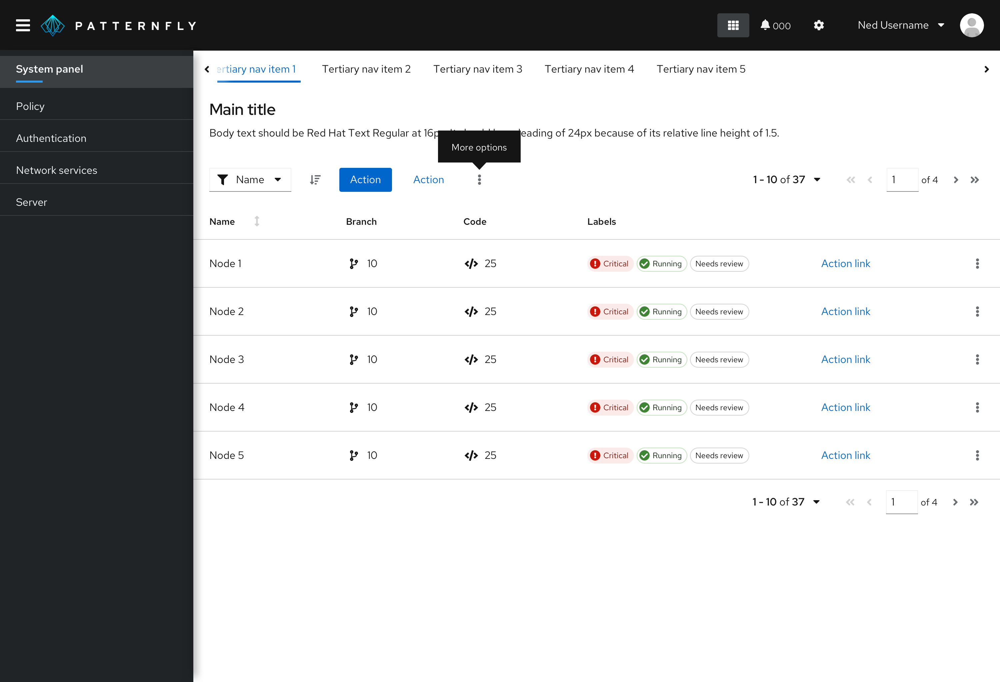
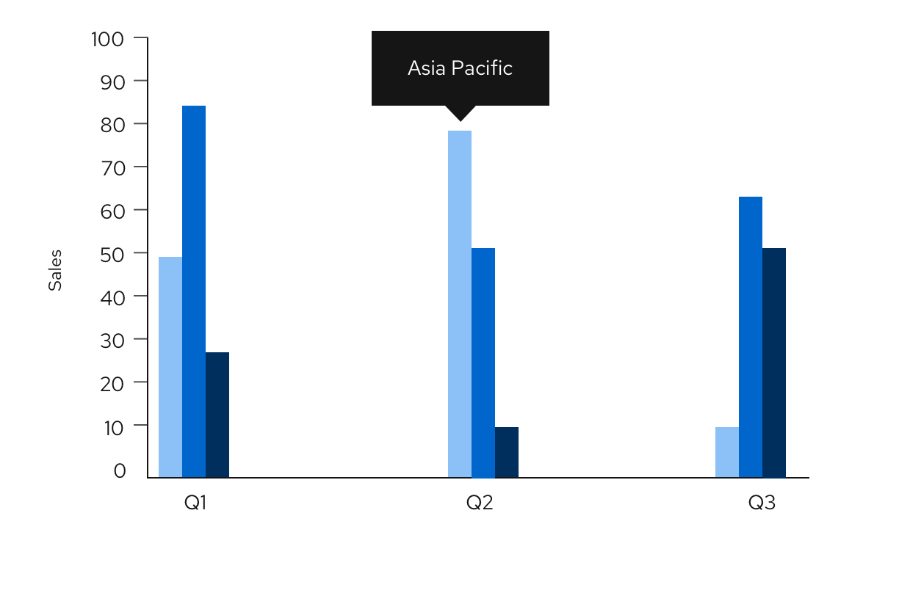
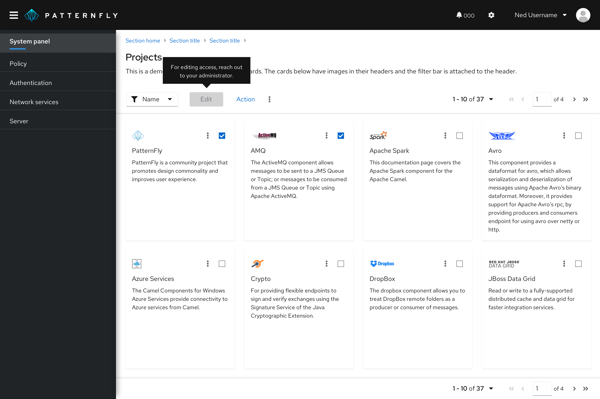

A **tooltip** is in-app messaging used to identify elements on a page with short, clarifying text.

For information on other forms of on-screen help, see [Popover](/components/popover/design-guidelines) and [Hint](/components/hint/design-guidelines). 

## Usage 
Use tooltips to:
- Provide labels for unlabeled icons.   

  

- Provide additional information on a data point or element in a chart or table.   

 

- Define new or unfamiliar UI elements that aren’t described directly in the user interface. For example, you can use a tooltip on a disabled button.

## Tooltip delay on hover
By default, tooltips have a 300ms entry delay when hovering over an object. Although this is the recommended delay time, you may customize it via prop. For example, if you have a tooltip on an icon, and you would like for it to appear immediately on hover, you may set the delay to 0 ms.

## Tooltips versus popovers
Both tooltips and [popovers](/components/popover/design-guidelines) provide more information in context for users. However, they’re different in a few ways:

- Tooltips are used for identification purposes, while popovers are used for added description or information in context. 
- Tooltips contain short descriptions or labels, while popovers contain longer descriptions, formatted text, and optional images or links.
- Tooltips appear on hover, while popovers appear on click.   

## Content
- Keep your tooltips clear and concise. Use the fewest number of words without sacrificing meaning.
- If the tooltip is a full sentence, include a period at the end. If the tooltip is a fragment, do not include a period at the end.
- Use tooltips for additional information. Don’t use tooltips for information critical to a user completing a task, such as password character requirements.  
- Tooltips should provide new and valuable information. Never use a tooltip to repeat information already available in the UI.
- Don’t use tooltips with question-circle icons to present contextual information in forms and other areas. Instead, use a [popover](/components/popover/design-guidelines).  

## Accessibility
Every time a user with a screen reader tabs into a field with a tooltip, the screen reader reads the tooltip aloud.

