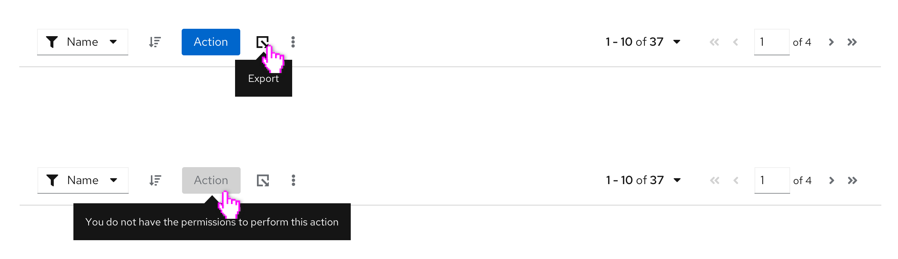

A **tooltip** provides short, clarifying descriptions of elements on a page. They are typically used to clarify the meaning of icons.

## Usage

Use tooltips to define new or unfamiliar UI elements that aren’t described directly in the user interface, or to get additional data from a data point or element in a chart or table.

**Guidelines**
* Keep your tooltips clear and concise. Use the fewest number of words you can without sacrificing meaning.
* If the tooltip is a full sentence, end it with a period.
* If information is needed for a user to complete a task (like a password character requirement), don’t hide it in a tooltip. Display it on the page instead.
* Tooltips should provide new and valuable information. Never use a tooltip to repeat information already available in the UI.
* Don’t use tooltips with question-circle icons to present contextual information in forms and other areas. Instead, use a popover.

**Common use cases**
* On icons
* In charts

**Accessibility**

Every time a user with a screen reader tabs into a field with a tooltip, the tooltip will be read out to them. 

### When to use a tooltip versus a popover

Both tooltips and popovers allow users to get more information in context. However, they differ in two ways:
 
 1. Tooltips are used for identification purposes, while popovers are used for added description or information in context. 
 2. Tooltips appear on hover, while popovers appear on click

**Use tooltips for:**
* Short descriptions of an item or to identify an item, like an icon button
* Content that is no longer than 1 or 2 lines

**Use popovers for:**

* Longer descriptions
* Formatted text
* When you would like your in-context help to include pictures, actions, or links 

## Other forms of on-screen help

1. [Hints](/components/hint/design-guidelines)
2. [Popovers](/components/popover/design-guidelines)