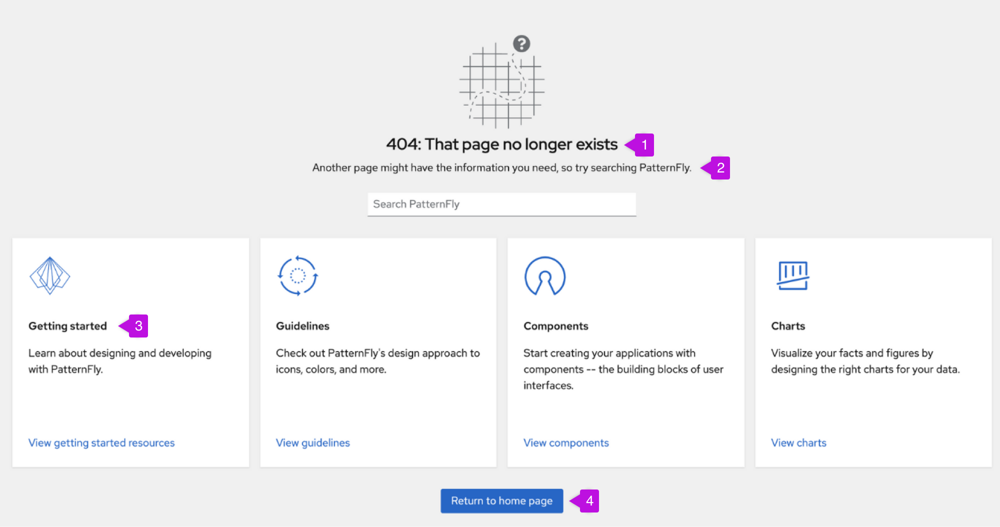

A 404 page is an error page that a user lands on when their requested content doesn’t exist or can’t be found. 404 pages are named after the type of error they communicate: “Error 404: Not found.”

Write 404 pages with [error message best practices](/ux-writing/error-messages) in mind: Explain what a 404 error is, define how users can proceed, and provide the tools they need to get there.

Effective 404 pages combine several elements to regroup, redirect, and empower lost users to reach their desired destination or find a new one.

1. **Heading:** Communicates what a 404 error is in plain language that users can understand. Avoid including “404” or “404 error” unless it’s clearly defined after: “404: That page no longer exists.” Write 404 headings without end punctuation (no period), unless punctuated page headings align with your brand or product.

2. **Next steps:** Define how users can proceed, typically by inviting them to search the site, explore suggested content, or both. Always write next steps in full sentences and punctuate accordingly.

3. **Suggested content (optional):** Points users toward relevant pages such as onboarding information, reference guides, or FAQs.

4. **Link to home page:** Provides a quick and easy way for users to navigate back to your site’s home page.

## Writing 404 page content
Consider your 404 page as a flight path instead of a dead end. Use clear, informative microcopy to point users in the right direction.

**Use understandable language.** Skip technical jargon by writing your 404 heading in plain and specific terms.

| **Do**                      | **Don't**                  |
|:-------------------------------:|:--------------------------:|
| 404: That page no longer exists | Error 404: Not found| 

 

 

**Avoid exclamations, colloquialisms, and excessive humor.** Write 404 headings to be informative and repeatable. When users land on a page more than once, jokes grow stale. Steer clear of extraneous words like “Uh oh!” or “Oops!”.

| **Do**                      | **Don't**                  |
|:-------------------------------:|:--------------------------:|
| We lost that page | Uh oh, spaghetti-o! We lost that one | 
| We couldn't find that page | Oops! We dropped the ball | 
| That page no longer exists | Huh, that's odd... | 

 

 

**Avoid assigning blame to the user.** If your brand doesn’t use first-person plural (“we”) pronouns, use “that page” or “this page” as your heading's subject instead.

| **Do**                      | **Don't**                  |
|:-------------------------------:|:--------------------------:|
| We can't find that page | Your search came up empty |
| That page no longer exists | The page you're trying to reach doesn't exist |

 

**Turn error into opportunity.** Always provide a link back to your site’s home page, and include supplemental next steps below your heading to encourage users to explore options beyond just going back to where they came from.

| **Do**                      | **Don't**                  |
|:-------------------------------:|:--------------------------:|
| Another page might have what you need, so try searching PatternFly. | That page doesn't exist. |

 

**Channel your brand voice.** Bland, impersonal error messages can be frustrating. Infuse your 404 page content with brand personality to support a more inviting site experience. 

| **Do**                      | **Don't**                  |
|:-------------------------------:|:--------------------------:|
| **404: We couldn't find that page** Another page might have what you need, so try searching PatternFly. | **Error 404: Not found** Requested URL not found on this server. Please try again. |

 

**Write for all audiences.** Be mindful of localization. Puns, wordplay, and cultural references may not localize for all users. Prioritize clarity over cleverness.

| **Do**                      | **Don't**                  |
|:-------------------------------:|:--------------------------:|
| **404: We lost that page** Let's find you a better one. Try a new search or return home. | **404: Not all who wander are lost...** But this page is. Search again or find your way back home. |

 

To see an example, visit [PatternFly’s 404 page](/404/).