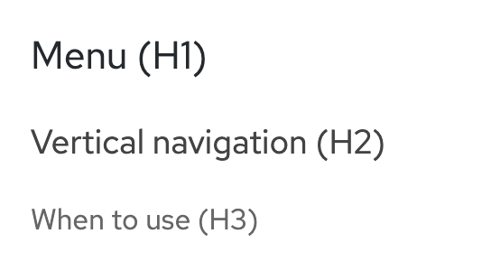
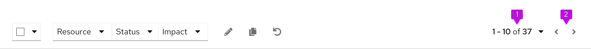
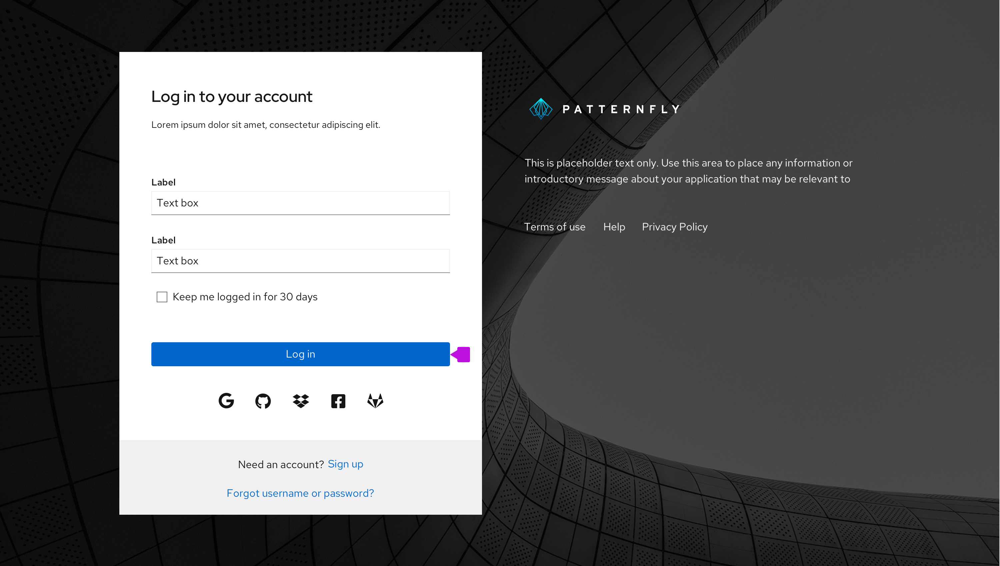

Design guidelines walk through building design patterns with PatternFly. This page focuses on how to write clear and consistent design documentation. To learn how to contribute design guidelines, see our [contribution guidelines](/contribute/design-guidelines/).

## Content architecture

Use headings, hierarchy, formatting, and lists to organize your design guidelines into digestible sections.

### Headings

Use headings to divide your content into topic-specific sections for easy navigation. Effective headings are:

- Structured around users' main goals.
- Front-loaded with descriptors for easy scanning.
- Attentive to parallel structure.
- Written in sentence case.

Headings should cascade levels without skipping––always progress from level to level, H1 to H2 to H3. Put your headings in H2 and subheadings in H3. If more sections appear beneath your subheading, style them in H4.

Example:

## Formatting 

### Capitalization

Our [capitalization style guidelines](/ux-writing/capitalization/) outline best practices for capitalization across PatternFly. 

Always write headings in sentence case. Write component names in lowercase.

Example: 

"Usage guidelines for card views"

### Bolds and italics

**Bold** component names when you first introduce them.

Example: A **card** is a square or rectangle container of related information.

*Italicize* words for emphasis, but do so sparingly.

### Lists

Lists package long, complex content into shorter, scannable sections. Use lists to introduce use cases, exceptions, and procedures.

When building lists, follow these best practices:

- Use bullets by default. Only use numbers if the order of items is important, like in a callout list.
- Introduce your list with a clause or phrase that describes the information it shares. 
- Start each item with a capital letter.
- End list items with a period if they're sentences, or if they form a full sentence when combined with the clause/phrase that introduces the list.
- Maintain parallel structure. Start every list item with the same part of speech. (Each item of this list starts with a verb.)

## Images

Design documentation includes images to contextualize elements in a UI and demonstrate them in action. All images should include alt text for accessibility.

### Annotations

Callouts demonstrate your design in action by highlighting specific areas in an image.

Use numbered callouts to call out multiple areas in your image, then use a corresponding numbered list to explain each one.

Example:

**1. Items in view:** Allows the user to select the item count (number of listed items) per page, as seen in full pagination

**2. Compact pager:** Supplies the user with page-back and page-next controls only

Avoid using a callout to highlight a single item, unless you're pointing out a small part of a large view, or the item isn't clearly shown in your image. Use a blank, unnumbered callout to mark the area, then bold it in your explanation.

Example:

Always write your **login button** as two words: "Log in."

## Style, voice, and tone

PatternFly's documentation is friendly and instructional. Learn more about voice in our [brand voice and tone section](/ux-writing/brand-voice-and-tone/).

When writing design guidelines, use:

- Present tense.
- Second-person point of view ("you").
- Active voice, unless you're using passive voice for emphasis.
- Direct language and sentence structure.
- Full words to introduce examples, instead of their abbreviations ("for example" instead of "e.g."), as seen on our [terms list](/ux-writing/terminology/).
- Descriptive language instead of directional language (up, down, left, right) to refer to elements in your document.
- Descriptive hyperlinks (not "click here").

If you're linking to other PatternFly pages, use relative URLs instead of full URLs.

Relative URL: /components/tooltip/design-guidelines
Full URL: https://www.patternfly.org/v4/components/tooltip/design-guidelines

## Design guidelines template

Use this template as a guide to structure your document. Depending on your content, you might have different sections and headings.

### Design guideline name

Title your page with your component or pattern name. Begin with a short 1-2 sentence description or definition of the design problem, topic, or function addressed in your document.

Example:

"**Pagination** splits data across multiple pages, typically within a table, list, or card view. If you use infinite scrolling, you don't need to use pagination."

### Elements

Introduce your component and the primary elements that compose it. List them and include explanatory copy for each one.

### Usage

Inform your readers about how and when to use this component or pattern. Include an explanation of the problems it solves along with the variations and best practices PatternFly users should be aware of when applying it in their designs.

This section might have subheadings that give further details about using your component in context.

### Content

Provide guidance for writing content that might appear in your component or pattern. This content section, if applicable, demonstrates how general terminology and wording best practices carry over to component-specific guidelines.

Content guidance includes:

- Editorial guidelines for labeling and message text.
- Length restrictions and what to do when text overflows.
- Localization considerations.
