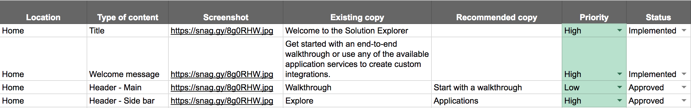

The words we use in our products are just as important as the components or layouts. The right words can drive better design decisions and guide users to succeed.

Our content standards help you use content design and strategy to build better experiences.

## How does UX writing fit into my design process?

Words can and should be factored in to every step in the design process. Simply put, ditch the lorem ipsum. Design with words.

**Discovery and sketching**

It’s ok to be a bit vague in your early sketches, as long as you’re still using real words for:
* Headers
* Titles
* Button labels

When you focus on these major content elements, you’re able to clarify the purpose of each screen and identify all of the main actions users are going to want or need to take.

**Low and mid-fidelity wireframes**

Replace any remaining placeholder text with real words. You’ll get better feedback from your team, stakeholders, and user test participants.

During this stage, it's also useful to pull all content out of the wireframes and catalog it using a spreadsheet or doc. This step is especially important when you are working with a larger team and content is reviewed and collaborated on by multiple people.

This approach provides several benefits:
* It decouples the words from the design and allows you to focus on the text.
* It makes it easier to collaborate and get feedback from your team.
* It's easier to track and share feedback.
* It enables you to share a single source of truth with your design team so you always have the most updated version of the copy consolidated in one place.
* It makes it easier to organize and review content for items that have more than one state or can change based on user input.

**High fidelity mockups**

If you design with real content from the beginning, by the time you create high fidelity mockups, you’ll already have two rounds of content feedback under your belt and can focus on refinement.

Now, you can work across teams to fine-tune your copy and align your words with voice and tone standards.

## Tips - writing effectively for UX

A small change in thinking can make a big impact. Focus on these general principles when you’re making content decisions.

* Know your audience
* Focus on their tasks and goals
* Understand the context

### Know your audience

Before you start, take minute to understand who you're writing for.

* Who is reading this?
* What do they care about?
* What messages do I want to communicate to them?
* What do they want to do? What am I trying to help them do?
* What are they seeing in the interfaces they already use every day?

Without this insight, content can feel confusing or even incorrect to your audience.

**Strategies to try**

Create user personas (or use the ones your team already has) and reference them as you work. If your team is in the process of gathering information about users, get involved!

* Ask to sit in on any interviews and listen.
* Make notes about specific words being used, standards being referenced, or concepts that keep coming up.
* Do your own research into your user domain by reading popular blogs or forums.

The more familiar you are with your user and their domain, the more natural the language in your interface will feel.

### Focus on tasks and goals

A task is more than just an end-goal; it’s every step your user needs to take to get from beginning to end. Understand the entire user journey to provide the right information in the right place at the right time.

**Strategies to try**

Frame each task as a conversation. Imagine you are sitting in a room with your user, and write out the conversation you might have with them to help them accomplish their task. This activity can help in several different ways:
* It helps you write in a natural and conversational way, which can inform and improve the content you use in the interface.
* It helps you anticipate questions the user might have along the way.
* It helps you anticipate information you need to collect from you user.
* It identifies gaps in your knowledge or understanding.

### Understand the context: Where are my users coming from?

Users carry around a lot of baggage. Now that you’ve got a great understanding of who your user is and where they’re trying to go, it’s time to figure out where they’re coming from...

**Literally** - Take a look at the application or feature you’re building and figure out the potential paths your user could have taken to arrive in this spot. Are they coming from a Google search? Another page in the application? An email?

Use that context to plan for the information they need to see in order to get themselves oriented. It might be a strong header with some intro text, a clear call to action, a breadcrumb bar, or all of the above.

**Personally** - You took the time to get to know your user. Put that knowledge to work! Consider where this person is coming from personally.
* What terminology are they expecting to see here?
* Will they be familiar with all of the information you’re giving them?
* Is it possible they might need additional information or links out to the documentation?
* Is this a task they’re going to do a lot, or only once or twice?

Use that context to choose the right terminology and prioritize your content.

**Emotionally** - Consider how your user is likely to be feeling in the situation you’re designing for. Is this situation stressful? Potentially confusing? Frustrating?

Use this context to make good choices about your tone. For example, a stressful error scenario is probably not a good time to make a joke.

## What's next?

Now that you have an idea of what UX writing is, how it fits into your process, and how to get started, use the [voice standards](/design-guidelines/content/voice-and-tone) to learn more about how to use the right words in the right context.
