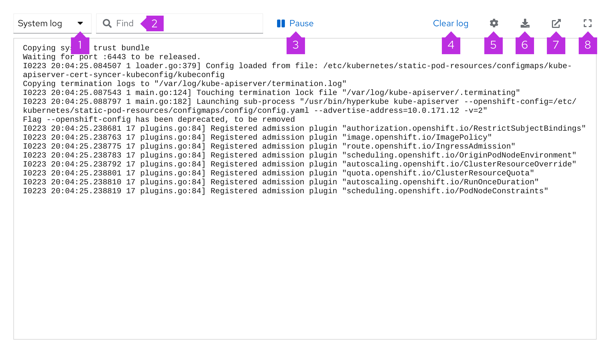
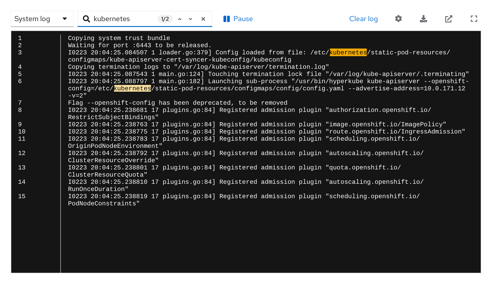
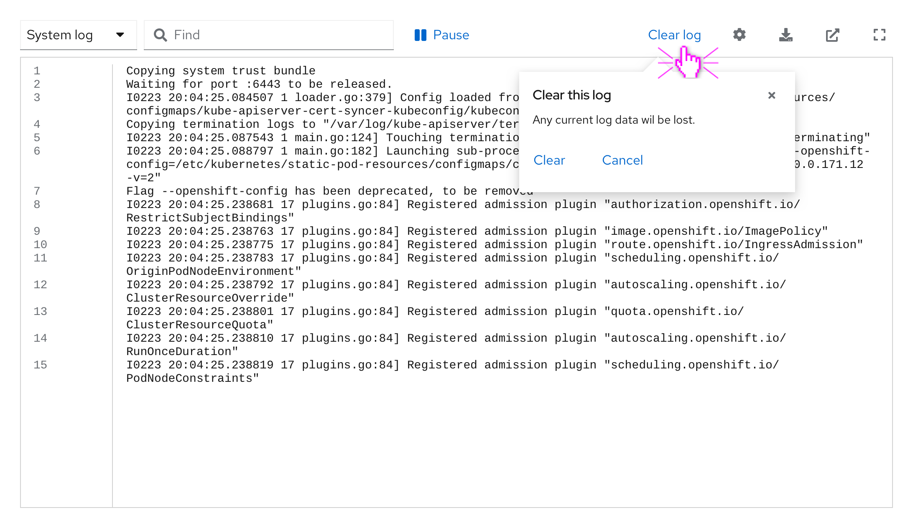
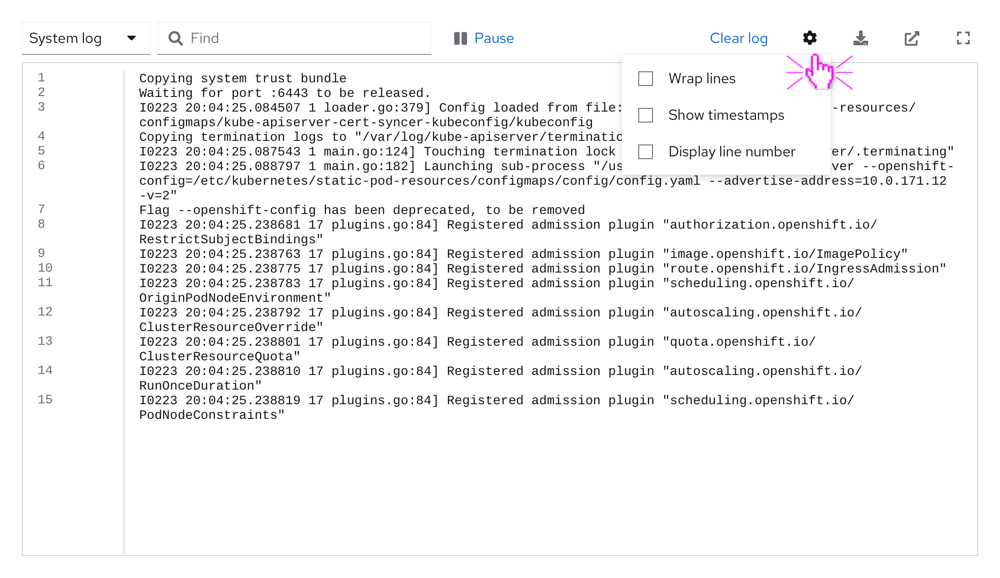
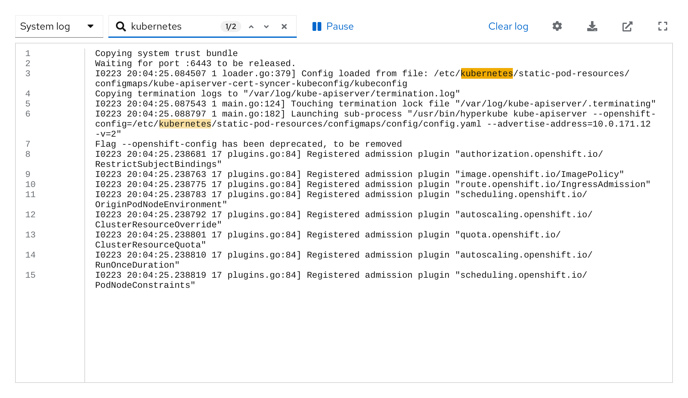

A **log viewer** is a preconfigured component that gives you the option to visualize your log content. Log viewer renders log output in real time in a clear and structured way.

## Light theme log viewer

1. **Type of log dropdown menu:** Allow users to switch between different types of logs.
2. **Search bar:** Use to look up historical logs. The results will be highlighted in the log.
3. **Pause button:** Play and stop your log content viewing, instead of scrolling through.
4. **Clear log:** Clear the displayed log output.
5. **Cog:** House settings such as wrapping lines, showing timestamps, and displaying line numbers.
6. **Export:** Export log content.
7. **Download:** Download the log file.
8. **Fullscreen:** Expand log viewer to full screen.

## Dark theme log viewer
We recommend using the light theme editor by default, but there is also a dark theme log viewer
available. All log viewer functionality remains the same whether a light or dark theme is used.

## Usability
Use a log viewer when:
* The user can manipulate 1 large log file or multiple log files at the same time.
* You want to create a more readable and accessible environment for the user.
* The user may actively search for specific logs within a large log file.
* The user shares files frequently with other users or teams.

## Log viewer functionality

### With popover
The clear log button opens up a popover with further options, to prevent a user from accidentally clearing their log content.

### With dropdown, drilldown, and search expanded
The cog icon in the log viewer toolbar allows you to store content options such as timestamps or line numbers for better orientation within the log viewer.

### With search results
The search bar provides highlighted search results for better findability within a log viewer’s content.

