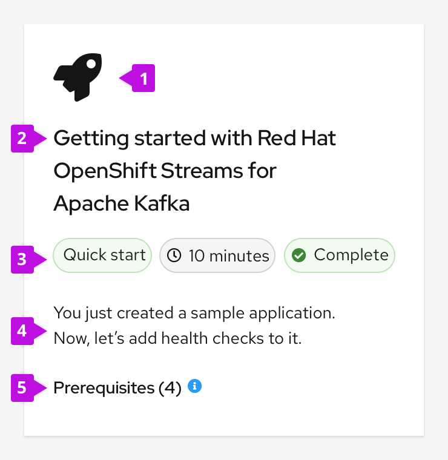

A **quick start** is a set of step-by-step instructions and tasks presented in a side panel embedded in a product’s UI. Quick starts can help users get started with a product, and they often provide guidance around installation and setup.

Each task in a quick start has multiple steps, and each quick start has multiple tasks. The outcome of the quick start includes the artifacts or state needed to successfully use the product, specific features, or add-ons.

## Elements

### Card

Quick starts are usually surfaced within a [catalog](https://www.patternfly.org/v4/components/card/design-guidelines/#cards-in-catalog-views) as clickable cards.

1. **Icon:** An icon associated with the quick start topic can be included on the card. If no specific icon exists, use the rocket icon.
2. **Title:** The title briefly communicates what the quick start covers.
3. **Labels:** [Filled labels](https://www.patternfly.org/v4/components/label) communicate the estimated completion time and status. If the quick start is presented in a mixed catalog of resources, a label can indicate the type of resource.
4. **Description:** The description summarizes the quick start outcome in four lines or fewer.
5. **Prerequisites (optional):** Prerequisites communicate user requirements prior to starting the quick start. They’re displayed in a popover, and they’re organized into a bulleted list. The total number of prerequisites is listed in parentheses on the quick start card.

### Catalog
Multiple quick starts are often presented to users in a catalog.

Catalogs with 14 or fewer quick starts should  include a simple toolbar with the following elements:
1. Keyword filter
2. Status filter
3. Item count  

Catalogs with 15 or more quick starts should include filtering functionality presented as vertical filters on the left side of the page instead of a simple toolbar.

For quick starts in a mixed catalog of resources, we recommend including an action link on the card so that users can easily recognize how to interact with it:

* **Start:** Use if the quick start hasn't been started yet
* **Continue:** Use if the quick start is in progress
* **Restart:** Use if the quick start has already been completed

There should only be one action displayed on a card at a time.

### Side panel
Quick starts use the [drawer component](https://www.patternfly.org/v4/components/drawer), which contains all the step-by-step instructions and tasks.

1. **Quick start title:** The quick start title that is shown on the card.
2. **Duration:** The estimated amount of time the quick start will take to complete.
3. **Close:** The close button allows the user to close the quick start at any time.
4. **Button bar:** The button bar allows the user to advance between quick start tasks. For task screens, the buttons are **Next**, **Back**, and **Restart**. For the intro screen, the only button is the **Start** button. On the completion screen, the buttons are **Close**, **Back**, and **Restart**.

Everything is contained in the drawer and remains anchored to the right, allowing the user to follow the steps without blocking any parts of the UI. The drawer does not overlay the UI and instead pushes it to the left, including the masthead. This prevents any modals or side panels within the UI from covering the quick start instructions. The side panel is also resizable.

#### Introduction screen
The first screen of any quick start is the introductory screen, which includes most of the information from the quick start card.

#### Tasks
Tasks consist of 2-10 steps, which walk the user through the UI to complete the goal of the task.

#### Check your work
The check your work module is shown at the bottom of the side panel for each task and helps the user validate that they have successfully completed the task. You can choose to make the check your work module required or optional. Validation questions should be yes/no questions, allowing the user to select the radio button with the appropriate response.

If a user selects **Yes**, the check your work module and associated task header turn green. The task header icon becomes a checkmark.

If a user selects **No**, the check your work module and associated task header turn red. The task header icon becomes an **X**. When possible, explain what a user must do to complete the task, or link to relevant documentation.

## Content guidelines
Here are some general guidelines to follow when authoring quick start content:
* Clearly state the outcome at the beginning of the quick start and provide brief context to explain why the user is completing the tasks.
* Avoid screen captures. They require regular maintenance and can potentially lead to issues around accessibility and page loading.
* Keep content minimal to avoid a wall of text that can overwhelm users and prevent easy skimming.
* (Optional) As needed, provide a carefully curated set of links at specific points in the quick start:
  * Provide links within a quick start task if the user is likely to need or want more conceptual or reference information.
  * Provide links at the end of quick starts if the user is likely to need or want additional technical  information upon completion.
  * Provide links in the check your work module when a user answers **No** if more robust information can help the user understand what actions they must take to complete the task.  

For more specific quick start content guidelines, refer to the [Red Hat OpenShift documentation](https://docs.openshift.com/container-platform/4.7/web_console/creating-quick-start-tutorials.html). While these guidelines are geared towards Red Hat OpenShift, they can apply to quick starts in any products.

## Quick starts in context

