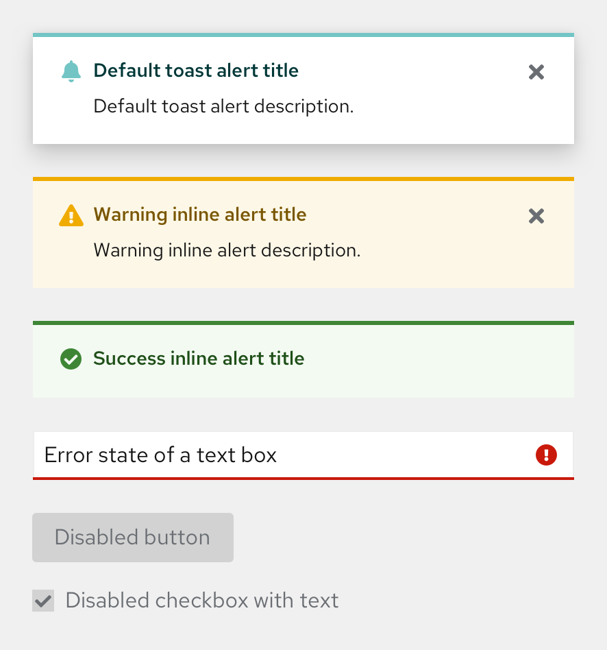
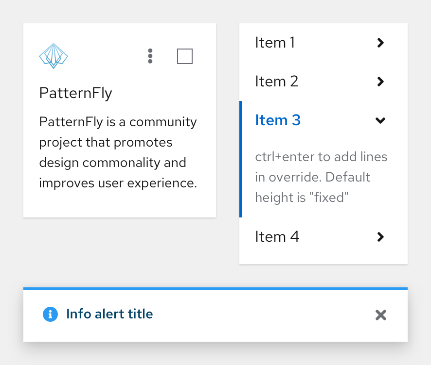

import { Alert, Grid, GridItem, Divider } from '@patternfly/react-core';
import { ColorSwatch } from './ColorSwatch';
import { ColorFamily } from './ColorFamily';
import './colors.css';

<Divider />

## Primary colors
<Grid hasGutter>
  <GridItem xl={6} lg={12} className="ws-colors-gridtext">
    <h3>PatternFly blue</h3>
    Primary colors are the colors displayed most frequently across your application screens and components. Our primary colors are used within a variety of components and are typically applied to default or active states and hover states.
    <ColorSwatch label="Default" color="--pf-global--primary-color--100">
      This color is most commonly used as as default or active state for many components including badges and spinners.
    </ColorSwatch>
    <ColorSwatch label="Hover" color="--pf-global--primary-color--200">
      This color is most commonly used as the hover or focus state for components that use the default primary color, such as buttons and dropdowns.
    </ColorSwatch>
  </GridItem>
  <GridItem xl={6} lg={12}>
    
  </GridItem>
</Grid>

<Divider className="ws-colors-divider" />

## Typography and iconography colors
<Grid hasGutter>
  <GridItem xl={6} lg={12} className="ws-colors-gridtext">
    <h3>Text and icons</h3>
    Typography and iconography colors are extremely similar because they can both be used in the same context, such as a link button. We have multiple shades of text colors on light and dark backgrounds so that you can emphasize hierarchy.
    <ColorSwatch color="--pf-global--Color--100">
      This color is used as a standard text and icon color as well as a hover state color for icon buttons. It is most commonly used as a text color for many components and application screens.
    </ColorSwatch>
    <ColorSwatch color="--pf-global--Color--200">
      This color is used as a secondary text color as well as a default color for icon buttons. It is most commonly used for many components, such as the app launcher and empty states.
    </ColorSwatch>
    <ColorSwatch color="--pf-global--link--Color">
      This color is most commonly used as a link text and icon color for many components, such as navigation and accordions. Blue icons use the same primary color variable as the blue text.
    </ColorSwatch>
  </GridItem>
  <GridItem xl={6} lg={12}>
    
  </GridItem>
</Grid>

<Divider className="ws-colors-divider" />

## Background colors
<Grid hasGutter>
  <GridItem xl={6} lg={12} className="ws-colors-gridtext">
    Background colors are used throughout components and can be used for certain screens depending on the use case. The light colors can be interchangeable for full-screen backgrounds. The dark background colors are strictly used within components.
    <ColorSwatch color="--pf-global--BackgroundColor--200">
      This color is most commonly used as a secondary background color for full application screens and hover backgrounds.
    </ColorSwatch>
    <ColorSwatch color="--pf-global--BackgroundColor--100">
      This color is most commonly used as a primary background color for full application screens and many components, such as cards and tables/data lists.
    </ColorSwatch>
    <ColorSwatch color="--pf-global--BackgroundColor--dark-100">
      This color is most commonly used as a background color for many components, such as tooltips and wizards.
    </ColorSwatch>
    <ColorSwatch color="--pf-global--BackgroundColor--dark-200">
      This color is used as a background color for navigation.
    </ColorSwatch>
    <ColorSwatch color="--pf-global--BackgroundColor--dark-300">
      This color is most commonly used as a background color for many components, such as navigation.
    </ColorSwatch>
    <ColorSwatch color="--pf-global--BackgroundColor--dark-400">
      This color is used as a background color for navigation.
    </ColorSwatch>
  </GridItem>
  <GridItem xl={6} lg={12}>
    
  </GridItem>
</Grid>

<Divider className="ws-colors-divider" />

## Status and state colors
<Grid hasGutter>
  <GridItem xl={6} lg={12} className="ws-colors-gridtext">
    Status and state colors are important when communicating data and action aspects through the UI with the user. Our status colors cover a variety of statuses including default, danger, success, information, and warning.
  </GridItem>
  <GridItem xl={6} lg={12} rowSpan={6}>
    
  </GridItem>
  <GridItem xl={6} lg={12}>
    <h3>Danger</h3>
    <ColorSwatch color="--pf-global--danger-color--300" caption="alert icon">
      This color is used as the icon color for the danger alert component.
    </ColorSwatch>
    <ColorSwatch color="--pf-global--danger-color--200" caption="alert title">
      This color is used as the title color for the danger alert as well as the background color for the danger button.
    </ColorSwatch>
    <ColorSwatch color="--pf-global--danger-color--100" caption="alert icon background">
      This color is most commonly used as an indication of danger or error for components, such as alerts and form inputs.
    </ColorSwatch>
  </GridItem>
  <GridItem xl={6} lg={12}>
    <h3>Default</h3>
    <ColorSwatch color="--pf-global--default-color--300" caption="alert title and icon">
      This color is used as the icon and title color for the default alert component.
    </ColorSwatch>
    <ColorSwatch color="--pf-global--default-color--200">
      This color is used as the background and icon color for the default inline alert component.
    </ColorSwatch>
    <ColorSwatch color="--pf-global--default-color--100" caption="alert icon background">
      This color is used as the icon background color for the default alert component.
    </ColorSwatch>
  </GridItem>
  <GridItem xl={6} lg={12}>
    <h3>Info</h3>
    <ColorSwatch color="--pf-global--info-color--200" caption="alert title and icon">
      This color is used as the icon and title color for the info alert component.
    </ColorSwatch>
    <ColorSwatch color="--pf-global--info-color--100" caption="alert icon background">
      This color is used as the icon background color for the info alert component as well as the background and icon color for the info inline alert component.
    </ColorSwatch>
  </GridItem>
  <GridItem xl={6} lg={12}>
    <h3>Success</h3>
    <ColorSwatch color="--pf-global--success-color--200" caption="alert title and icon">
      This color is used as an indication of success for components, such as alerts and forms. It is used as the icon and title color for the success alert component.
    </ColorSwatch>
    <ColorSwatch color="--pf-global--success-color--100" caption="alert icon background">
      This color is most commonly used as an indication of success for components, such as alerts and forms. It is used as the background color for the success alert component as well as the background and icon color for the success inline alert component.
    </ColorSwatch>
  </GridItem>
  <GridItem xl={6} lg={12}>
    <h3>Warning</h3>
    <ColorSwatch color="--pf-global--warning-color--200" caption="alert title and icon">
      This color is used as the icon and title color for the warning alert component.
    </ColorSwatch>
    <ColorSwatch color="--pf-global--warning-color--100" caption="alert icon background">
      This color is used as the icon background color for the warning alert component as well as the background and icon color for the warning inline alert component.
    </ColorSwatch>
  </GridItem>
  <GridItem xl={6} lg={12}>
    <h3>Disabled</h3>
    <ColorSwatch color="--pf-global--disabled-color--100">
      This color is used as the disabled text color when text is indicated as disabled.
    </ColorSwatch>
    <ColorSwatch color="--pf-global--disabled-color--200">
      This color is most commonly used as a disabled background color for many components, such as buttons and the app launcher.
    </ColorSwatch>
    <ColorSwatch color="--pf-global--disabled-color--300">
      This color is most commonly used as an alternate disabled background color for many components, such as dropdowns and options menus.
    </ColorSwatch>
  </GridItem>
</Grid>

<Divider className="ws-colors-divider" />

## Shadows
<Grid hasGutter>
  <GridItem xl={6} lg={12} className="ws-colors-gridtext">
    Shadows provide specifics about depth, direction of movement, and surface edges. Depending on the surface’s elevation and relationships to other surfaces, the type of shadow will change.
    <ColorSwatch label="Large" color="--pf-global--BoxShadow--lg">
      This variable is used to indicate a large shadow for many components, such as alerts and modals.
    </ColorSwatch>
    <ColorSwatch label="Medium" color="--pf-global--BoxShadow--md">
      This variable is used to indicate a medium shadow for many components, such as accordion and dropdowns.
    </ColorSwatch>
    <ColorSwatch label="Small" color="--pf-global--BoxShadow--sm">
      This variable is used to indicate a small shadow for the card component.
    </ColorSwatch>
  </GridItem>
  <GridItem xl={6} lg={12}>
    
  </GridItem>
</Grid>

<Divider className="ws-colors-divider" />

## Contrast ratios

  <a href="https://www.w3.org/WAI/standards-guidelines/wcag/new-in-21/" target="_blank" className="pf-m-link">Level AA in the Web Content Accessibility Guidelines 2.1</a> requires a contrast ratio of at least 4.5:1 for normal text and 3:1 for large text, and a contrast ratio of at least 3:1 for graphics and user interface components (such as form input borders).

Check color contrast between background color and text color using a <a href="https://color.a11y.com/?wc3" target="_blank" className="pf-m-link">WCAG AA-compliance tool.</a>

Make sure that, on hover, link texts provides ample contrast from both background color and from the default state of link text.

<Divider className="ws-colors-divider" />

## Color palette
Our palettes are created as a system designed to reinforce application content and workflows. Bright colors are reserved for specific interactions such as reinforcing status and are used sparingly. Our palettes are simple and consolidated to allow them to be easily deployed and versatile for any situation.

<Grid hasGutter>
  <GridItem xl2RowSpan={1} xl2={4} xl={6} xlRowSpan={2} sm={12}>
    <ColorFamily title="Grey family" family="black" />
  </GridItem>
  <GridItem xl2={4} xl={6} sm={12}>
    <ColorFamily title="Blue family" family="blue" />
  </GridItem>
  <GridItem xl2={4} xl={6} sm={12}>
    <ColorFamily title="Shadows" family="shadows" />
  </GridItem>
  <GridItem xl2={4} xl={6} sm={12}>
    <ColorFamily title="Green family" family="green" />
  </GridItem>
  <GridItem xl2={4} xl={6} sm={12}>
    <ColorFamily title="Cyan family" family="cyan" />
  </GridItem>
  <GridItem xl2={4} xl={6} sm={12}>
    <ColorFamily title="Purple family" family="purple" />
  </GridItem>
  <GridItem xl2={4} xl={6} sm={12}>
    <ColorFamily title="Light blue family" family="light-blue" />
  </GridItem>
  <GridItem xl2={4} xl={6} sm={12}>
    <ColorFamily title="Gold family" family="gold" />
  </GridItem>
  <GridItem xl2={4} xl={6} sm={12}>
    <ColorFamily title="Light green family" family="light-green" />
  </GridItem>
  <GridItem xl2={4} xl={6} sm={12}>
    <ColorFamily title="Orange family" family="orange" />
  </GridItem>
  <GridItem xl2={4} xl={6} sm={12}>
    <ColorFamily title="Red family" family="red" />
  </GridItem>
</Grid>