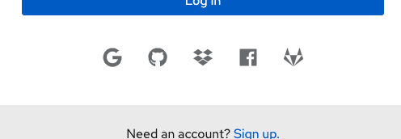

import { Alert, ApplicationLauncher, ApplicationLauncherGroup, ApplicationLauncherItem, Button, Card, CardBody, Divider, Dropdown, DropdownToggle, EmptyState, EmptyStateIcon, Flex, FlexItem, FlexModifiers, Grid, GridItem, LoginPage, Title } from '@patternfly/react-core';
import CaretDownIcon from '@patternfly/react-icons/dist/js/icons/caret-down-icon';
import CheckCircleIcon from '@patternfly/react-icons/dist/js/icons/check-circle-icon';
import ExclamationCircleIcon from '@patternfly/react-icons/dist/js/icons/exclamation-circle-icon';
import GithubIcon from '@patternfly/react-icons/dist/js/icons/github-icon';
import OutlinedCalendarAltIcon from '@patternfly/react-icons/dist/js/icons/outlined-calendar-alt-icon';
import StarIcon from '@patternfly/react-icons/dist/js/icons/star-icon';
import TagIcon from '@patternfly/react-icons/dist/js/icons/tag-icon';
import TimesCircleIcon from '@patternfly/react-icons/dist/js/icons/times-circle-icon';
import { IconRecommendations } from './IconRecommendations';
import { IconsTable } from './IconsTable';
import './icons.css';

<Divider className="ws-icons-divider" />

If you're a developer, check out our <a href="/get-started/developers#using-styles">getting started</a> page to learn more about how to get and use our icon set.

## Icon sizes
<Grid gutter="md">
  <GridItem xl={6} lg={12} className="ws-icons-gridtext">
    Medium icons are used as our base size across our system as a whole and we recommend using this base size within your applications. Small, large and x-large icons are used sparingly across PatternFly components. Here is a full complete list of icon sizes:
    <Flex className="ws-icon-sizes ws-icon-sizes-sm" breakpointMods={[{modifier: FlexModifiers['align-items-flex-start']}]}>
      <FlexItem className="ws-icon-size">
        <CheckCircleIcon size="sm" />
      </FlexItem>
      <FlexItem>
        
Small (10px)

        <code>-pf-global-icon-FonSize-sm</code>
      </FlexItem>
    </Flex>
    <Flex className="ws-icon-sizes ws-icon-sizes-md" breakpointMods={[{modifier: FlexModifiers['align-items-flex-start']}]}>
      <FlexItem className="ws-icon-size">
        <CheckCircleIcon size="md" />
      </FlexItem>
      <FlexItem>
        
Medium (18px)

        <code>-pf-global-icon-FonSize-md</code>
      </FlexItem>
    </Flex>
    <Flex className="ws-icon-sizes ws-icon-sizes-lg" breakpointMods={[{modifier: FlexModifiers['align-items-flex-start']}]}>
      <FlexItem className="ws-icon-size">
        <CheckCircleIcon size="lg" />
      </FlexItem>
      <FlexItem>
        
Large (24px)

        <code>-pf-global-icon-FonSize-lg</code>
      </FlexItem>
    </Flex>
    <Flex className="ws-icon-sizes ws-icon-sizes-xl" breakpointMods={[{modifier: FlexModifiers['align-items-flex-start']}]}>
      <FlexItem className="ws-icon-size">
        <CheckCircleIcon size="xl" />
      </FlexItem>
      <FlexItem>
        
X-large (54px)

        <code>-pf-global-icon-FonSize-xl</code>
      </FlexItem>
    </Flex>
    No matter the size of the icon, when icons are next to text, they should be center-aligned horizontally. An example of this alignment in a component is a <a href="design-guidelines/usage-and-behavior/buttons-and-links#link-button">link button</a>. If icons are stacked, they should also be center-aligned vertically.
    <Grid>
      <GridItem span={6} className="ws-icon-alignment ws-icon-alignment-correct">
        
<CheckCircleIcon/><strong>Correct alignment</strong>

        <Flex>
          <FlexItem><TagIcon size="sm"/></FlexItem>
          <FlexItem>Small icon with text</FlexItem>
        </Flex>
        <Flex>
          <FlexItem><OutlinedCalendarAltIcon size="md"/></FlexItem>
          <FlexItem>Medium icon with text</FlexItem>
        </Flex>
        <Flex>
          <FlexItem><GithubIcon size="lg"/></FlexItem>
          <FlexItem>Large icon with text</FlexItem>
        </Flex>
      </GridItem>
      <GridItem span={6} className="ws-icon-alignment ws-icon-alignment-incorrect">
        
<ExclamationCircleIcon/><strong>Incorrect alignment</strong>

        <Flex>
          <FlexItem><TagIcon size="sm"/></FlexItem>
          <FlexItem>Small icon with text</FlexItem>
        </Flex>
        <Flex>
          <FlexItem><OutlinedCalendarAltIcon size="md"/></FlexItem>
          <FlexItem>Medium icon with text</FlexItem>
        </Flex>
        <Flex>
          <FlexItem><GithubIcon size="lg"/></FlexItem>
          <FlexItem>Large icon with text</FlexItem>
        </Flex>
      </GridItem>
    </Grid>
  </GridItem>
  <GridItem xl={6} lg={12}>
    <Card className="ws-icon-size-examples">
      <CardBody>
        
<b>Small icons</b>

        <Flex  breakpointMods={[{modifier: FlexModifiers['align-items-flex-start']}]}>
          <FlexItem>
            <Dropdown
              toggle={<DropdownToggle id="toggle-id">Dropdown</DropdownToggle>}
            />
          </FlexItem>
          <FlexItem breakpointMods={[{modifier: FlexModifiers.grow}]}>
            <ApplicationLauncher isOpen={true} favorites={['openshift']} isGrouped className="ws-icons-appLauncher" onFavorite={()=>null} items={[
              <ApplicationLauncherGroup label="Favorites" key="Favorites">
                <ApplicationLauncherItem isFavorite key="item 1" id="openshift">OpenShift</ApplicationLauncherItem>
                <ApplicationLauncherItem key="item 2" id="github">Github</ApplicationLauncherItem>
              </ApplicationLauncherGroup>
            ]} />
          </FlexItem>
        </Flex>
        
<b>Medium icons</b>

        <Alert variant="default" isInline title="Default inline alert title"/>
        
<b>Large icons</b>

        
        
<b>X-large icons</b>

        <EmptyState variant={EmptyStateVariant.lg}>
          <EmptyStateIcon icon={CubesIcon} />
          <Title headingLevel="h5" size="xl">
            This is a large empty state
          </Title>
        </EmptyState>
      </CardBody>
    </Card>
  </GridItem>
</Grid>

<Divider className="ws-icons-divider" />

## Icon colors
Visit our <a href="/design-guidelines/styles/colors" className="pf-m-link">colors page</a> to learn more about icon colors.

<Divider className="ws-icons-divider" />

## All icons
PatternFly uses custom icons and selections from <a href="https://fontawesome.com/icons">FontAwesome</a>. PatternFly icons are two dimensional and flat. Navigate to FontAwesome’s website to download SVGs of any ‘fa’ icons. Click on any single pf-icon in the table to download it as an SVG. Download all icon SVGs <a href="#">here</a>.

If you’re a designer, these icons are the same set as the ones in the <a href="https://www.patternfly.org/v4/get-started/designers">PatternFly Sketch Design Kit</a>. It is possible to use any FontAwesome icon as long it follows the guidelines above.

If you’re looking to copy HTML for an icon: 
Use this for 'pficon' icons: `<i className="pf-icon [insert-icon-name]"></i>` 
Use this for 'fa' solid icons: `<i className="fas [insert-icon-name]"></i>` 
Use this for 'fa' regular icons: `<i className="far [insert-icon-name]"></i>` 
<small>Note: Be sure to read <a href="/get-started/developers#using-styles" className="pf-m-link">how to get started with icons</a> when using 'fa' regular icons</small>

If you're looking to copy React for an icon: 
Use this for 'pficon' icons: `import { [insert-icon-name] } from '@patternfly/react-icons'`

<IconsTable />

<Divider className="ws-icons-divider" />

## Updated icon recommendations
We’ve recently updated some of our PatternFly icons as well as icon usage guidelines. If you are using an outdated icon, we suggest you migrate over to the newest recommendations.

<IconRecommendations />
