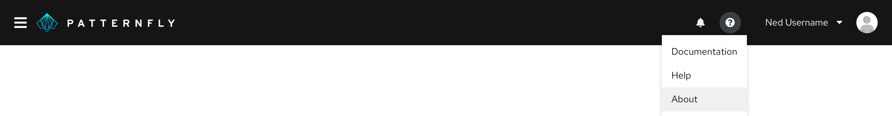

The about modal stores the version number(s) of the application as well as any appropriate legal text.

## Primary elements

1. **Backdrop:** Blurs any interface elements in the background to bring the modal content into focus
2. **Modal**
3. **Branding:** Provides logo and branding for the product. Substitute your own logotype by providing an SVG that can be scaled proportionately to fit the space.
4. **Product title**
5. **Close button**
6. **Content:** Label and version
    * When version and build information are both shown: Version 6.3 (Build 5)
    * When version only: Version 6.3
    * When build only: Build 5
7. **Modal image:** The modal image should be the same as the [background image](/documentation/react/components/backgroundimage) you use for your application.
8. **Trademark and copyright information:** Optionally include legal text. Suggested format for copyright -  Copyright (c) 2018 Company

## Usage
Use the about modal to provide information about the product including the product name, logo, version numbers, and any appropriate legal text.

**Accessing the about modal**

Provide access to the about modal using a help icon in the application masthead. Clicking the help icon will launch a dropdown menu. The help menu should always include an option labeled "About" that launches the about modal.

<!--Learn more about how to create and organize a masthead in the [masthead design guidelines](/design-guidelines/usage-and-behavior/).-->

## Related components and demos
**HTML/CSS**
* [About modal](/documentation/core/demos/aboutmodal)
* [About modal box](/documentation/core/components/aboutmodalbox)
* [Backdrop](/documentation/core/components/backdrop)
* [Background image](/documentation/core/components/backgroundimage)
* [Button](/documentation/core/components/button)

**React**
* [About modal](/documentation/react/components/aboutmodal)
* [Background image](/documentation/react/components/backgroundimage)
* [Brand](/documentation/react/components/brand)
* [Button](/documentation/react/components/button)
