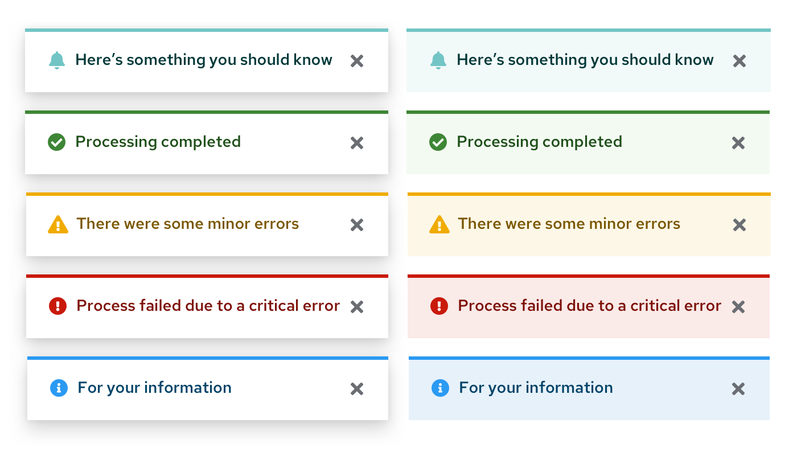
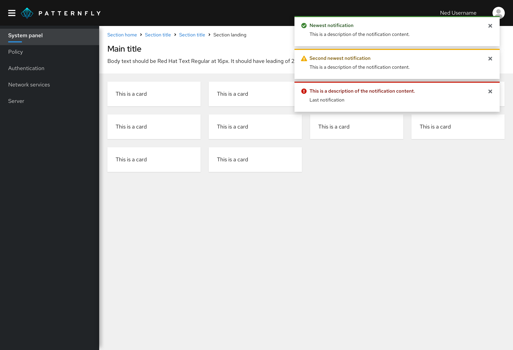

Alerts are used when the system wants to notify the user about some status or other event. These guidelines talk about how to properly use different types of alerts in your designs.

## Elements
### Alert
Alerts are used to communicate status information to the user without blocking other actions through the user interface. There are two styles that can be applied to an alert depending on whether it is intended as an [inline](#inline-alerts) or [toast](#toast-alerts) alert. Toast alerts should always be dismissable, whereas inline alerts can be both dismissable and non-dismissable. Other elements are consistent between alert types.

1. **Status area:** Icon and color indicate the status or severity of the alert.
2. **Alert title:** Include a short descriptive message. Long message text will wrap. Text color is coded to match alert type.
3. **Close (optional):** Dismiss the alert. Required for toast alerts and optional for inline alerts.
4. **Actions (optional):** One or more actions can be placed inside of an alert.
5. **Description (optional):** If a longer message is required, it can be included within the Description field. This can also include a navigation link as an alternative to an action.

#### Communicating status
The status icon, background, and alert title are coded to communicate the severity of an alert.

|Type     |Icon    |Usage      |
|---------|--------|--------------|
|Default  |fa-bell | Use for generic messages with no associated severity
|Info     |fa-info-circle|Use for general informational messages (default)|
|Warning  |fa-exclamation-triangle |Use to indicate that a non-critical error has occurred|
|Critical |fa-exclamation-circle | Use to indicate that a critical or blocking error has occurred
|Success  |fa-check-circle | Use to indicate that a task or process has completed successfully

For more information about exact colors used to represent status and severity, visit the [Colors](/design-guidelines/styles/colors#status-and-state-colors) page.

## Usage
Alerts can be used to communicate:

* **Synchronous notifications:** Returned as a direct response to some user action like clicking the Submit button on a form.

* **Asynchronous notifications:** Generated by the system in response to some internal event. They may reflect status of a process, an internal error, or similar system event.

Message text should be succinct and clearly state what the issue or problem is. Embedded links should navigate the user to the location where they can take action.

There are three ways that the system can communicate notifications to the users.

|           |Usage     |UI placement     |Persistence
|-----------|----------|-----------------|---------------|
|[Inline alerts](#inline-alerts)|Use for notifications that are a direct response to a user action, like clicking the Submit button on a form, and can be informational or that identify actions required on that page before the user can continue. |Appear at the top of the content area and push other content down. | Persist until the user dismisses them or navigates away from the page.
|[Toast alerts](#toast-alerts) |Use to present a system notification that should not interrupt the user’s current workflow. |Enter from the right edge of the screen and overlay content. |Remain until they time out, or the user dismisses them.
|[Modal alerts](#modal-alerts) |Use when you must interrupt the task at hand until the user takes action. |Overlay the UI and prevent further user actions until the user closes the modal. |Remain until the user dismisses the modal.

### Inline alerts
Inline alerts are synchronous and appear as the result of a user action or upon loading a page. They insert themselves into the content area, push down other content, and will persist until the user closes them or navigates away from the page.

See a [high-fidelity example of inline alert placement](#inline-alert-placement) below.

#### When to use
Use an inline alert when you want to return feedback as the result of a user action within a page while allowing the user to continue working. Common uses for inline alerts include form validation or warning messages that should not interrupt the user’s flow.

An inline alert should never block the user from interacting with other content on a page. For informational alerts, the user should be able to dismiss the alert by clicking the Close button on the alert. For error conditions, we recommend that the alert is dismissed only when the condition raising it has been cleared.

In addition to static message content and links, interactive elements may optionally be included in the body of an inline alert to ask the user for further input or feedback.

#### When not to use
Do not use inline alerts to reflect the status of an asynchronous operation. In this case, a Toast Alert should be used.

#### Alternative solutions
If the user must take action to address a situation before proceeding consider using a [modal](design-guidelines/usage-and-behavior/modal). Inline alerts are preferred to a modal when the problem can be corrected on the current page, however.

### Toast alerts
Toast alerts enter from the right edge of the screen and remain until they time out or until the user dismisses them. Toast alerts overlay other content on the page.

See a [high-fidelity example of toast alert placement](#toast-alert-placement) below.

#### When to use
Use toast alerts when you want to report an asynchronous event without interrupting the user’s current workflow. Actions and links may be used in alerts, but only as a shortcut or redundant means to navigate or invoke the action. A toast alert should never be used as the only means for taking actions on an alert event.

Toast notifications must always have a close button so the user can dismiss them. You may also include an optional time-out to dismiss the alert automatically after a period of time. Eight (8) seconds is a recommended timeout. Alerts should not dismiss while the user is hovering over them.

#### When not to use
Do not use a toast alert when an event requires immediate action or for synchronous events like form validation.

### Stacking multiple alerts
Multiple alerts will stack. The most recent alert should appear at the top and others will push down. When alerts are deleted, any space above will be filled by pushing remaining alerts up in the stack order.

An [Alert Group](documentation/react/components/alertgroup) component allows a set of alerts to be properly positioned and stacked as shown below.

### Examples

#### Toast alert placement
Toast alerts always stack in the upper right of a page.

#### Inline alert placement
If an alert message applies globally to the content on a page, place the alert in the page header area just below the title.

But if the alert applies only to specific content, you might consider placing the alert inline with page content to call attention to the error.

## Accessibility considerations

Toast alerts present special challenges for accessibility. Screen readers will announce the arrival and message content of an incoming toast alert, but user focus will not be placed there. This will make it difficult for these users to directly act on the alerts itself. Therefore, we recommend that any message containing actions be descriptive of how the can navigate to perform the action in the application. Messages that contain links should specify the location in text as well as including a simple text link. For example, a simple notification message might take the form:

A more accessible version of this message would look like this:

While this is more verbose, it has the advantage of being usable for both sighted and non-sighted users by providing instructions to screen reader users about where they can go to complete the action.

## Related components and demos
**HTML/CSS**
* [Alert](/documentation/core/components/alert)
* [Alert group](/documentation/core/components/alertgroup)

**React**
* [Alert](/documentation/react/components/alert)
* [Alert group](/documentation/react/components/alertgroup)
