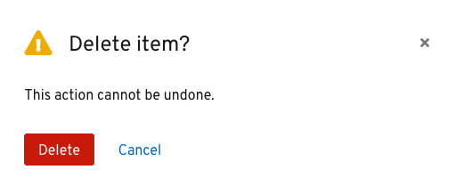
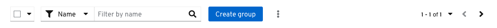
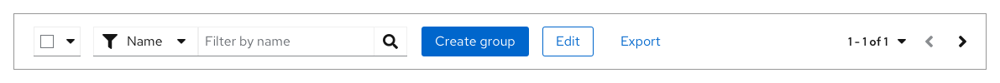

A button refers to a box area or text that can be clicked or tapped.

## Usage

Buttons can be used to communicate and immediately trigger actions a user can take in an application, like submitting a form, cancelling a process, or creating a new object. Buttons can also be used to take a user to a new location, like another page inside of a web application, or an external site such as help or documentation. 

### Button types
The following button styles, shown in order of visual hierarchy, can be used in your designs according to your needs. 
* [Danger button](#danger-button)
* [Primary button](#primary-button)
* [Secondary button](#secondary-button)
* [Tertiary button](#tertiary-button)
* [Link button](#link-button)
* [Icon button](#icon-button)

You don't need to use these buttons in the order that their labels imply. For example, you don't always need to use the secondary button as the second button in your designs. The most important thing is to establish a visual hierarchy between any buttons in your designs. There are, however, some best practices to keep in mind.

#### Danger button ####

Danger buttons are the most prominent of all the button options. Use danger buttons for actions a user can take that are potentially destructive or difficult/impossible to undo, like deleting or removing user data. These are mostly found in modals to emphasize a destructive action the user is about to take.

_Example of a danger button in a modal_

#### Primary button ####

A primary button is the most prominent button on a page, used for the most important call to action on a page. Try to limit primary buttons to one per page.

_Example of a primary button inside a toolbar_

_Example of a primary button inside an empty state_

#### Secondary button ####

Secondary buttons are buttons with less visual prominence than primary buttons. Use secondary buttons for general actions on a page, that don’t require as much emphasis as primary button actions. For example, you can use secondary buttons where there are multiple actions, like in toolbars or data lists.

_Example of secondary buttons in data lists_

#### Tertiary button ####

Tertiary buttons are one the least visually prominent buttons and are designed to be less striking than a primary or secondary button, while still retaining a classic button format. Tertiary buttons are flexible and can be used as needed.

In this example, you can see a tertiary button used to show a possible “Edit” action. This button format highlights the action, while making it clear that it is not the main call to action on the page. 

_Example of tertiary button on a page_

#### Link button ####

Links buttons are labeled buttons with no background or border. Link buttons can be used for actions that:
* May not need as much emphasis.
* Navigate users to another page within the same window.
* Navigate users to an external page.

While all link buttons lack borders, they can still vary in appearance. Link buttons that navigate users to another page within the same window should be presented as stand-alone text. Link buttons that navigate users to an external page may include an icon on the left or right of the text to further emphasize the action. For example, you could add an external link icon to show that clicking on it will navigate users externally to another website or application.

 

You might use a link button instead of a secondary button format to create greater visual hierarchy between two buttons. Examples include using text buttons as cancel buttons in modals or wizards, as well as for secondary actions in empty states. 

_Example of a link button in a modal_

_Example of link buttons in an empty state_

#### Icon button ####

Icon buttons are useful in places where space is limited. For example, if you have too many actions within a menu, you could use a kabob icon to indicate more actions, or an export icon for exporting data. You can also use this button type for actions that are commonly associated with icons, like an exit icon to close a window or a hamburger icon to open a menu.

For example, this toolbar uses an export icon as an action button due to limited space.

<!--  ### Using buttons in your designs
We recommend aligning buttons to different elements or areas on the screen depending on the content being provided. The recommended alignment simplifies scanning and helps users complete and submit form content more quickly.  

#### Buttons on full page forms
* Place the primary button to the left of the cancel button.
* Align submit buttons with left-edge of input fields.

#### Buttons on modals
* Align submit buttons to the bottom right of the modal.
* Place the primary button to the right of the cancel button.
* Align submit buttons with right-edge of input fields.

We'll want to include some information for button usage on wizards when we have some examples.
 #### Buttons on wizards
The placement of buttons on wizards will depend on the layout of content you present. -->

## Usage guidelines

There are certain cases where specific buttons must be used within your UI. 

Follow these guidelines for buttons in wizards:  
* The **Next** button should always be a primary button. 
* The **Back** button should always be a secondary button. 
* The **Cancel** button should always be a text button.

Always use link buttons in the following cases:
* For cancel buttons in wizards or modals

  

* For more actions in empty states

  

* For action buttons in tables

  

* For action buttons in alerts

  

## Button placement

Buttons in forms, modals, or wizards should always be left aligned in the box. This solves for:
* **Modularity and flexibility:** A standard alignment creates consistency in how objects appear across all areas of an app.
* **Accessibility:** The form submit buttons are on the same scan line as the form fields, which benefits users who are sight-limited. Also, users who are blind can more easily navigate left-aligned form submit buttons because the button order is consistent across all contexts. 
* **Responsiveness:** The most important actions (i.e., primary buttons) are encountered first when elements are stacked vertically.

## Button spacing and action lists

The standard spacing between each button is 16px, even for danger buttons. If buttons are stacked vertically, the spacing between each button should be 8px.

_Standard spacing_

_Stacked spacing_

Currently, the only exception to this is in wizards, where the **Cancel** button is spaced 48px away from the primary and secondary **Next** and **Back** buttons, and 24px away if stacked.

_Wizard spacing_

_Wizard stacked spacing_

If you have a specific use case where buttons need to be spaced further away from the rest, the button groups action list allows for customization as needed.

_Action group spacing_

## Buttons and overflow menus

There are cases where you will have multiple buttons next to each other, like in a toolbar. When the space shrinks (e.g., switching from desktop to mobile view), you can have the buttons collapse into a kabob overflow menu. Additionally, you can choose to make the primary action persist or have all options collapse into the kabob.

_Buttons appear in the toolbar_

_Buttons placed in overflow menu due to limited space, with primary button persisting_

## Content

**Writing button labels**

* Button labels should be specific and clearly communicate their associated action.
* Always use verbs or verb phrases.
* To avoid wrapping, aim for short labels when possible (1–3 words)
* Avoid the use of articles (e.g., write “Add source” instead of “Add a source”)
* Avoid long button labels that might risk wrapping.

**Writing link labels**

Use specific, action-focused labels that match what the user will see when they arrive at their location. For example, if you are sending a user to a dashboard, your link label might read _View dashboard_. For a link directing a user to a support forum, the label might read _Get help in the support forum_. See [PatternFly's content guidelines](/design-guidelines/content/writing) for additional guidance.

## Related components and demos
**HTML/CSS**
* [Button](/documentation/core/components/button)

**React**
* [Button](/documentation/react/components/button)
