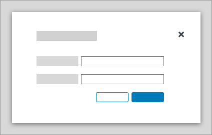
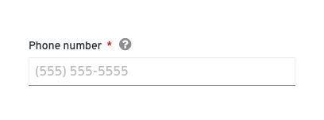
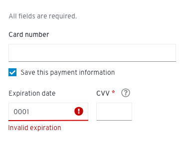
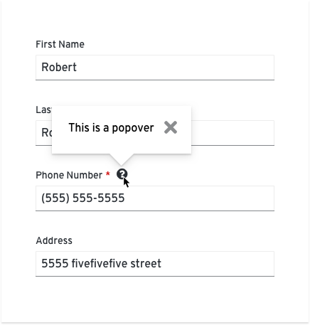
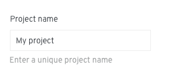
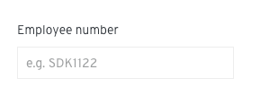
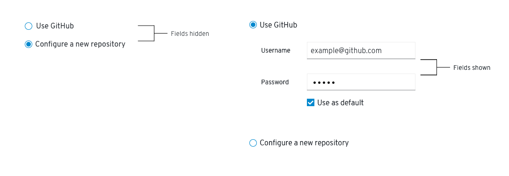
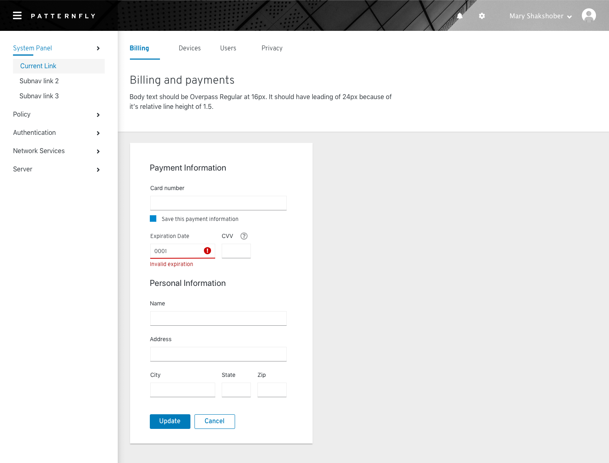
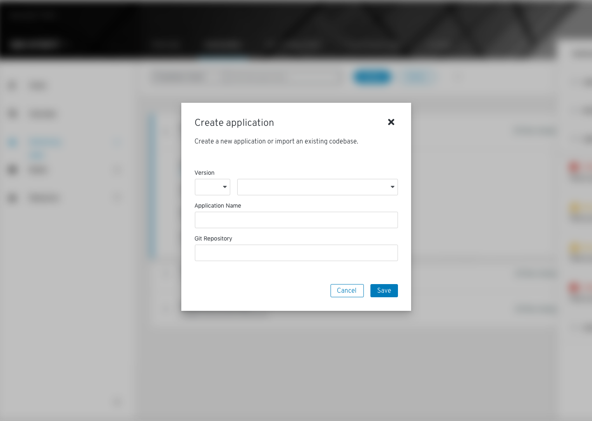

A form is a group of elements used to collect information from a user. Forms can be presented to the user in a variety of contexts depending on the use case and scenario.

[View form demos](/documentation/core/demos/basicforms)

## Elements
Most forms will contain the following basic elements:

*Form elements*

1. [Labels](#labeling): Field labels can be aligned to the top or left of the field depending on the layout of your page and the amount of space you have to work with.

2. [Text input/text area](/design-guidelines/usage-and-behavior/data-input): Provides an area for users to input free-form text.

3. [Data input](#provide-the-right-data-input): Provides a way for users to submit any information that is not free-form text.

4. [Help](#provide-the-right-kind-of-help): Provides contextual assistance like popovers, placeholder text, or helper text, in any area where the user might need additional information to provide the right input.

5. [Errors and validation](#provide-errors-and-validation): Ensures that the correct information is collected before the form can be submitted to the system.

6. **Buttons:** Enable a user to submit or exit a form. Button placement depends on the type of form you're presenting to the user.

7. [Required field indicator](#indicating-required-fields)

<!--When using forms in a modal, align buttons to the right edge of the input field. Place the primary button on the far right and the secondary button to the left.

When using full page forms, align buttons to the left, placing the primary button on the left and secondary on the right.

-->

## Designing forms
### Labeling
Always provide labels for text and data input so users understand what information is being requested of them. Labels can be aligned to the top or left of an input.

* Use top-aligned labels when you are space constrained or if mobile usage is a high priority.
* Whichever approach you use, we recommend that you maintain consistency throughout an application.

**General guidelines**
*  Use sentence-style capitalization for all text elements, **except**: product names and proper nouns. Sentence style capitalizes only the first word of each sentence and proper nouns, like names.
* Always provide a label for input components.
* Labels should clearly state the required input.
* Do not use a colon after the label name.

**Top-aligned labels**

Use top-aligned labels by default. Top-aligned labels provide a consistent left edge and close proximity between label and input. Top-aligned labels also offer the most horizontal area for long labels.

When to use:
* The ability to complete the form quickly is a high priority.
* Label length might be long or vary, e.g. internationalization.
* The user will be entering familiar content and is less likely to make data entry errors.
* Only a few form fields need to be presented.
* Related fields must be grouped horizontally, e.g. [first name] [last name].

**Left-aligned labels**

Left-aligned labels provide a strong vertical edge and help users to scan for context.

Left-aligned labels are good for unfamiliar content or forms in which well-considered responses are necessary. They support left to right reading between label and field and are good for layouts with more horizontal space than vertical.

When to use:
* The user is presented with unfamiliar content and would benefit from scanning the form to understand the overall context.
* It’s more important that the user pay close attention to the form material, rather than completing it quickly.

To accommodate mobile viewports, left-aligned labels should responsively adjust to a top-aligned layout.

**Labeling for checkboxes and radio buttons**

Checkboxes and radio buttons have a different labeling convention, where the labels should be aligned to the right of the input control.

### Indicating required fields
A required field should be indicated with an asterisk ( * ) to the right of the field label.

If **all fields** on a form are required, do not use an asterisk for every field. Instead, provide a message at the top of the form stating, "All fields are required." If all fields are optional, the message should state, "All fields are optional."

### Provide the right data input
PatternFly provides a variety of input components that enable a user to make a selection. Each component was created to serve a specific use case.

**Checkboxes**

Use checkboxes to enable users to select any number of items from a list. The user could select all of the available options, some of them, or none.

You can also present users with a single checkbox to enable or disable an option or setting.

If you have more than 5 options to present to the user, use a select list.

**Radio buttons**

Use radio buttons to enable users to choose from a list of two or more mutually exclusive options. Users can only select one option. Selecting a different radio button will automatically deselect the previously selected option.

If you have more than 5 options to present to the user, use a select list.

**Switch**

Use a switch to toggle between two different states.

**Select lists**

Use a select list to enable users to select one option from a list of options. Select lists can be configured to enable users to select one option or multiple options depending on the use case.

Learn more about data input variations in the [data input design guidelines](/design-guidelines/usage-and-behavior/data-input).

### Provide the right kind of help

**Popovers**

Use a **popover** for longer (2 sentences or more) explanations, content that requires formatting like numbered or bulleted lists, or content that requires you to include buttons, links, or images.

  **DO**

  * Use popovers with the filled question mark icon.
  * Use popovers for any field that may require additional background or explanation.
  * Keep descriptions as concise as possible.

  **DON'T**

  * Don’t use popovers to compensate for bad design or rely on them to explain a graphic or word choice.
  * **Never** hide critical information in a popover. Don’t put any information into a popover that a user will always need to complete their task.

**Helper text**

Helper text is text below a form field that helps a user provide the right information, like _Enter a unique name_. Use helper text for information that a user needs to know in order to enter the correct information. For context or background information that is “nice to have,” use an infotip.

  **DO**

  * Keep helper text concise while providing enough information to enable a user to complete their task.
  * Use helper text to provide critical information that is secondary to the field label.
  * Limit the use of helper text to avoid overwhelming the user.

  **DON'T**

  * Try to avoid helper text that exceeds the length of the input area.
  * **Never** use helper text as a replacement for field labels.

**Placeholder text**

Placeholder text is text inside a form field that provides an example of the required or recommended format for text input.

For example, placeholder text for a date might be _e.g. YYYY-MM-DD_.

Use placeholder text when the requested data type might be unfamiliar or the field requires the user to provide data in a specific format.

  **DO**

  * Try to limit the use of placeholder text to unfamiliar input types or specific syntax requirements (like a specific date format, number format, etc).
  * Always precede placeholder text with "e.g." followed by a space. For example "e.g. (781)555-5555" or "e.g. 491"
  * Keep hints concise; never extend the length of the text field.
  * Limit the use of syntax hints to avoid overwhelming the user.

  **DON'T**

  * Don’t use placeholder text to communicate complex and lengthy requirements like password requirements. Instead, use an infotip.
  * Don’t provide placeholder text when it isn't necessary.
  * **Never** use placeholder text as a replacement for field labels.

### Provide errors and validation
When a form field submission results in an error, let users know as soon as possible. Always present error states on the form, and use inline errors whenever possible. The error state you can use will depend on whether validation happens on the client or the server.

**Client-side validation**

Client-side validation can be performed as soon as a field loses focus, and allows you to use inline validation to alert users of errors or issues immediately. This type of validation allows users to quickly see and address issues.

Some common use cases include:
* A user entering data in an invalid format
* A user leaving a required field blank
* A user leaving a required field incomplete

When an error occurs, inline errors will replace any existing [helper text](#provide-the-right-kind-of-help) until the error is fixed.

**Server-side validation**

Server-side validation is performed when the user attempts to submit a form. In this scenario, the user completes the form in its entirety and the page is reloaded with any errors detected.

For server-side validation, use an inline alert along with inline errors wherever possible to make it simple for the user to quickly identify areas that need to be fixed.

Notifications should describe the error and help users solve the problem.

### Use progressive disclosure
Use progressive disclosure to hide and show fields based on the users’ selection. This approach keeps the workflow short and allows the user to focus on only the fields relevant to them. It also avoids using color to indicate whether or not a field is available, making it suitable for colorblind users.

<!-- ### Form examples
**In a card**

**In a modal**

**As a wizard**
-->
### Enabling and disabling buttons
* For short forms like wizards, disable submit buttons until all conditions required to complete the form are met - this reduces the need to return validation errors due to incomplete submissions.
* For long scrolling forms, do not disable the submit button - the missing field and submit button might not be visible on the screen at the same time.
* Once a user has submitted a form, disable the submit button to avoid duplicate submission.  
* Use feedback messages and progress indicators like spinners or progress bars if the time to process the form might exceed users’ expectations.

### Content
Think of a form as a conversation between your application and your user. Apply the following principles to organize and craft content for your forms:

**Focus on the task and context**

Make sure you are clear about what the user is trying to accomplish with this form and how your users are thinking about the task they’re trying to complete.

* What are they trying to achieve?  
* What kinds of questions will they have?
* Where might they get stuck?

Start by writing out the conversation you might have with someone if you were guiding them through the task. This exercise can help you organize your form, name your fields appropriately, better understand the context of the task, and write in a more natural way.

**Use your understanding of context to plan your content hierarchy:**

* **Include the most critical information in the field label.**
  Answer the most basic question first: what data do I need to provide here? The field label you choose will depend on the context of your form. For example, is it enough to request a name, or do you need to specify first name, last name, and middle initial?

* **Include critical secondary information as helper text.**
  Critical secondary information is information a user must have in order to provide the right input. For example, a user creating a name for a new asset may need to specify a unique name for that asset. Letting the user know this up front helps avoid unnecessary errors.

* **Include background information/context as field-level help in an popover.**
  For example, you could use this type of help to define an unfamiliar term or concept that a novice user might not be familiar with. **Never hide critical information in an popover.**

* **Use natural language**
  Again, think of a form as a conversation with your user. No one wants to have a conversation with a robot.

## Related components and demos
The PatternFly components listed can be used in a number of ways to build forms to suit specific needs or use-cases.

**HTML/CSS components**
* [Form](/documentation/core/components/form)
* [Button](/documentation/core/components/button)
* [Check](/documentation/core/components/check)
* [Content](/documentation/core/components/content)
* [Dropdown](/documentation/core/components/dropdown)
* [Form control](/documentation/core/components/formcontrol)
* [Input group](/documentation/core/components/inputgroup)
* [Popover](/documentation/core/components/popover)
* [Progress](/documentation/core/components/progress)
* [Switch](/documentation/core/components/switch)
* [Tooltip](/documentation/core/components/tooltip)

**React components**
* [Form](/documentation/react/components/form)
* [Button](/documentation/react/components/button)
* [Checkbox](/documentation/react/components/checkbox)
* [Dropdown](/documentation/react/components/dropdown)
* [Progress](/documentation/react/components/progress)
* [Radio](/documentation/react/components/radio)
* [Select](/documentation/react/components/select)
* [Switch](/documentation/react/components/switch)
* [Text area](/documentation/react/components/textarea)
* [Text](/documentation/react/components/text)
* [Popover](/documentation/react/components/popover)
* [Text input](/documentation/react/components/textinput)
* [Tooltip](/documentation/react/components/tooltip)
