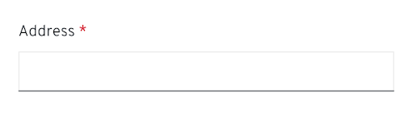

A form is a group of elements used to collect information from a user. Forms can appear in a variety of contexts, like inside a page, in a modal, or in a wizard, depending on the use case.  Some form examples include a log-in form, a registration form, a settings configuration form, or a survey.

[View form demos](/documentation/core/demos/basicforms)

## Form elements

Most forms will contain the following basic elements:

1. **[Labels](#labels):** Labels let users know what information they should submit in each form field.
2. **[Text input/text area](/design-guidelines/usage-and-behavior/text-input):** These areas provide spaces for users to enter text.
3. **[Data inputs](#data-inputs):** Data input provides a way for users to submit any information that is not freeform text, such as checkboxes, radio buttons, and dropdowns.
4. **[Buttons](#buttons):** Buttons enable a user to submit or exit a form.

## Designing forms
### Form Content
Think of a form as a conversation between your application and your user. Apply the following principles to organize and craft content for your forms:

#### Focus on the task and context

Be sure you understand what task your user is trying to accomplish with this form, and consider how they’re thinking about that task. Ask yourself: 
* What are they trying to achieve?
* What kinds of questions will they have?
* Where might they get stuck?

#### Form writing guidance
Start by writing out the conversation you might have with someone if you were guiding them through the task. This exercise can help you organize your form, name your fields appropriately, better understand the context of the task, and write in a more natural way.

**Use your understanding of context to plan your content hierarchy:**
* **Include the most critical information in the field label.** Answer the most basic question first: What data do I need to provide here? The field label you choose will depend on the context of your form. Field labels should be unique and identify all the information that is being collected.
* **Include critical secondary information as helper text.** Critical secondary information is information a user must have in order to provide the right input. For example, a user creating a name for a new asset may need to specify a unique name for that asset. Letting the user know this up front helps avoid unnecessary errors.
* **Include background information/context as field-level help in a popover.** For example, you could use this type of help to define an unfamiliar term or concept that a novice user might not be familiar with. 
**Never hide critical information in a popover.**
* **Use natural language.** Again, think of a form as a conversation with your user. No one wants to have a conversation with a robot.

### Data inputs
PatternFly provides a variety of input components that enable a user to make a selection. Each component was created to serve a specific use case.

#### Switch
Use a switch to toggle between two different states.

#### Radio buttons
Use radio buttons when users can only choose one option from a list of two or more mutually exclusive options. Selecting a different radio button will automatically deselect the previously selected option. If you have more than 5 options to present to the user, use a select list.

#### Checkboxes
Use checkboxes to enable users to select any number of items from a list. The user could select all of the available options, some of them, or none. If you have more than 5 options to present to the user, use a select list.

#### Select lists
Use a select list to enable users to select one or more options from a list of options. Select lists can be configured to enable users to select one option (single select) or multiple options (multi-select) depending on the use case. Use a select list when you have more than 5 options to present to a user.

Learn more about data input variations in the [data input design guidelines](/design-guidelines/usage-and-behavior/data-input/).

#### Data input arrangement
Arrange radio buttons and checkboxes vertically or horizontally depending on space considerations.  We suggest the following:

* In cases where saving vertical space is important and there are three or fewer items, consider placing in a horizontal list.

    
    

* In cases where there are more than three items and you want to make it easier to quickly scan the list of options, stack them vertically.

    

 * If you have space constraints (and your labels are short) you can also use a multi-column grid.

    

### Labels
Always provide labels for text and data input so that users understand what information is being requested of them. Labels can be aligned at the top or to the left of an input, although top alignment is preferable for the following reasons: 
* Saves horizontal space
* Allows for more responsive designs
* Assures closer proximity to text fields, aiding with wrapping when necessary 
* Results in easier scanning of the form fields

Whichever approach you use, we recommend that you maintain consistency throughout an application.

#### Top-aligned labels

Use top-aligned labels by default. Top-aligned labels provide a consistent left edge and close proximity between label and input. Top-aligned labels also offer the most horizontal area for long labels.

#### Left-aligned labels

Left-aligned labels are another available form option. They are useful for layouts with more horizontal space than vertical. However, as a general rule, they should be avoided in favor of top-aligned labels.

To accommodate mobile viewports, left-aligned labels should responsively adjust to a top-aligned layout for smaller viewports.

#### Checkbox and radio button labels
Checkboxes and radio buttons have a different labeling convention, where the option labels should be aligned to the right of the input control. 

#### General labeling guidelines
* Use sentence-style capitalization for all text elements except: product names, proper nouns and acronyms. Sentence-style capitalizes only the first word of each sentence and proper nouns, like names.
* Always provide a label for input components.
* Labels should clearly state the required input.
* **Do not** use a colon after the label name.

### Required fields
A required field should be indicated with an asterisk ( * ) to the right of the field label.

If **all fields** on a form are required, do not use an asterisk for every field. Instead, provide a message at the top of the form stating, "All fields are required." If all fields are optional, the message should state, "All fields are optional."

### User help
There are 3 different ways you can help a user with filling out a form: placeholder text, helper text, and popovers.

#### Placeholder text
Placeholder text is text inside a form field that provides an example of the required or recommended format for text input. For example, placeholder text for a date might be “MM-DD-YYYY” to indicate the formatting order the date should be entered in. Note that it should not include crucial information, as it disappears as soon as a user starts typing. 

For accessibility reasons, you should always precede placeholder text that is in example form with "Example," followed by a space like "Example, (555) 555-5555" for a phone number example or "Example, 491" for a security code example. This will ensure that users with screen readers will know the difference between the form label and the placeholder text. Placeholder text that does not use an actual example, like “MM-DD-YYYY,” does not need to be preceded with “Example.”

**Usage**
* Use placeholder text when the requested data type might be unfamiliar or the field requires the user to provide data in a specific format. 
* Try to limit the usage of placeholder text to unfamiliar input types or specific syntax requirements (like a specific date format or number format). 
* Keep placeholder text brief, and only use it when necessary. 
* **Do not** use placeholder text as a replacement for field labels, or when the information is critical for users to see while they are filling out the field.

#### Helper text
Helper text is permanent text below a form field that helps a user provide the right information, like Enter a unique name. 

**Usage**
* Helper text should be kept concise
* Helper text should be specific to the input and not the label.
* If there is specific information about the label it should be with the label. 
* If needed, helper text can wrap to two lines, but it should never extend past the width of the input field.
* Keep helper text concise and avoid exceeding the length of the input.

#### Popovers
Popovers are content boxes that are used for fields that might require additional background or explanation. You can also use a popover to link to external help pages or other related information. In forms, popovers are indicated by an unfilled question mark circle that a user can click on to reveal the information. They should be placed to the right of a form label. 

 

**Usage**
* You may use popovers for content that requires formatting like numbered or bulleted lists.
* Use popovers to guide users as to where they can find the information needed.
* Use popovers for content that requires you to include buttons, links, or images. 
* **Do not** hide critical information inside a popover that users would need in order to complete their task. 

For more information on user help, see our [embedded assistance guidelines](/design-guidelines/usage-and-behavior/embedded-assistance).

### Use progressive disclosure
Use progressive disclosure to hide and show fields based on the users’ selection. This approach keeps the workflow short and allows the user to focus on only the fields relevant to them. It also avoids using color to indicate whether or not a field is available, making it suitable for visually impaired users.

 

## Errors and validation
When a form field submission results in an error, let users know as soon as possible. Always present error states on the form using field level errors whenever possible. The error state you can use will depend on whether validation happens on loss of focus or on submission. When an error occurs, any placeholder text will no longer be visible as it will be replaced by the user’s input. Additionally, field level errors will replace any existing helper text until the error is fixed. Therefore, it is important that your error message explains what the user can do to fix it, beyond stating that there is an error.

For example, instead of simply telling the user there is an “invalid input”,  error messages should specify the correct format to re-write the input in such as “Date format must be MM-YY-DD”.

 

### Validation on loss of focus
Validation on loss of focus can be performed as soon as a field loses focus. It alerts users of errors or issues immediately after they complete their input, through inline validation, allowing users to quickly see and address issues.

Some common use cases include:
* A user entering data in an invalid format.
* A user leaving a required field blank.
* A user leaving a required field incomplete.

### Validation on submission
Validation on submission is performed when the user attempts to submit a form. In this scenario, the user completes the form in its entirety and the page is reloaded with any errors detected. 

For validation on submission, use an [inline alert](design-guidelines/usage-and-behavior/alerts-and-notifications#inline-alerts) along with field level errors wherever possible to make it simple for the user to quickly identify areas that need to be fixed.
Notifications should describe the error and help users solve the problem.

## Form formatting
### Spacing
There should always be 24px spacing underneath every form input. If there is helper text, the 24px spacing should start after the helper text. Additionally, the spacing between data inputs like checkboxes and radio buttons, for example, should also be 24px when on the same line and 24px when the options are presented on top of one another. For more spacing information, read the [PatternFly spacer guidelines](/design-guidelines/styles/spacers#considering-line-height-and-padding).

### Buttons
#### Placement
Buttons to submit the form should always be placed to the bottom left of the form and be left-aligned with all the form fields. Buttons should be placed 16px apart, no matter where the form is placed. This includes when the form is inside a page, inside a wizard, or on a card. This solves for a number of issues outlined in the [Buttons documentation page](/design-guidelines/usage-and-behavior/buttons-and-links#button-placement). 

Buttons for other actions outside of submitting or cancelling the form may be placed elsewhere depending on your use case.

#### Button accessibility
There are times where multiple forms may live on the same page, which means that there may be multiple submit buttons. Although fully sighted individuals can easily identify which button submits which form, this is not the case for screen reader users who would not be able to identify between actions that are labeled the same. For that reason, it is critical to incorporate the name of the form, or some type of unique context, into the accessible name that's used for the submit button. For example, if there was a form titled "Create account,” the submit button could read "Submit form.” However, the accessible name could be "Submit create account form" so that the submit button can be distinguished from another in the same document. This will allow the user to have more context, helping fill the gaps for any element that may have multiple instances on the same page.

#### Enabling and disabling buttons
* Form submit buttons should be disabled until a user starts filling out the form or edits it in any way.
* For short forms like wizards, disable submit buttons until all conditions required to complete the form are met — this reduces the need to return validation errors due to incomplete submissions.
* For long scrolling forms, do not disable the submit button — the missing field and submit button might not be visible on the screen at the same time.
* Once a user has submitted a form, disable the submit button while processing is taking place to avoid duplicate submission.
* Use feedback messages and progress indicators like spinners or progress bars if the time to process the form might exceed users’ expectations.

### Forms in a page

#### Placement
Forms in a page should be left and top aligned in the content area of a page. There should be a minimum of 24px padding around the contents of the form and the neighboring elements.

#### Width
Generally, it is up to you to decide how wide you want your form to be, but here are some guidelines and recommendations:
* The width of your form should generally reflect the length of the content that's being inputted.
* Your form width should be as wide as the widest input field in the form. 
* If your input fields are all very long, the maximum suggested width is 880 pixels. However, you should use your best judgement based on the context and content of the form. Having a form that is 880px wide is usually not necessary.

Note that all input fields in your form will be the same length. The only exception being in a [multi-column form](#multi-column-forms), where you may have two or more adjacent fields in a single line. In that case, the form inputs will share the available width on that line.

### Forms in wizard
Similar to an in-page form, forms in wizards should be aligned to the left of the content area and have a minimum of 24px padding around its contents and the neighboring elements. This would look the same whether you are using an in-page wizard or a modal wizard.

Additionally, error validation for a form in a wizard’s page should occur when or by the time the user clicks the “Next” button. You should not wait until the user has completed the whole wizard before telling them where possible errors lie.

### Forms in a modal
Forms in a modal should be horizontally centered with the modal background and fill up the modal width, leaving 24px between the form contents, and the modal background edges.

### Multi-column forms
Multi-column forms are forms that can have multiple inputs on a single form line. You can create a multi-column form using any of the [layouts](/documentation/core/layouts/bullseye) offered in PatternFly, such as the [Grid](/documentation/core/layouts/grid) or [Flex](/documentation/core/layouts/flex) layouts.

#### Usage
Multi-column forms can be useful when you have limited vertical space. However, as a general rule, PatternFly recommends only using multi-column forms if you have extra space and avoiding them otherwise. They can be more confusing to the user and increase the chances of a user missing out on a form field.

If you do decide to group certain columns together, they should be organized so that field information on the same line is related to one another. Common cases for this include:
* First name, Middle initial, Last name
* City, State, Zip code
* Credit card number, Expiration date, Security code

You should never have multi-column forms that read like a book, where you finish the left side of the form first, then move on to the right side. The form itself should still be filled from top to button and should not have two unrelated fields on the same line.

## Related components and demos
The PatternFly components listed can be used in a number of ways to build forms to suit specific needs or use cases.

**HTML/CSS components**
* [Form](/documentation/core/components/form)
* [Button](/documentation/core/components/button)
* [Check](/documentation/core/components/check)
* [Content](/documentation/core/components/content)
* [Dropdown](/documentation/core/components/dropdown)
* [Form control](/documentation/core/components/formcontrol)
* [Input group](/documentation/core/components/inputgroup)
* [Popover](/documentation/core/components/popover)
* [Progress](/documentation/core/components/progress)
* [Switch](/documentation/core/components/switch)
* [Tooltip](/documentation/core/components/tooltip)

**React components**
* [Form](/documentation/react/components/form)
* [Button](/documentation/react/components/button)
* [Checkbox](/documentation/react/components/checkbox)
* [Dropdown](/documentation/react/components/dropdown)
* [Progress](/documentation/react/components/progress)
* [Radio](/documentation/react/components/radio)
* [Select](/documentation/react/components/select)
* [Switch](/documentation/react/components/switch)
* [Text area](/documentation/react/components/textarea)
* [Text](/documentation/react/components/text)
* [Popover](/documentation/react/components/popover)
* [Text input](/documentation/react/components/textinput)
* [Tooltip](/documentation/react/components/tooltip)
