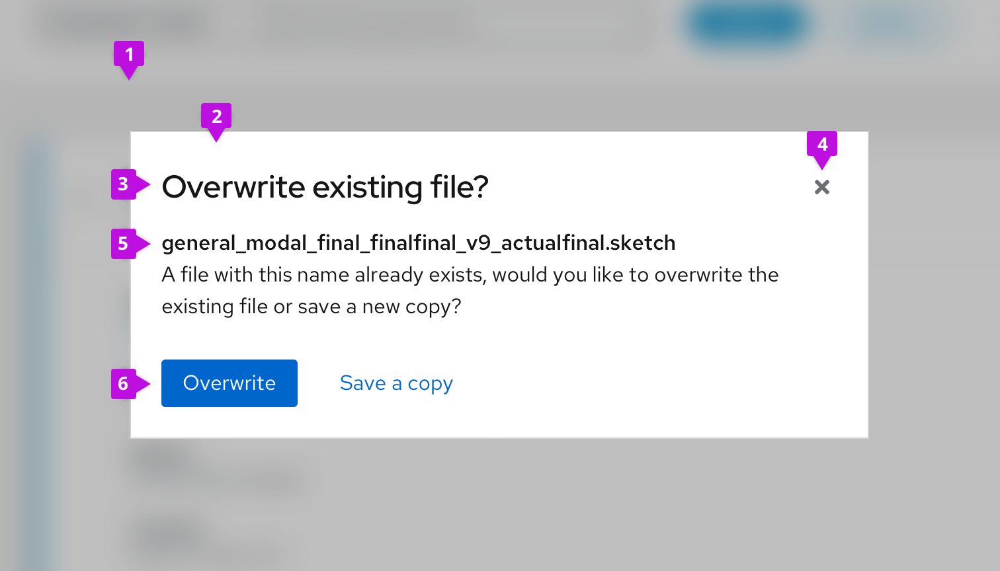
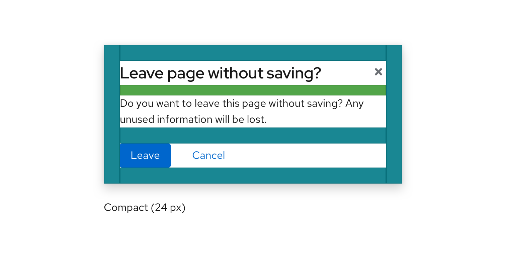
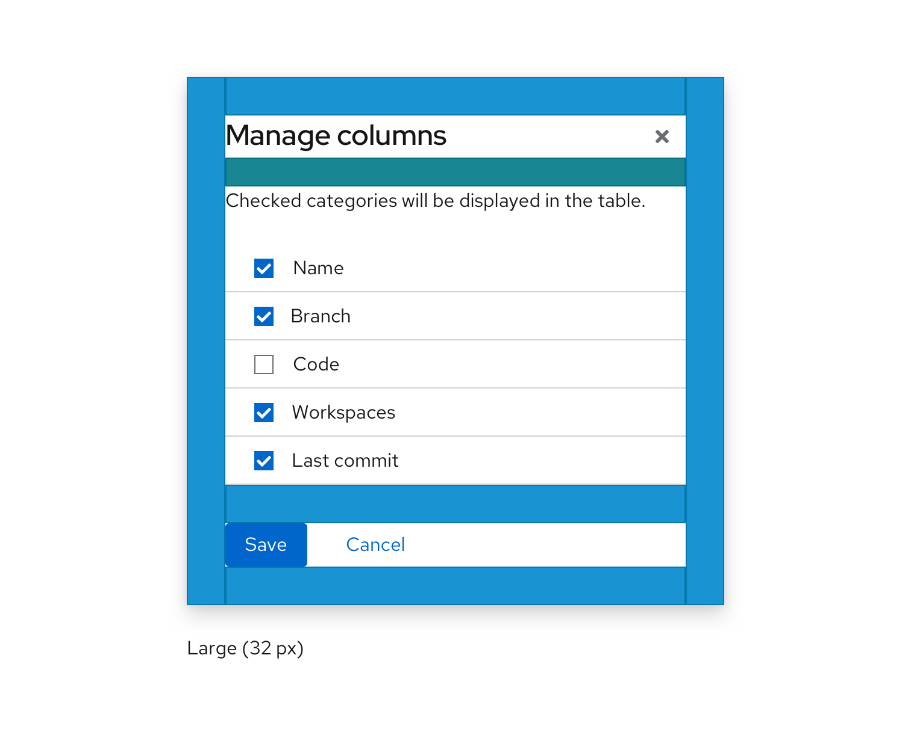
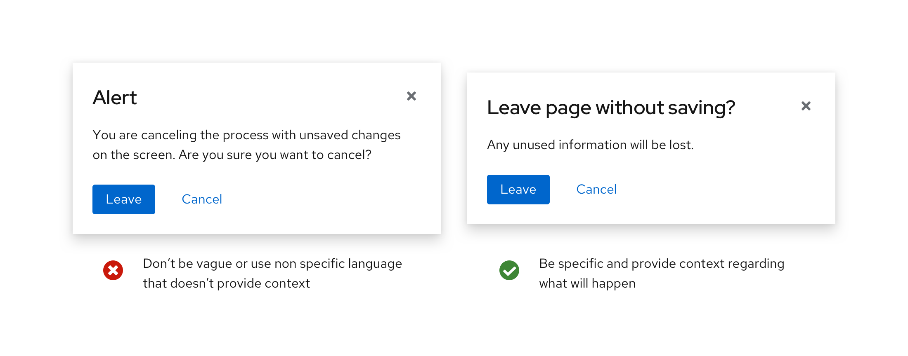
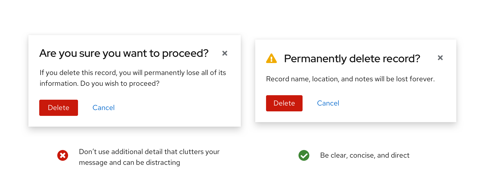
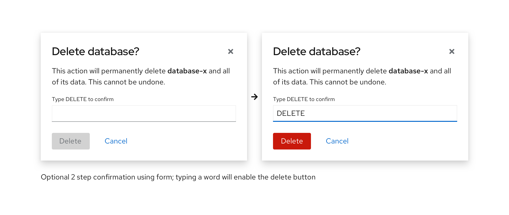
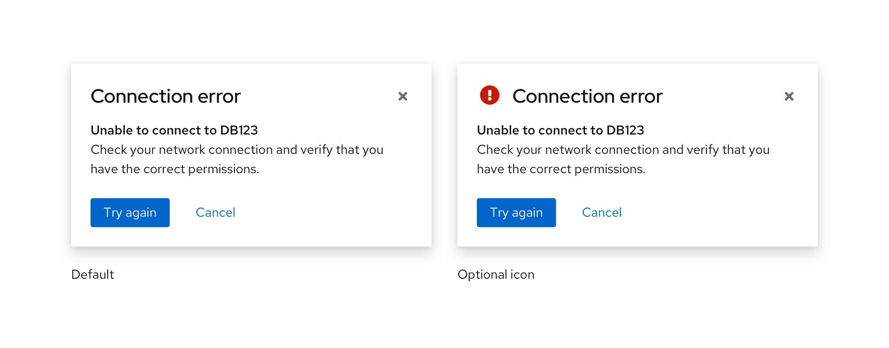

Use modal dialogs to load and display important information without navigating away from the current page.

## Primary elements

1. **Backdrop**
2. **Modal box**
3. **Title:** Concisely convey the purpose of the modal.
4. **Close**
5. **Content area**
6. **Buttons:** Enable a user to confirm, submit, or exit. Modal dialogs can include multiple action buttons, but should be limited to one primary button

### Spacing
#### Compact
 

The compact modal dialog uses a spacing of 24px. Use this for smaller modals that don’t contain much content.

#### Large

The large modal dialog uses a spacing of 32px. Use this for larger modals that contain a lot of content (code previews, forms, tables...).

## Usage
### When to use
Use a modal dialog when information is critical and requires user input or attention.
Use modals to:

* [Validate user decisions](#validate-user-decisions)
* [Report errors](#report-errors)
* [Provide the result of a task or state of an application](#provide-the-result-of-a-task-or-state-of-an-application)
* [Get required user input](#get-required-user-input)

### When not to use
Modal dialogs interrupt user task flow and should be avoided for any information that is not critical to user success.

### Types of modals
#### Validate user decisions
Use a confirmation dialog to validate user decisions and communicate consequences. Confirmation dialogs need to clearly restate the action the user is trying to take and explicitly outline the consequences of that action. They should be clear, concise, and direct. Give the user the important information first—additional detail like “Are you sure?” clutters your message and can be distracting.

Depending on your design template, follow this format for confirmation dialogs:
* **Headline:** A headline is usually phrased as a question. Include important keywords (like “permanent”) in the headline.
* **Body text:** Body text gives information about the action’s consequence.
* **Buttons:** Buttons allow a user to answer the headline question. These can simply be “yes” or “no,” but adding some context increases clarity—especially when skimming.

**Note:** Since confirmation dialogs disrupt user task flow, do not provide confirmation dialogs for actions that are easily reversed or insignificant.

##### Confirm a non-destructive action

Provide buttons on confirmation dialogs that make it simple for users to understand and confirm their choices. When choosing button labels, use descriptive verbs that clearly indicate the consequence of a selection, like Delete, Save, or Create. Avoid vague labels like OK or Done.

Ambiguous title and button labels make it more difficult for the user to understand their options and make a decision. Descriptive title and button labels make it easy for the user to scan the content and make a decision quickly.

##### Confirm a destructive action

If an action is difficult or impossible to undo, a warning icon can be incorporated into the modal to add emphasis. If an action will seriously impact the system and cannot be undone, use a destructive style button. Otherwise, use a primary button.

Sometimes it is necessary to require an additional confirmation with a destructive action. An example using a form field can be seen below. In order for the destructive action to become actionable, the user needs to type in a word or phrase to make the button active.

#### Report errors

Use error dialogs to inform users of problems interrupting normal or expected behavior.
An error message should be actionable, human readable, and answer the following questions:
* What is the problem?
* Why did it happen?
* How can I fix it?

Never blame the user. Use passive voice where appropriate to avoid assigning blame.
* ⛔ You put in the wrong password.
* ✅ That password wasn’t recognized OR
* ✅ We didn’t recognize that password.

#### Provide the result of a task or state of an application

Use passive dialogs to communicate critical information like the status of an application or result of an action. The content of a passive dialog should be important, immediately relevant, and either lead to or require action on the user’s part.

Some usage examples include:
* Notifying a user that an operation may take a long time to complete
* Notifying a user that a critical process is complete

**Note:** If information is not critical, don’t use a passive dialog. Instead, use inline notifications or toast notifications.

#### Get required user input
Sometimes users may need to provide additional input in order to complete an action. In this situation a form or other type of element may be incorporated into the modal. An example of this use case is the [modal wizard](/documentation/core/demos/wizard).

### Content
* Clearly restate the action the user is trying to take and explicitly outline the consequences of that action.

* Provide button labels that make it simple for users to understand and confirm their choices. Use descriptive verbs that clearly indicate the consequence of a selection, like Delete, Save, or Create. Avoid vague labels like OK or Done.

* Use descriptive title and button labels so the user can scan content and make a decision quickly. Ambiguous title and button labels make it more difficult for the user to understand their options and make a decision.

* If the modal needs to convey the importance of information visually, icons can be added.

See our [content guidelines](/design-guidelines/content/writing) for additional guidance.

#### Icon use in modal dialogs

| Icon | Use case(s) | Usage |
| ------------- |-------------|-------------|
|  <i class="fas fa-exclamation-triangle" aria-label="warning" />  | **Warning:** Caution/ Warning | Use on confirmation dialogs or passive dialogs to indicate a higher level of urgency and importance.|
|  <i class="fas fa-exclamation-circle" aria-label="critical warning" />  | **Critical Warning:** Information will be deleted/permanent action  | Use on confirmation dialogs or passive dialogs to indicate the highest level of urgency and importance. |
|  <i class="fas fa-info-circle" aria-label="acknowledgement" />  | **Acknowledgement:** Inform the user of an action or result  | Use on confirmation or passive dialogs to indicate a lower level of urgency. |

## Components and demos used
The PatternFly components listed in the following sections can be used in a number of ways to suit specific needs or use cases. We’ll explore several examples in this documentation.

**HTML/CSS components**
* [Modal](/documentation/core/demos/modal)
* [Modal box](/documentation/core/components/modalbox)
* [Button](/documentation/core/components/button)

**React components**
* [Modal](/documentation/react/components/modal)
* [Button](/documentation/react/components/button)
