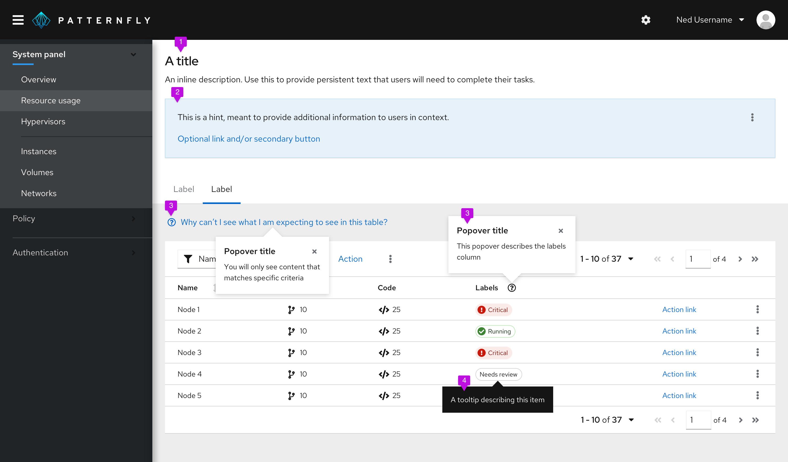
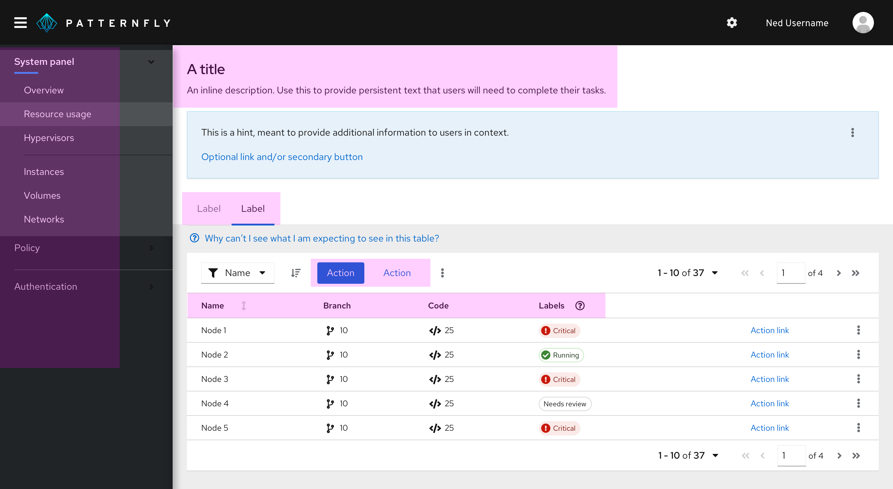
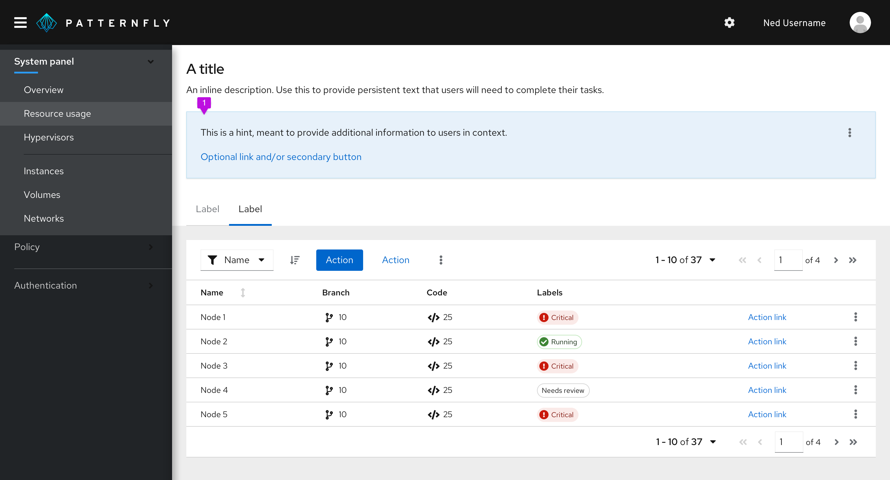
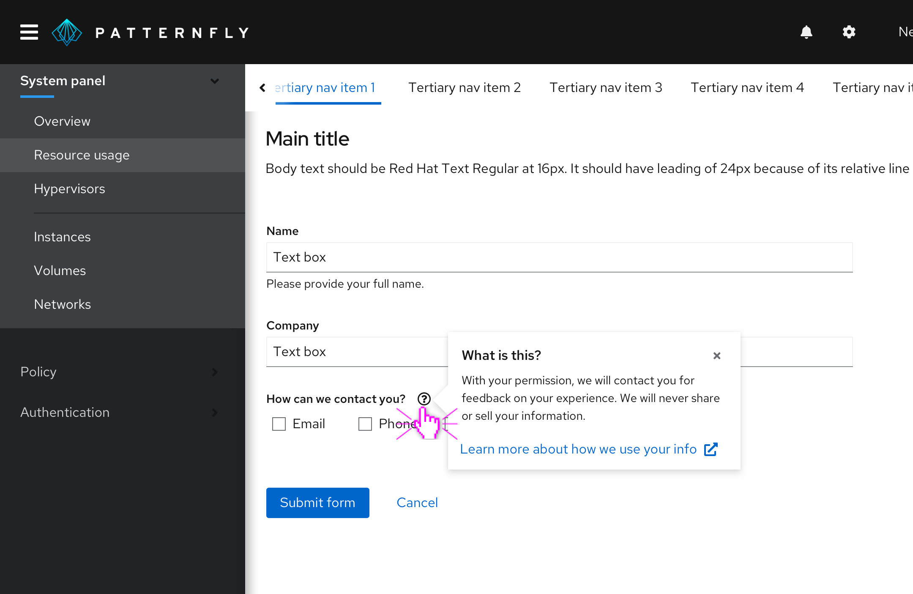
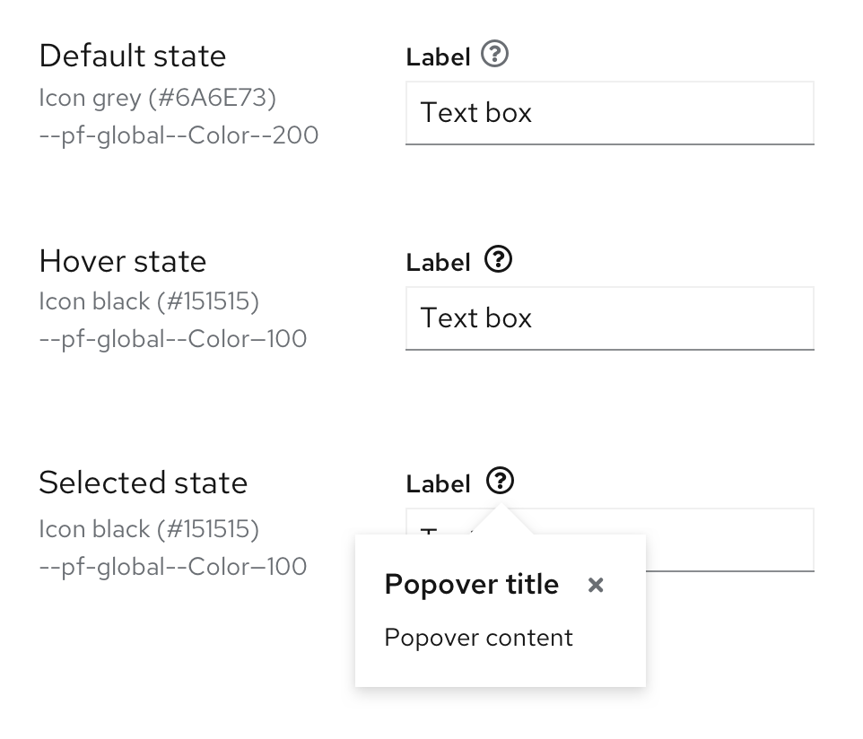
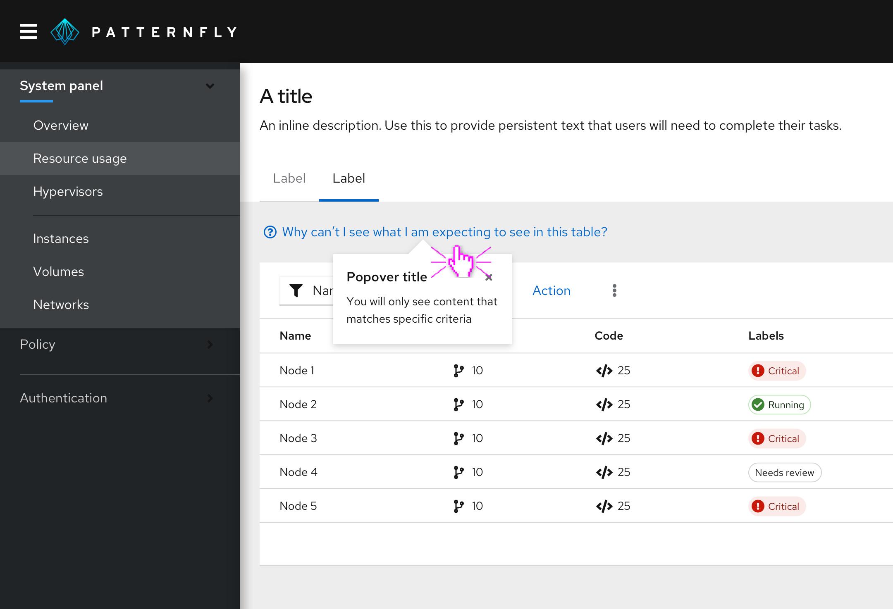
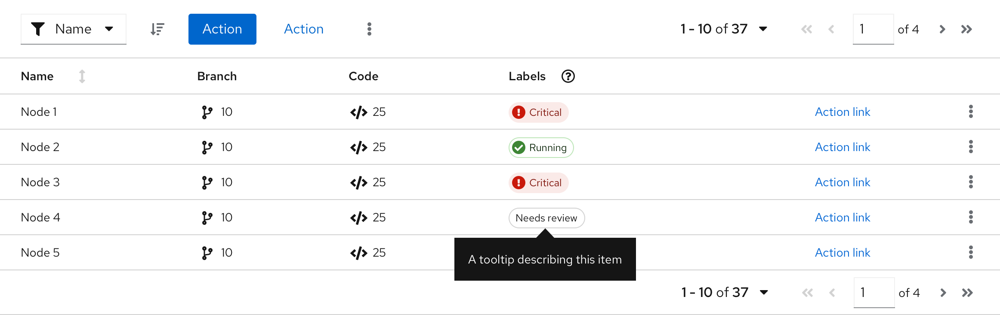
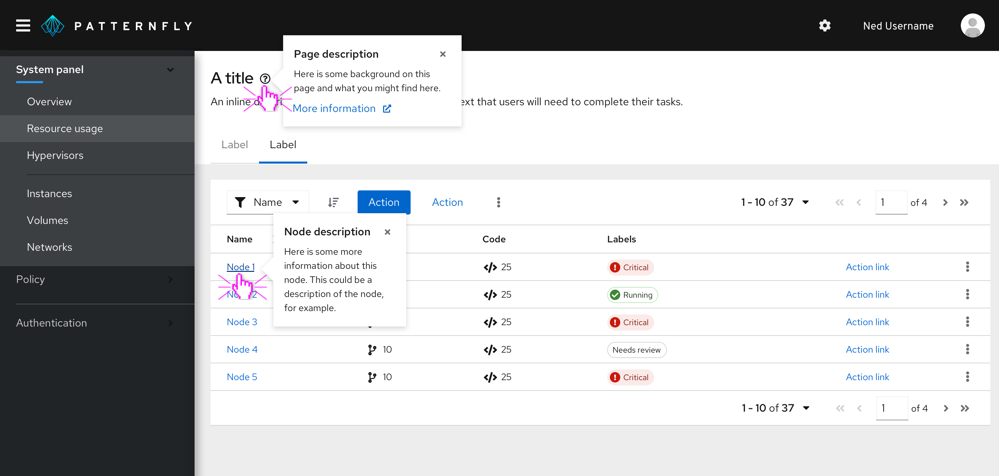

Use on-screen help to provide additional assistance for users in context. On-screen help should be provided in a way that enables the user to find the information they need at the moment they need it, while completing a particular step or task.

## Principles
**Use thoughtfully and sparingly**

Never use on-screen help as a substitute for usable and intuitive design. On-screen help should work to support good user experience design.

**Assume intermediate proficiency**

Assume the user has an intermediate level of proficiency in using your application.  As such, avoid making assistance too novice level or too reliant upon expert-level knowledge.

**Keep your content hierarchy in mind**

Plan your content hierarchy to provide the right content in the right place at the right time. You can think about content hierarchy in three levels:

* **Level 1: critical information a user must have in order to complete a main task.** This information should be available persistently through titles, headers, inline descriptions, and labels.
* **Level 2: information that supports users with additional context as they complete their tasks.** This information is nice to have, but not critical to task completion and is likely needed by just a subset of users. Provide Level 2 content using progressive disclosure methods like popovers or tooltips.
* **Level 3: information that enables users to find and access external resources like support or documentation.**

## Forms of on-screen help and how to use them

1. [Persistent text](#persistent-text)
2. [Hints](#hints)
3. [Popovers](#popovers)
5. [Tooltips](#tooltips)

### Persistent text
Persistently available text like titles, headers, descriptions, and labels enables the user to understand where they are, what they are doing, and what they need to do to use the interface and complete their task.

**Usage**

When crafting persistent text, target users with an intermediate level of proficiency and defer novice or expert content to other levels of the content hierarchy. For example, a description beneath a title that explains the purpose and goals of a page might make sense on a form or wizard that users are only going to access occasionally, but can be too much for a dashboard that users will see every time they log in.

**Examples**
* Navigation items and page titles
* Chart titles and labels
* Wizard or modal titles
* Form titles, descriptions, and labels
* Button labels
* Filter labels

### Hints
Hints provide a one-step reminder, explanation, or call to action for a page or modal.

**Usage**

Use hints to help the user get more out of the interface. Hints can provide information about an interaction or prerequisite step that might not be obvious otherwise. 

### Popovers

Popovers provide helpful contextual information at the moment users need it.

**Usage**

Use popovers to anticipate and answer questions for the user, help explain unfamiliar terms, or provide context around a task. You may also link to further information inside a popover.

Always use a question-circle icon when using the popover pattern to define a term or explain a concept. When in the UI, the default icon color is grey. Once the user hovers or clicks over the icon to open the popover, the icon turns black.

You may also use popovers with link text. For example, when there is no obvious UI element to add a popover to, you may pose a question, preceded with a question-circle icon to alert the user that they can find more information by clicking on it. 

Popover text should adopt link button styling and always be preceded by a question-circle icon, which should be blue, following the link button styling. Clicking on the link text should trigger a popover that provides an answer to the question posed in the hint text.

Popovers are triggered by a click and dismissed in one of the following ways:

* The user clicks the exit icon
* The user clicks an action button inside the popover
* The user clicks anywhere on the screen outside the popover

Never hide critical information in a popover. Critical information is any information the user *must have and will always need* in order to complete a task.

**Common use cases**
* On form field labels
* On titles, headers, other kinds of labels
* In a table column header

### Tooltips
Use tooltips to define new or unfamiliar UI elements that aren’t described directly in the user interface, or to get additional data from a data point or element in a chart or table.

**Usage**
* Tooltips should provide new and valuable information. Never use a tooltip to repeat information already available in the UI.
* Don’t use tooltips with question-circle icons to present contextual information in forms and other areas. Instead, use a popover.

**Common use cases**
* On icons
* In charts

**Guidelines**
* Keep your tooltips clear and concise. Use the fewest number of words you can without sacrificing meaning.
* If the tooltip is a full sentence, end it with a period.
* If information is needed for a user to complete a task (like a password character requirement), don’t hide it in a tooltip. Display it on the page instead.

**Accessibility**

Every time a user with a screen reader tabs into a field with a tooltip, the tooltip will be read out to them. 

### When to use a tooltip versus a popover

Both tooltips and popovers allow users to get more information in context. However, they differ in two ways:
 
 1. Tooltips are used for identification purposes, while popovers are used for added description or information in context. 
 2. Tooltips appear on hover, while popovers appear on click

**Use tooltips for:**
* Short descriptions of an item or to identify an item, like an icon button
* Content that is no longer than 1 or 2 lines

**Use popovers for:**

* Longer descriptions
* Formatted text
* When you would like your in-context help to include pictures, actions, or links 

## Related components and demos
**HTML/CSS**
* [Button](/documentation/core/components/button)
* [Content](/documentation/core/components/content)
* [Popover](/documentation/core/components/popover)
* [Tooltip](/documentation/core/components/tooltip)

**React**
* [Popover](/documentation/react/components/popover)
* [Tooltip](/documentation/react/components/tooltip)
* [Button](/documentation/react/components/button)
* [Text](/documentation/react/components/text)
