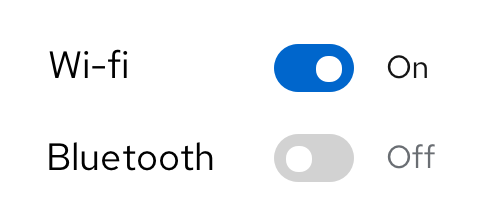
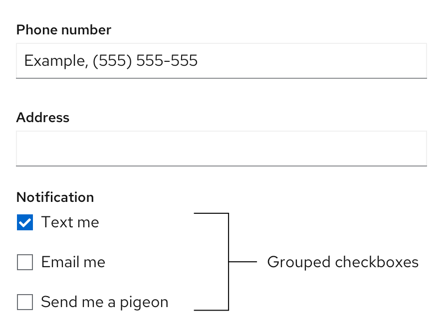
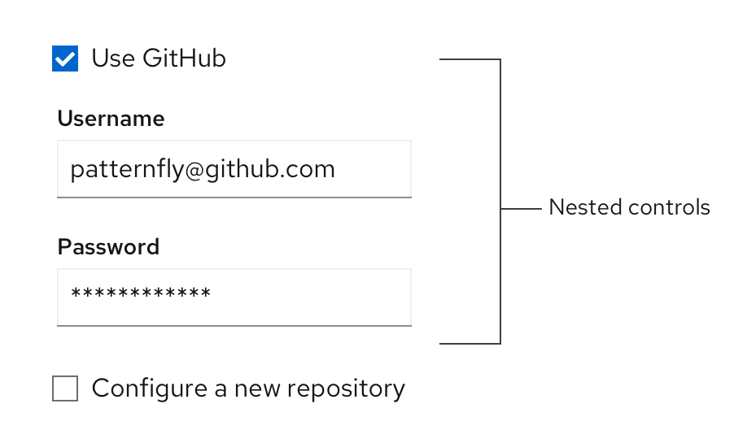
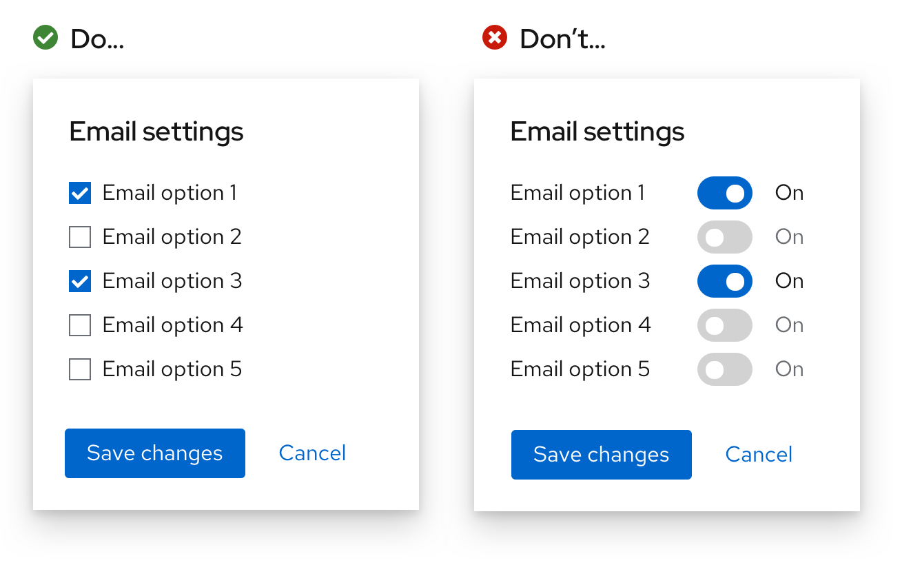
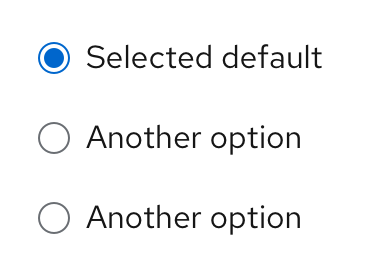
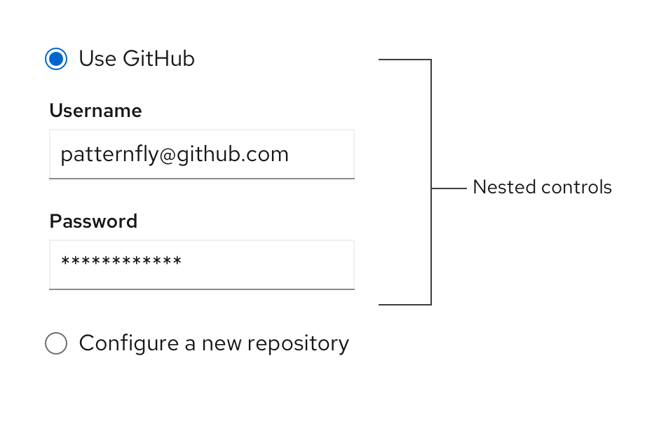
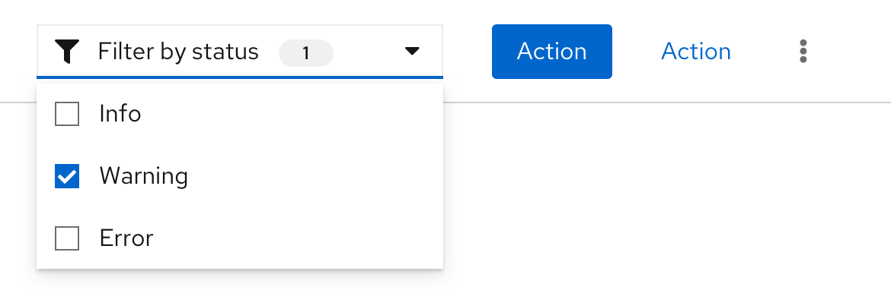
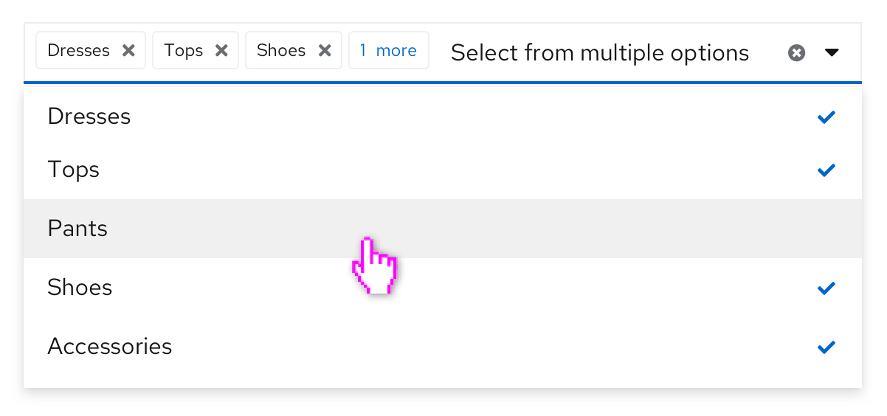

Selection controls allow the user to provide information by selecting from a known set of options or a constrained format/value range.

**Selection controls:** 
[Switch](#switch), [Checkboxes](#checkboxes), [Radio buttons](#radio-buttons), [Select lists](#select-lists). 

## Usage
Selection controls enable users to select from a predetermined set of options. Choose controls based on the following considerations:

* How many options do you have to present to the user?
* How many items does the user need to be able to select?

### Switch
A switch allows users to instantly toggle between an enabled or disabled state. It is assumed that when a user toggles a switch, the change will save automatically without the need for additional action (like clicking a “Save” button).

**General guidelines**
*  Add a label in front of your switch to specify what is being switched on or off (example, wi-fi, bluetooth).
* Don’t use a switch if the options you’re presenting to the user are anything other than “on” or “off.” Instead, use radio buttons. 
* Depending on your use case, you may want to add labels to your switches for added clarity, like “on” and “off” to indicate to the user what setting they’ve switched to.

### Checkboxes
Checkboxes allow users to choose **one or more items** from a list of options.

You can also use a single checkbox to allow a user to enable or disable a feature or setting, along with a save button. 

**General guidelines**

* Use checkboxes if you’re presenting 5 or fewer options to the user. If you’re presenting more than 5 options, use a [select list](/design-guidelines/usage-and-behavior/data-input#select-lists) instead.
* Use checkboxes if the user can select multiple options. If the user can only select one option, then use radio buttons. 

**Labeling and alignment**

Checkbox labels fall to the right of the checkbox control. If placed vertically, all checkbox controls should be aligned with the left edge of other controls or input fields in the form or on the page. 

You can use headings to label a group of checkboxes. The placement of headings will depend on the layout of other content in the form or on the page you’re designing. For more information on how to arrange checkboxes, see the [forms documentation](/design-guidelines/usage-and-behavior/forms#data-input-arrangement).

You also have the option to use progressive disclosure by nesting other controls underneath a checkbox. The nested options would be enabled or disabled when the user selects or deselects a checkbox.

#### When to use switches versus checkboxes

The main difference between a switch and a checkbox is that a switch changes an option and saves it simultaneously, while checkboxes require a separate action such as pressing a “Submit” or “Save” button to save the selection. 

**Here are some guidelines for when to use a switch versus a checkbox:**

* Use checkboxes when the options do not save automatically and require the user to perform an additional action to save changes (in this case, pressing the “Save changes” button).

    

* Use a switch for situations where you are turning a series of one or more independent options on or off.

    

* Use checkboxes when you may have an intermediate state where you can select all, none, or some actions.

    

### Radio buttons
Radio buttons allow users to select **one item** from a list of options.

**General guidelines**

*  Use radio buttons when a user needs to make one mutually exclusive choice, and only one option can be selected at a time.
* A default option should always be selected for the user. If the user selects a different option, the default option should be automatically deselected.
* To enable the user to select a null option, provide a radio button with the label “None.”
* Use radio buttons if you’re presenting 5 or fewer options to the user. If you’re presenting more than 5 options, use a [single select list](#single-select). 
* If space is limited, you can also use progressive disclosure by nesting other controls underneath a radio button.

    

**Labeling and alignment**

Radio button labels fall to the right of the radio button control. You can use headings to label a group of radio buttons. The placement of headings will depend on the layout of other content in the form or on the page you’re designing. For more information on how to arrange radio buttons, see the [forms documentation](/design-guidelines/usage-and-behavior/forms#data-input-arrangement).

### Select lists
Select lists enable users to select one or more items from a list. Select lists should also be used when options are dynamic or variable. 

PatternFly offers several variations of select lists:
* [Single select](#single-select)
* [Checkbox select](#checkbox-select)
* [Multiple select](#multiple-select)
* [Typeahead](#typeahead)
* [Form select](#form-select)

#### Single select 
Single select lists allow users to select a single, mutually exclusive option. When the user selects an option from the list, the selection appears in the toggle.

#### Checkbox select
Checkbox select lists allow users to select one or more options from a known list of options, using checkboxes as a selection method. You may choose to have a badge display in the toggle to show how many items have been selected. A common use case for checkbox select lists is in a toolbar filter for a table or page, for example. 

#### Multiple select 
Multiple select lists allow users to select one or more options from a list, with the selected options marked with a blue check. It differs from the checkbox select in that each option selected by the user appears in the top display area as chips. Once the number of selections reaches a certain number (the default is 3, but you may choose to change this based on your use case), the regular chips will be replaced by a gray chip indicating how many more items were selected (for example, 1 more). 

#### When to use checkbox select versus multiple select 
Both the checkbox select and multiple select lists allow users to select multiple options from a list. However, there are some points to take into consideration when deciding which one to use.

**Use checkbox select when:**
* Horizontal space is limited.
* It is not crucial for the user to see their selections in the toggle itself.
* Using a select list inside a toolbar. Toolbars have limited space, and the user will already be able to see their selection as chips below the filter itself.  

**Use multiple select when:**
* Horizontal space is not limited
* It is useful for the user to see their selections from the toggle itself.
* In a form, where a user may benefit from being able to quickly scan their inputs before submitting

#### Typeahead
Typeahead allows users to narrow a displayed list of options by typing into the input field. Type ahead is  recommended for lists with more than ten options and is available for single and multiple select lists. Although the typeahead within toggle functionality does not exist for the checkbox select, there is an option to add a typeahead capability within the menu of items if needed, as seen in this [grouped checkbox input with filtering](/documentation/react/components/select#grouped-checkbox-input-with-filtering) example.

When providing fewer than 5 options, you can use [radio buttons](#radio-buttons) or [checkboxes](#checkboxes) to display all options to the user simultaneously if you don’t have any space constraints.

#### Form select
A form select is a native select created by the browser, and it’s typically used within forms. If your use case only calls for simple selects, you may opt to use a [form select](/documentation/react/components/formselect). But if your use case requires more customization and capability, use a PatternFly [custom select list](/documentation/react/components/select). Just keep in mind that you should not use custom selects and form selects together in the same context, in order to maintain visual consistency in the UI.

## Related components and demos
**HTML/CSS**
* [Switch](/documentation/core/components/switch)
* [Check](/documentation/core/components/check)
* [Radio](/documentation/core/components/radio)
* [Select](/documentation/core/components/select)
* [Form control](/documentation/core/components/formcontrol)

**React**
* [Switch](/documentation/react/components/switch)
* [Checkbox](/documentation/react/components/checkbox)
* [Radio](/documentation/react/components/radio)
* [Select](/documentation/react/components/select)
* [Form select](/documentation/react/components/formselect)

