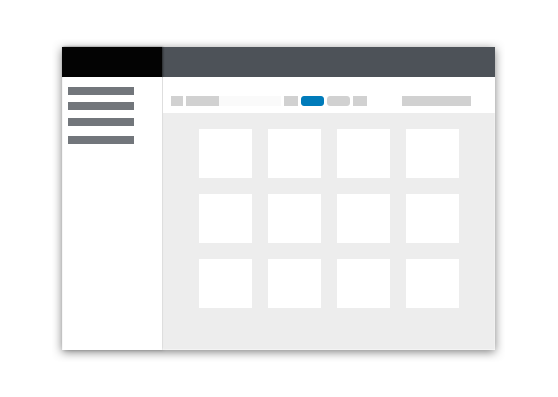
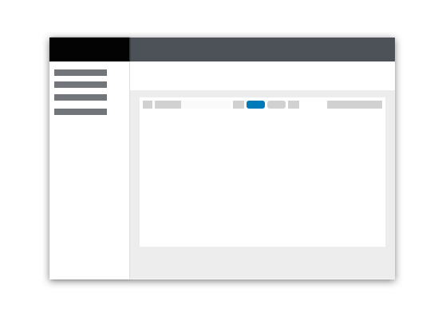
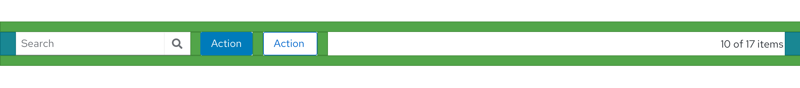
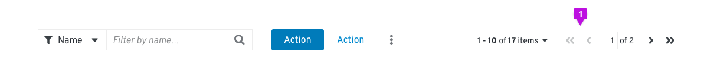

Toolbars can be included to allow a user to manage and manipulate a data set. Data can be presented in any valid presentation, a table, a list, or a data visualization (chart), for example. The PatternFly Toolbar component is a flexible layout system that accommodates a variety of configurations that can be adapted to your specific needs.

## Elements

The toolbar is a container for holding a variety of elements (toolbar items and groups) that are used to manipulate a set of data.

**Update to show padding**

All items should be centered vertically within the toolbar. There is a 24px of padding before and after the toolbar content.

### Toolbar items and groups
Toolbar items are individual components that can be placed inside of a toolbar. Often, it makes sense to group sets of like items to create desired associations and to enable items to respond together to changes in viewport width. The default spacing between items and groups is 16px, but this can be modified, if required.

#### Common toolbar items and groups

| Element | Description |
| ----------------------- | ------------------------------------------------ |
| **Bulk selector** | A Bulk selector can be added when you want to give users the ability to select multiple items within a page. Besides allowing the user to select and deselect all items on a page, other application specific options can be added in the dropdown. Bulk selection allows the user to select or deselect all items on a page and provide an indeterminate state that notifies the user when only some items are selected. Bulk selectors should always be the left-most element in a toolbar and has a 24px spacer to its right. |
| **Search filter** |A search filter combines an attribute selector with a search field to perform attribute-vale searches. See the [Filters](design-guidelines/usage-and-behavior/filters) documentation for more details. |
| **Filter group** | A filter group combines multiple select filters into a single group. See [Filters](/design-guidelines/usage-and-behavior/filters) for more information about available filters.|
| **Icon button group** | Actions or settings that are represented by icons can be added in an Icon button group. In the example, Sort and Export are represented as icons. |
| **Button group** | Any global actions that apply to selected data items are included left-aligned following filter and icon buttons. These may be placed within an [overflow menu](#Overflow-menus) component to collapse the group as the viewport shrinks. No more than two items should be exposed as buttons. Button labels should be limited in length to preserve horizontal space. |
| **Pagination** | When pagination is supported, a Pagination component will be included. Pagination will always be right aligned in the toolbar. If pagination is not used, substitute the item count for pagination control. For example, report “17 items” to represent the total number of items or “10 of 17 items” to indicate that 10 items were returned as the result of a filter event. |
| **Overflow menu** |An overflow menu is a component that can be used in a toolbar (or elsewhere) to group a number of actions that should be collapsed into a kebab at a certain breakpoint. In the toolbar, the overflow menu will commonly be used to group a set of actions that are intended to collapse into the kebab at smaller viewport sizes. |

### Toggle groups
A toggle group can be used when you want to collapse a set of items into an overlay panel at a certain breakpoint. This allows complex toolbars with multiple items and groups of items to be responsive. A toggle group is useful for containing filter controls, for example. When the toolbar responds to adapt to a mobile viewport, the contents contained in a toggle group will collapse into an overlay panel that can be toggled by clicking the Filter icon.

### Vertical dividers
When you have a large toolbar containing many groups of items, use a vertical divider to further
separate the groups visually.

**Update to show correct spacing**

## Usage
### Order of toolbar elements

**Update this example to show correct spacing of items and groups**

Within the toolbar, layouts may vary depending on the use case.
* When used, bulk selection should be the left-most element.
* Filters and global actions may follow.
* When pagination is used, it should be the right-most element.
* When pagination is not used, the item count should be the right-most element.

### Placement in a page

The toolbar should live as close to possible to the content it controls. For a card view, the toolbar should be placed inside of the page header, above the card grid. This arrangement is also recommended if the user may switch between views (e.g. view as cards or as a list).

For simple list and table views, the toolbar should always appear above the data set to which it applies. Toolbars should stretch to the width of the data view to which it applies, with the elements aligned in a horizontal row.

Note that there should be no spacers on the left and right edges of the toolbar if there are already padding spacers being used with whatever component the toolbar is placed within (e.g. cards).

### Multi-line toolbars
In most cases, toolbars should arrange elements in a single horizontal row. The PatternFly toolbar does allow for expansion to multiple rows when needed however. The following are some examples of when a multi-line toolbar may be needed.

#### Filtering

**1. Filter Chips:** When filters are applied, the toolbar will expand in height to make space for a row of filter chips. Upon clearing the applied filters, the toolbar will collapse to its default height.

#### Stacked toolbar
There may be situations where all of the required elements simply cannot fit is a single line. In this example, we want to expose multiple filter options as separate select lists. This is a good option when providing visibility to available filters is more important than optimizing space.

## Examples
**Basic toolbar**

The basic toolbar is sufficient for most cases. It includes filters, global actions, and item count. The Toolbar is shown here with an Attribute-Value (textbox) filter, but a variety of filter types may be used.
1. **Item count**: When a filter is applied, the item count will be updated to represent the filtered subset of items. For example, “10 of 17 items.” The item count should be the right-most element.

**Toolbar with pagination**

When pagination is needed, a pagination component can be used.
1. **Pagination:** When pagination is used, the pagination component replaces the item count. It should be the right-most element.

**Toolbar with filter chips**

When the current settings of the controls are not sufficient to convey applied filters, filter chips should be used.
1. **Filter chips:** When filters are applied the toolbar will expand and filter chips will be displayed on the second row. Users can clear all filters by clicking the “Clear filters” link, and the toolbar will collapse back into one row.

**Custom toolbar**

Custom toolbars can vary by use case. In the above example, the toolbar is primarily comprised of filters.

**Responsive toolbar**

The toolbar adapts to smaller viewport sizes by collapsing or hiding elements that take significant space, including filters and actions. On mobile devices, when used, pagination will be available from the footer, only.

In the above example, when the viewport size is reduced both the filter controls, contained in a toggle group, and the global actions, contained in an overflow menu, collapse to minimize the space required by the toolbar.

**Update this. Where did the sort icon come from?**

## Related components and demos
**Core HTML/CSS**
* [Data Toolbar (beta)](/documentation/core/beta/datatoolbar)
* [Overflow menu (beta)](/documentation/core/beta/overflowmenu)
* [Chip](/documentation/core/components/chip)
* [Chip group](/documentation/core/components/chipgroup)
* [Pagination](/documentation/core/components/pagination)

**React**
* [Data Toolbar (beta)](/documentation/react/beta/datatoolbar)
* [Overflow menu (beta)](/documentation/react/beta/overflowmenu)
* [Chip group](/documentation/react/components/chipgroup)
* [Pagination](/documentation/react/components/pagination)
