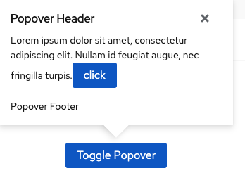

import { AccessibilityDatalist } from './accessibility-datalist.js';

## Accessibility
When it comes to accessibility, there’s always room to improve. That’s why this guide is a work in progress. Your feedback can make it better, so tell us what you think.  

Contribute to our [accessibility documentation](https://github.com/patternfly/patternfly-org) or [reach out to us](https://www.patternfly.org/v4/get-in-touch/)—we’d love to hear from you!

_“The power of the Web is in its universality. Access by everyone regardless of disability is an essential aspect.”_ — Tim Berners-Lee, W3C Director and inventor of the World Wide Web

When it comes to product experiences, no one should get left behind. That's why accessibility is so important in design and development. The goal of software accessibility is to remove barriers and create inclusive product experiences that work for everyone, regardless of ability.

Accessibility is best achieved when considered early in the design and development process. So if you contribute to PatternFly or use it for your products, familiarize yourself with accessibility first.


### Understanding users’ needs
Great user experiences don’t just happen. They’re designed, tested, and refined with the user in mind. To develop inclusive products, it’s important to understand the varying needs of a wide range of users and consider the assistive tools and methods they use. 

This section provides information to help you better understand and address the needs of these [different user groups](https://a11yproject.com/posts/myth-accessibility-is-blind-people/).

**Note**: Some users might fall into multiple groups, and some might use tools created for a different group.
<br />
<br />

**No vision:** <br />Users with no vision rely on screen readers to access web sites and applications. Often, screen reader users will navigate a page by browsing specific elements, like headers, links, or form elements. 
- **Tip:** Use semantic elements and check that labels are meaningful when pulled out of context.    

**Low vision:** <br />Users with low vision can have different needs depending on the nature of their visual impairment. Users may have difficulty with color differentiation, blurriness, or lack of vision in central or peripheral areas. 
- **Tip:** These needs mean that interfaces should not rely on color to communicate information, palettes need to have sufficient contrast, and layouts should be responsive when font sizes are increased.
<br />

**Motor:** <br />Users with poor motor control can use a range of devices to access contents. 
- Users who rely on a keyboard need elements that are keyboard accessible and highly visible when in focus. 
- Users who rely on a mouse or touch need target areas that are large enough to be hit easily.
<br />

**Cognitive:** <br />Users who have difficulty processing information benefit from well-written content. 
- Information should be clear, concise, and easy to scan. 
- Consider visual hierarchy, chunk content into short, related sections, and avoid long paragraphs.
<br />

These are some of the main user groups, but it is not an exhaustive list. Often “the Persona Spectrum”, coined by Microsoft, can be used to understand related mismatches and motivations across a spectrum of permanent, temporary, and situational scenarios. 

While accessibility tends to focus on those with disabilities, everyone benefits from accessible products. For example: 

- Accessible written content is easier to comprehend for people who aren’t fluent in the language and for people with low literacy levels. 
- Alternative text (alt text) makes images accessible to users with low bandwidth connections or with older technologies that can’t load the images. 
- Closed captioning benefits those in crowded areas, those teaching children how to read, or those learning a new language. 

There are plenty more examples we could include. Essentially, accessibility takes _all users_ into account.
<br />


### Experience parity

The PatternFly community believes all abilities should be treated equally. In other words, there should be parity in the experience of all users—one user group shouldn't be prioritized over the other. 

To help you achieve this, consider these guidelines:

- There should be parity among all input types: touch, mouse, and keyboard.
  - Don’t optimize the experience for one input type at the expense of another.
  - Contents that a user can interact with using a mouse should also be accessible using touch or keyboard.
  - Don’t show interactive elements on hover. Interactive elements that can display in a pop-up must display on click/touch/Enter events.
- There should be parity between the screen reader contents and visibly rendered contents (refer to the [first Note for aria-hidden](https://www.w3.org/TR/wai-aria/#aria-hidden).
- There should be parity between hover and focus events. Any information that’s available on hover for the mouse user should be available on focus for the keyboard-only user. It should also be available to the screen reader user using aria-describedby (refer to [Tooltips & Toggletips example from Inclusive Components](https://inclusive-components.design/tooltips-toggletips/)).


When building accessible user experiences, solving for one can extend to many. Humans are diverse and unique, and inclusive design takes that into consideration to create truly incredible products.  


<br />


## Accessibility and PatternFly

As a design system, PatternFly provides accessible building blocks to work with. We do our best to cover all areas that are within our control and take at least some of the accessibility work off your hands.

With constant enhancements to PatternFly, we maintain this accessibility through a combination of automated and manual testing. We use [aXe: The Accessibility Engine](https://www.deque.com/axe/) on our build to ensure that all components pass this accessibility audit before they’re added to PatternFly. 

We regularly audit keyboard accessibility with both manual testing and integration tests. We’re also aiming to provide full support for Voice Over as our main screen reader, but we still test our components through NVDA and JAWS. As part of our manual audit, every component is run through Voice Over to make sure they’ll be as accessible as possible in your products.

Our goal is to meet [level AA in the Web Content Accessibility Guidelines 2.1](https://www.w3.org/WAI/WCAG21/quickref/?currentsidebar=%23col_customize&levels=aaa). If you use PatternFly or contribute to PatternFly as a designer or developer, these are the items you can expect to be covered in PatternFly:


| Guideline  | Link  |  |  |  |  | Tested |
| --- | --- | --- | --- | --- | --- | --- | 
| Semantic HTML structures are used to accurately communicate the purpose and relationship of UI elements. | [WCAG 1.3.1](//www.w3.org/WAI/WCAG21/quickref#info-and-relationships) | `design` | `html` | `css` |  | Automated testing with axe and manual testing |
|Color is not the only method of communication. Providing meaning with color is supplementary to providing meaning with text. | [WCAG 1.4.1](//www.w3.org/WAI/WCAG21/quickref#use-of-color) | `design` | `html` | `css` |  | Manual testing and axe used |
| Colors used provide sufficient contrast | [WCAG 1.4.3](//www.w3.org/WAI/WCAG21/quickref#contrast-minimum) and [1.4.11](//www.w3.org/WAI/WCAG21/quickref#non-text-contrast) |  |  | `css` |  | Automated testing with axe |
| Font sizes can scale up to 200% without loss of content or functionality, and up to 400% without needing to scroll in more than one direction.  | [WCAG&nbsp;1.4.4](//www.w3.org/WAI/WCAG21/quickref#resize-text) and [1.4.10](//www.w3.org/WAI/WCAG21/quickref#reflow) |  |  | `css` |  | Manual testing |
| Styles that affect text spacing (line height, space between paragraphs, letter spacing, and word spacing) can be increased without loss of content or functionality. | [WCAG 1.4.12](//www.w3.org/WAI/WCAG21/quickref#text-spacing) |  |  | `css` |  | Manual testing and axe used |
| Contents that appear on hover and focus are dismissable, hoverable, and persistent. | [WCAG 1.4.13](//www.w3.org/WAI/WCAG21/quickref#content-on-hover-or-focus) |  | `html` | `css` | `js` | Manual testing | 
| All functionality is keyboard accessible. | [WCAG 2.1.1](//www.w3.org/WAI/WCAG21/quickref#keyboard) and [2.1.2](//www.w3.org/WAI/WCAG21/quickref#no-keyboard-trap) |  | `html` |  |  | Manual testing |
| Elements in the HTML and in the layout follow a logical order. | [WCAG 1.3.2](//www.w3.org/WAI/WCAG21/quickref#meaningful-sequence) and [2.4.3](//www.w3.org/WAI/WCAG21/quickref#focus-order) | `design` | `html` | `css` |  | Manual testing |
| Elements with focus are clearly visible. | [WCAG 2.4.7](//www.w3.org/WAI/WCAG21/quickref#focus-visible) |  |  | `css` |  | Manual testing |
| Flashing content does not flash more than three times in any one-second period, or the flash is below the general flash and red flash thresholds. | [WCAG 2.3.1](//www.w3.org/WAI/WCAG21/quickref/?showtechniques=231#three-flashes-or-below-threshold) |  |  | `css` |  | Manual testing|
| Functionality that uses complex gestures can also be operated with a single pointer without a path-based gesture. | [WCAG 2.5.1](//www.w3.org/WAI/WCAG21/quickref#pointer-gestures) | `design` |  |  |  | Manual testing |
| Pointer events can be cancelled.  | [WCAG 2.5.2](//www.w3.org/WAI/WCAG21/quickref#pointer-cancellation) | | | | `js` | Manual testing |
| Visible labels of UI components are either the same as the accessible name or used in the beginning of the accessible name. | [WCAG 2.5.3](//www.w3.org/WAI/WCAG21/quickref#label-in-name) |  | `html` |  |  | Automated testing with axe and manual testing |
| The target area for clickable elements is at least 44 by 44 [CSS pixels](//www.w3.org/TR/WCAG21#dfn-css-pixels). | [WCAG 2.5.5 (AAA)](//www.w3.org/WAI/WCAG21/quickref#target-size)* |  |  | `css` |  | Manual testing |
| An accessible name is provided for all elements. | [WCAG 4.1.2](//www.w3.org/WAI/WCAG21/quickref#name-role-value) | `design` | `html` |  |  | Automated testing with axe and manual testing with VO
| Status messages can be programmatically determined through role or properties. | [WCAG 4.1.3](//www.w3.org/WAI/WCAG21/quickref#status-messages) |  | `html` |  |  | Manual testing |

*WCAG 2.5.5 is included for reference only. This guideline suggests a size that is larger than what PatternFly requires.


<br />

## Accessibility Development Guide

To assess how accessible your applications or products are, consider these questions:
- **Is it discoverable/perceivable by all users?** If you can see or click on it then it should be discoverable and perceivable by all users. You should determine if you can easily navigate to it by keyboard or by screen reader.
- **Is it interactable?** If you can get to it, it should be easy to actually use once you’ve focused on the element. You should be able to interact with it by keyboard. (Ex: If it’s a button, can you press enter to initiate the action?) Also use a screen reader to ensure you can initiate the action.
- **Is it understandable?** If the element can be found and interacted with, it should be clear what this action does. If it’s a button, you should determine if it has visible text that would be clear out of context of the page. If it doesn’t have visible text, you should check if it has an aria-label or accessible name.

Keep in mind that while PatternFly provides accessible components, we can't guarantee that your products will be accessible. There are a few items outside the scope of PatternFly, so you should keep these items in mind to ensure accessibility in anything you build: 
<br />


<AccessibilityDatalist />

<br />

### Techniques
The [WCAG 2.0 techniques](https://www.w3.org/TR/WCAG20-TECHS/Overview.html#contents) provide examples on how to meet accessibility guidelines. The techniques listed below are adopted as standard within PatternFly for handling specific patterns.


#### Labeling with Aria
For sighted users, the context and visual appearance of an element can provide sufficient cues to determine the purpose. But in some situations, this isn’t the case. For example, the X often used in the top-right corner of pop-up divs (light boxes) to indicate the control for closing the div might not be clear to those using assistive technology. 



Aria supplements HTML so that interactions and widgets commonly used in applications can be passed to assistive technologies when there is not otherwise a mechanism natively. 

Only use labels when necessary to make it accessible. If there is visible text, then there doesn’t need to be an aria-label. Aria is meant to add context (through labeling or description) for screen reader users when there isn’t visible text, not override or reiterate what’s already there. If there is visible text, aria may reiterate or override the visible text so check that your aria is useful.

It’s important to understand that aria can only affect the semantics of an element; it has no effect on the behavior of the element. For example, while you can make an element hidden to screen readers with `aria-hidden=”true”`, that does not change the focus behavior for that element.


#### Form fields

Use [explicit linking](https://www.w3.org/TR/WCAG20-TECHS/H44.html) between `label` and form input elements (e.g. `input`, `textarea`, or `select`) when both elements are present. Aside from providing an accessible name to screen readers, this method also increases the clickable area of the form element by making the label clickable, too. ([H44](//www.w3.org/TR/WCAG20-TECHS/H44.html))

When a `label` element cannot accompany a form input element, provide the label using using `aria-label` or `aria-labelledby`. ([ARIA14](//www.w3.org/TR/WCAG20-TECHS/ARIA14.html)) In a single-field form, the submit button label can serve as the field label for sighted users ([G167](//www.w3.org/TR/WCAG20-TECHS/general.html#G167)) as well as assistive devices when using `aria-labelledby`


#### Icons
Icons are _decorative_ if you can remove an icon without affecting the information that is presented on the page. Icons are _semantic_ when they provide information that otherwise isn't present, such as indicating status, indicating type of alert message, or replacing text as button labels. When an icon is semantic, the meaning must be provided in alternative ways to the user.

Add `aria-hidden="true"` for all icons, either to the icon element or a parent element of the icon. This renders the icon as something that assistive devices can ignore. Additionally, follow these guidelines for semantic icons:

- Add a label for the icon in tooltip text that displays on hover and on focus for focusable elements. 

- For **interactive elements** like `<a>` and `<button>` where an icon is used as the label instead of text, provide the label on the interactive element using aria-label. 

  Example: 

     ```html noLive
      <button class="..." aria-label="Close Dialog">
        <i class="..." aria-hidden="true"></i>
      </button>
      ```

- For **non-interactive icons**, include .pf-screen-reader text near the icon. Depending on the component, the .pf-screen-reader text might not be a direct sibling to the icon element.  

  Example: In the alert component, the icon label text is adjacent to the message. This way, when role="alert" is added to .pf-c-alert__body for dynamically displayed alerts, the type of message is announced along with the message text.

  ```html noLive
      <div class="pf-c-alert pf-m-success" aria-label="Success Alert">
        <div aria-hidden="true" class="pf-c-alert__icon">
          <i class="fas fa-check-circle"></i>
        </div>
        <div class="pf-c-alert__body">
          <h4 class="pf-c-alert__title">
            {{#> screen-reader}}Success:{{/screen-reader}} Success alert title
          </h4>
        </div>
      </div>
      ```

#### Images
All images should have alt text so that assistive technology can provide an image description. This will help your site’s SEO, too. When an image contains words that are important to understanding the content, the alt text should include those words. This allows the alt text to play the same function on the page as the image. 

**Note**: Alt text does not necessarily describe the visual characteristics of the image itself. It just needs to convey the same meaning as the image. 

The exception to this practice is when images are primarily for presentation purposes and are not essential pieces of content. To signify that an image should be skipped by a screen reader, set the value of the alt attribute to an empty string, such as **alt=””**.

#### Trapping focus
The recommended interaction pattern for the modal components like the modal or pop-over is to trap focus within the modal element of the component when it becomes visible.  

- For keyboard-only users that use the tab key to navigate the interface, this means that focus cannot be shifted outside of the modal when using the tab key. Instead, when focus leaves the last focusable item, it should be placed on the first focusable item of the modal. 
- For screen reader users, the other contents on the page should be hidden from the screen reader.

Based on the [screen reader / browser combinations](https://www.patternfly.org/v4/get-started/accessibility-guide#testing) we use for testing, we recommend applying `aria-hidden="true"` to the parent wrapping element of the page contents. Note that the modal element of the component must not be a descendent of this element with `aria-hidden="true"` and should be included as a sibling to this element.

<br />

## Testing Your Accessibility
Many accessibility issues can be found by doing a few simple checks: 

1. Validate your HTML. Structural, semantic HTML is the key starting point toward good accessibility practices. When a screen reader (or any sort of assistive device) scans a web page, it gets information about the Document Object Model (DOM), or the HTML structure of the page. No styles or JavaScript will be read by a screen reader. 

Screen reader software like Voice Over, NVDA, or JAWS doesn’t just turn text into speech. It can use information in the HTML to list all of the headings on a page, give extra navigation controls to data tables, or announce how many items are in a list, among other things. This makes semantic HTML essential. 

There are many tools you can use to validate your HTML, such as [W3C’s markup validation service](https://validator.w3.org/). 

2. Use an accessibility audit tool to check for violations. If you are using PatternFly in your project, we recommend using [aXe: The Accessibility Engine](//www.deque.com/axe/) to check for accessibility violations. If you are contributing to PatternFly, refer to our [README.md](//github.com/patternfly/patternfly/blob/master/README.md#testing-for-accessibility) on how to run this tool.
3. Test keyboard accessibility, and check that these requirements are met:
    - All functionality is keyboard accessible
    - Elements in the HTML and in the layout follow a logical order.
    - Elements with focus are clearly visible
4. Disable styles, then test the information architecture and presence of adequate text labels. The [WAVE browser extension from WebAIM](//wave.webaim.org/extension/) provides this feature if it isn't available in the browser you are using.
5. Test with any screen reader available in your operating system. We target these screen readers to test PatternFly:
    - JAWS with Chrome, Windows ([keyboard shortcuts](//dequeuniversity.com/screenreaders/jaws-keyboard-shortcuts))
    - Voiceover with Safari, Mac ([keyboard shortcuts](//dequeuniversity.com/screenreaders/voiceover-keyboard-shortcuts))
    - NVDA with Firefox, Windows ([keyboard shortcuts](//dequeuniversity.com/screenreaders/nvda-keyboard-shortcuts))
6. Check color contrast for the following:
    - Text color against background color ([Understanding WCAG 1.4.3](//www.w3.org/WAI/WCAG21/Understanding/contrast-minimum.html))
    - Text color against link color ([Technique G183](//www.w3.org/TR/WCAG20-TECHS/G183.html))
    - Visible boundaries of buttons and form elements against adjacent background color ([Understanding WCAG 1.4.11](//www.w3.org/WAI/WCAG21/Understanding/non-text-contrast.html))

<br />

### Screen Readers
To truly test your accessibility, open up a screen reader of your choice (we use Voice Over). Just as front-end developers use their browser to see how their changes look, you should also open a screen reader to see how your accessibility looks. 

Generally, screen readers access the DOM (Document Object Model), and they use browser APIs (Application Programming Interfaces) to get the information they need. In this way, a screen reader knows what to say when a set of list items begins and ends, and it typically announces, in advance, how many items are in the list. A screen reader can also traverse a page using heading navigation to speak the heading level. 

Here are a few aspects that can affect how screen readers communicate information:

- **Semantic HTML** - Semantics refers to the meaning of a piece of code. A semantic element clearly describes its meaning to both the browser and the developer. For example, `<div>` and `<span>` are non-semantic elements because it tells nothing about its contents. Examples of semantic elements include `<form>`, `<table>`, etc. which clearly define its contents. Screen readers expect semantic HTML when traversing the DOM so non-semantic elements that are not customized to be made accessible are highly likely to be inaccessible. Aria and other accessible attributes are meant to extend the functionality and meaning of native semantics, but at the core, your HTML should be semantic.

- **Headings** - A visual user can scan a page and fairly quickly understand the information architecture of the page. Visually impaired users have other methods of achieving this. One common method is the use of headings where a user will use the heading levels to determine the flow of information. Having headings that vary in size simply based on design and not functionality will likely confuse these users. Having a clear flow of sequential heading sizes based on headings and subheadings is significantly clearer to all users.

- **Accessible names for all elements** - When an element does not have visual text or when further explanation is necessary, a screen reader will not know what an item is or does. If you have an icon `<button>`, for example, the screen reader can only tell that it’s a button if it doesn’t have a label, not what the button does. Add a few more non-labeled buttons, and now all the screen reader sees are vague buttons with no understanding of what they do. See above section on labeling for more information.

- **Links** - similar to the above point, links need clarity too and should always have a label. Without it, users have no idea where the links point to - would you click on a link if you had no idea where it went? If you have the same label for multiple links though, it needs to be the same URL. Links, buttons, and form controls should make sense out of context. If a user wants to look at all of the links available, they should be able to differentiate the available links. You shouldn’t have ten “Click here” links.

- **Landmarks** - As mentioned earlier, landmarks help identify regions to communicate the structure of a page. There are a number of types of landmarks such as banners, navigation, main, form, etc. When there are more than one of the same role (for example, two navigation regions on the same page), these regions should be differentiated by an `aria-label`.

- **Dynamic content** - One of the biggest accessibility concerns with dynamic content is the need to notify users that the content has changed. Sighted users benefit from highlighting or drawing visual attention to the changes. Non-sighted users need to be notified some other way, such as by loading a new page, sending the focus to the new content, or using ARIA live announcements.

- **Unrelated announcements** from the OS outside of the web app - Other notifications can interrupt a user while interacting with a page. For example, "you received a new chat msg from xyz". This possibility should be considered when designing and developing for screen readers as it will impact their experience. This is why it's good to keep things like validation messages and alerts terse, as it makes it less likely that an announcement will be interrupted. 


<br />

#### Checklist for testing
These are some of the main areas we check for on the PatternFly team. We recommend that you check for these same areas in your applications, too. 

**General questions**

<input type="checkbox" unchecked /> VO Rotor Navigation can discover all information <br/>
<input type="checkbox" unchecked /> VO Shortcut Navigation can discover all information <br/>
<input type="checkbox" unchecked /> VO Cursor Navigation can discover all information. (dependent on component and use case- easy way to navigate to component) <br/>
<input type="checkbox" unchecked /> Tabbed Keyboard Navigation can discover all information
- However, if content should be hidden from a screen reader, for instance, if it’s offscreen or just presentational, make sure that content is set to aria-hidden=”true”.  <br/>

<input type="checkbox" unchecked /> Is it understandable and usable? <br/>
  - <input type="checkbox" unchecked /> When you navigate to an item by keyboard or by screen reader, you can easily understand and use the item <br/>
  - <input type="checkbox" unchecked /> Flow of information makes sense when navigating - screen readers navigate the page in DOM order, if you’ve used CSS to visually reposition elements, they may be announced in a nonsensical sequence. If you need something to appear earlier in the page, try to physically move it earlier in the DOM.

**Accessibility points** <br />
<input type="checkbox" unchecked /> **Structure:** Need to map the visual information architecture to the various rotor menus that exist by default. <br />
- <input type="checkbox" unchecked /> **Check rotor:** are there good headings, landmarks, links, form controls, etc? Do they make sense, are descriptive but not overloading with info? <br />
  - <input type="checkbox" unchecked /> Headings (check that heading levels convey structure/content and do not skip)
    - A common practice is to use a single h1 for the primary headline or logo on a page, h2s to designate major sections, and h3's in supporting subsections <br />
  - <input type="checkbox" unchecked /> Links <br />
  - <input type="checkbox" unchecked /> Form Controls <br />
  - <input type="checkbox" unchecked /> Landmarks <br />
  - <input type="checkbox" unchecked /> Tables <br />


<input type="checkbox" unchecked /> **Labels:**
- <input type="checkbox" unchecked /> **Link** labels should be unique unless they have the same url, should be descriptive/informative
- <input type="checkbox" unchecked /> **Buttons, form controls**, etc.
  - Go through form controls and check if they all have labels (accessible vs. good experience)
  - **Expandable buttons** should have some indication that it has the expandable control
- <input type="checkbox" unchecked /> **Form input** has to have some label even if not visible
- <input type="checkbox" unchecked /> **Icons**: where you don’t visibly see text there should still be some kind of text for screen reader
- <input type="checkbox" unchecked /> **Images**: Check all images for proper alt text. The exception to this practice is when images are primarily for presentation purposes and are not essential pieces of content. To signify that an image should be skipped by a screen reader, set the value of the alt attribute to an empty string, e.g., `alt=””`.
- <input type="checkbox" unchecked /> **Landmark** regions have labels, more than one type of landmark and not the same (navigation, main, form, etc.)
Section element shouldn’t be used unless it has a label
- <input type="checkbox" unchecked /> **Tables**: Can you tell what the table is and what’s in it? (https://webaim.org/techniques/tables/)
- <input type="checkbox" unchecked /> **Aria**: if there is visible text then there doesn’t need to be an `aria-label` (aria aids in description to screen reader users, doesn’t have to reiterate or override what might already be there, check that your aria is useful)
  - It’s important to understand that ARIA can only affect the _semantics_ of an element; it has no effect on the _behavior_ of the element. 
  - For example, while you can make an element hidden to screen readers with `aria-hidden=”true”`, that does not change the focus behavior for that element. 
