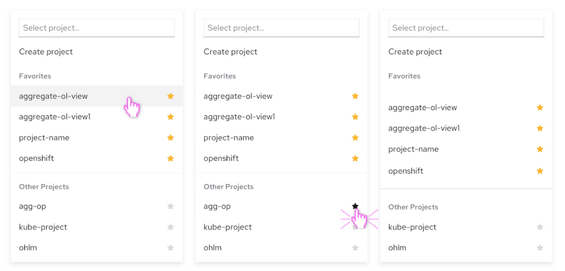
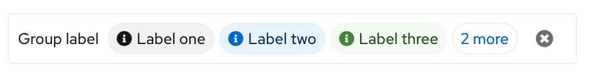
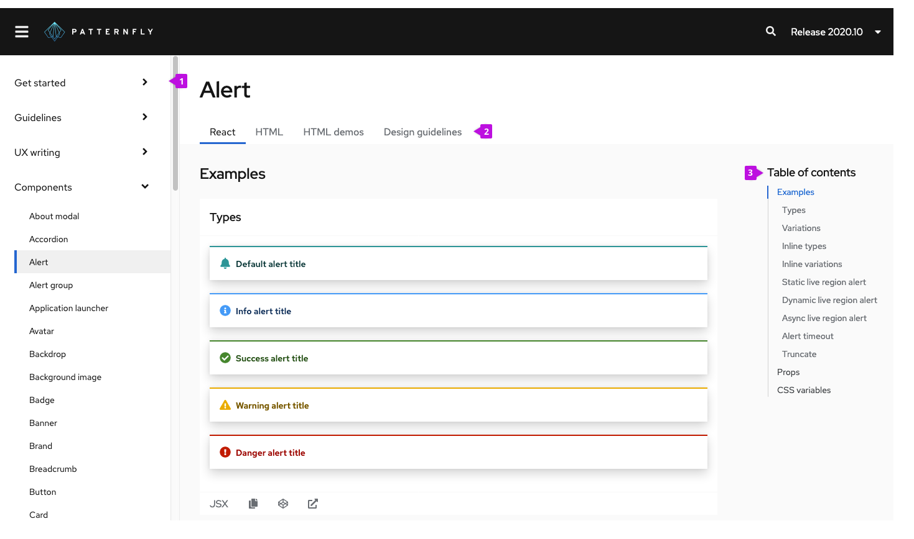

# PatternFly Release Highlights
## Release 2020.12
### New features and enhancements
#### Introduce support for favorites into the [Select component](https://www.patternfly.org/v4/components/select#favorites)

This feature allows for marking items as favorites to pin them to the top of the menu. This is especially useful when you have a long list of potential options but a smaller number that will be used frequently. **Note:** inclusion of dividers in the Select menu (as shown above) is still not implemented in this release. This feature will be added in a follow-up PR during our next release milestone.

#### [Table header fix](https://github.com/patternfly/patternfly-react/pull/4778)
Fixed a bug that prevented  interactive elements from being added to sortable table headers. This will allow infotip popovers to be triggered from column headers.

#### Introduced the [Skeleton component](https://www.patternfly.org/v4/components/skeleton)
The new Skeleton component is an animated placeholder that can be used to implement skeleton loading on a page. We offer a variety of sizes and shapes to take the place of text strings or graphical elements like charts.

#### Added a [bottom panel drawer](https://www.patternfly.org/v4/components/drawer#panel-on-bottom) variation

This adds a horizontal drawer that can be attached to the bottom of a page. This is most useful when you want to insert a terminal window or something similar that will slide up from the bottom the viewport.

#### Introduced a [Label group](https://www.patternfly.org/v4/components/label-group) component
Label groups have similar properties to Chip groups. They can include an optional  category label and can manage overflow conditions if there are many labels in the group.

See the [latest release notes](https://www.patternfly.org/v4/get-started/release-notes) for a more detailed list of changes.

### Web site changes
Also with this release we are introducing a new website experience at [www.patternfly.org](http://www.patternfly.org). This update will make it easier to find content and browse examples.

**Highlights include:**

1. Everything consolidated into a single collapsible menu. Based on user research studies conducted earlier this year, we have simplified our site navigation by placing all pages into a single vertical menu.

2. React and HTML examples as well as design guidelines are now consolidated on a common component page. This will ensure that all of the information about a component can be found in one place without the need to switch around between sections of the site.

3. A Table of Contents sidebar was introduced to make it easier to directly navigate to the examples or documentation you are looking for when on any component page.

These improvements should make the PatternFly website much easier to use. We welcome any questions or feedback that you have as you familiarize yourself with the new site.

### What we’re working on...
#### 2020.13 (October 9)
* [Data list: draggable rows](https://github.com/patternfly/patternfly-react/issues/4708)
* [Basic date picker](https://github.com/patternfly/patternfly-react/issues/4730) - support basic date picker with calendar
* [Basic time picker](https://github.com/patternfly/patternfly-react/issues/4731) - introduce a basic time picker
* [Add option to programmatically set `No results found` in Select](https://github.com/patternfly/patternfly-react/issues/4744)
* [Typeahead has no affordance to type when clicking on arrow](https://github.com/patternfly/patternfly-react/issues/4745)  - Will force focus into the text input when opening the dropdown menu.
* [Menu component](https://github.com/patternfly/patternfly-react/issues/4712) - Introduce a modular menu component that can be placed in a page or shown on right-click. Will support fly-out and drill-down use cases.
* [Add support for react-router Link in a Label](https://github.com/patternfly/patternfly-react/issues/4811)

#### 2020.14 (October 30)
* [Action list component](https://github.com/patternfly/patternfly/issues/2021) - Positions a set of buttons with standard spacing.
* [Code editor](https://github.com/patternfly/patternfly-design/issues/836) - Edit blocks of code using the Monaco code editor. Can optionally be used as a read-only display with language appropriate syntax highlighting.
* [Splitter component](https://github.com/patternfly/patternfly-react/issues/4715) - Used in conjunction with the Drawer, creates a resizable panel.
* [Date Range picker](https://github.com/patternfly/patternfly-react/issues/4732) - introduce a range picker to support picking multiple dates on the same calendar.
* [Add ability to have radio buttons in a table](https://github.com/patternfly/patternfly/issues/3418) - Will allow radio buttons to be used to support single-select use cases.
* [Add Help button to modal header](https://github.com/patternfly/patternfly/issues/3474) - Allows addition of an optional Help button in a Modal.
* [Introduce Sticky Header/Footer capability](https://github.com/patternfly/patternfly/issues/3417) - Will enable any page sections to be made “sticky.”

For a complete roadmap showing all items planned in future releases, see our [PatternFly Feature Roadmap](https://github.com/orgs/patternfly/projects/4?fullscreen=true) project board.
