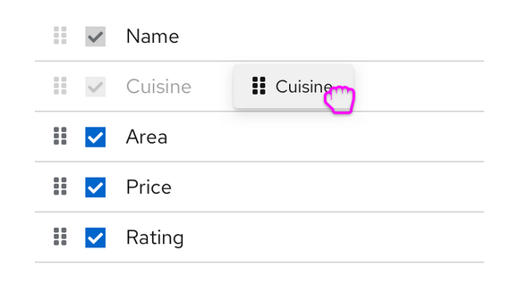

# PatternFly Release Highlights
## Release 2020.13
### New features and enhancements
#### [Data list: draggable rows](https://www.patternfly.org/v4/components/data-list#draggable)
Rows can now be reordered in a Data list using drag and drop. This is useful any time you want to support manual sorting of items in a list.

#### [Basic date picker](https://www.patternfly.org/v4/components/date-picker)
A basic date picker with calendar is now available for selecting a single date. This supports date selection in a variety of localized formats.

#### [Added ability to have radio buttons in a table](https://www.patternfly.org/v4/components/table#selectable-radio-input)
Radio buttons can now be placed in a table row to support single-select use cases.

#### [Select component enhancements](https://www.patternfly.org/v4/components/select)
Several enhancements were made to improve the behavior and flexibility of the Select component. Notably:
* We now force focus on typeahead input even when the user click the 'open menu' button on the toggle.
* We've added a 'no results' message to an empty typeahead menu if an empty options array is passed to typeahead select.
* Dividers are now supported in Select menus.

#### [Add support for react-router Link in a Label](https://www.patternfly.org/v4/components/label#router-link)
This enables the option to use a React-router link in addition to a standard link in a label.

### What we’re working on...
#### 2020.14 (October 30)
* [Basic time picker](https://github.com/patternfly/patternfly-react/issues/4731) - introduce a basic time picker
* [Menu component](https://github.com/patternfly/patternfly-react/issues/4712) - Introduce a modular menu component that can be placed in a page or shown on right-click. Will support fly-out and drill-down use cases.
* [Code editor](https://github.com/patternfly/patternfly-design/issues/836) - Edit blocks of code using the Monaco code editor. Can optionally be used as a read-only display with language appropriate syntax highlighting.
* [Add Help button to modal header](https://github.com/patternfly/patternfly/issues/3474) - Allows addition of an optional Help button in a Modal.
* [Introduce Sticky Header/Footer capability](https://github.com/patternfly/patternfly/issues/3417) - Will enable any page sections to be made “sticky.”
* [Expand/collapse all for Data list](https://github.com/patternfly/patternfly-react/issues/4942) - will allow all rows in a data list to be expanded in a single click.

#### 2020.15 (November 20)
* [Action list component](https://github.com/patternfly/patternfly/issues/2021) - Positions a set of buttons with standard spacing.
* [Splitter component](https://github.com/patternfly/patternfly-react/issues/4715) - Used in conjunction with the Drawer, creates a resizable panel.
* [Date Range picker](https://github.com/patternfly/patternfly-react/issues/4732) - introduce a range picker to support picking multiple dates on the same calendar.
* [Dual list selector component](https://github.com/patternfly/patternfly/issues/3556) - make it easier to select multiple items from long lists.
* [Touchspin component](https://github.com/patternfly/patternfly/issues/362) - Support a touchspin component for entering numeric values.
* [Add expand/collapse all to Table](https://github.com/patternfly/patternfly-react/issues/4943) - will allow all rows in a data list to be expanded in a single click.
* [Horizontal/collapsible card](https://github.com/patternfly/patternfly/issues/3555) - introduce new card variants and demos to support horizontal card layouts.

For a complete roadmap showing all items planned in future releases, see our [PatternFly Feature Roadmap](https://github.com/orgs/patternfly/projects/4?fullscreen=true) project board.
