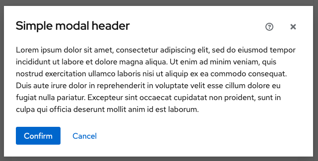
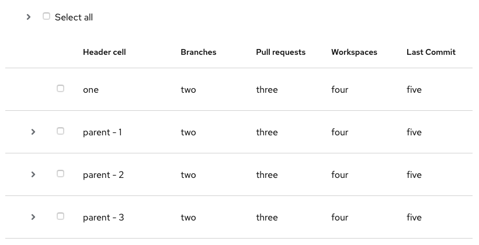
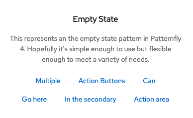

# PatternFly Release Highlights
## Release 2020.14
### New features and enhancements

#### [Added Help button to modal header](https://www.patternfly.org/v4/components/modal#with-help)
Adds an optional Help button to a Modal.

#### Added expand all capability for [data lists](https://www.patternfly.org/v4/components/data-list/react-demos#expandable-control-in-toolbar) and [tables](https://www.patternfly.org/v4/components/table/react-demos#expandcollapse-all)

Allows all rows in a data list or table to be expanded in a single click by clicking the expand-all icon in the toolbar.

#### Added [extra-small empty state](https://www.patternfly.org/v4/components/empty-state#extra-small)
The extra-small empty state can be used inside of a card or anyplace else you want to display an empty state in a constrained space.

#### [Introduced sticky page sections](https://www.patternfly.org/v4/components/page/react-demos#sticky-section-group)
This is a new feature added to the Page component that allows for defining sticky sections on a page. It will enable defining sticky headers, footers, toolbars, etc.

See the [latest release notes](https://www.patternfly.org/v4/get-started/release-notes) for a more detailed list of changes.

### What we’re working on...

#### 2020.15 (November 20)
* [Code editor](https://github.com/patternfly/patternfly-design/issues/836) - Edit blocks of code using the Monaco code editor. Can optionally be used as a read-only display with language appropriate syntax highlighting.

* [Menu component](https://github.com/patternfly/patternfly-react/issues/4712) - Introduce a modular menu component that can be placed in a page or shown on right-click. Will support fly-out and drill-down use cases.

* [Action list component](https://github.com/patternfly/patternfly/issues/2021) - Positions a set of buttons with standard spacing.

* [Splitter component](https://github.com/patternfly/patternfly-react/issues/4715) - Used in conjunction with the Drawer, creates a resizable panel.

* [Date picker with custom calendar](https://github.com/patternfly/patternfly-react/issues/5057) - will replace Flatpicker with a custom PatternFly calendar component.

* [Dual list selector component](https://github.com/patternfly/patternfly/issues/3556) - make it easier to select multiple items from long lists.

* [Touchspin component](https://github.com/patternfly/patternfly/issues/362) - Support a touchspin component for entering numeric values.

* [Horizontal/collapsible card](https://github.com/patternfly/patternfly/issues/3555) - introduce new card variants and demos to support horizontal card layouts.

* [Lighweight, composable table components](https://github.com/patternfly/patternfly-react/issues/2358) - this will enable developers to compose a PatternFly table from a set of lightweight components as an alternative to the existing PatternFly table component.

#### 2020.16 (December 11)
* [Basic time picker](https://github.com/patternfly/patternfly-react/issues/4731) - introduce a basic time picker.

* [Date Range picker](https://github.com/patternfly/patternfly-react/issues/4732) - introduce a range picker to support picking multiple dates on the same calendar.

* [Custom alerts](https://github.com/patternfly/patternfly/issues/3257) - this will allow for inserting a custom icon into an alert in addition to the standard status icons defined by PatternFly.

* [Expandable form sections](https://github.com/patternfly/patternfly/issues/3557) - these will be expandable nested sections useful for organizing information on long, complex forms.

* [Multi-level drill down menu](https://github.com/patternfly/patternfly-react/issues/5024) - introduces a drill-down menu component for displaying hierarchical data.

* [Table favorities](https://github.com/patternfly/patternfly-react/issues/5020) - adds the ability to favorite rows in the Table component.

* [Jump links component](https://github.com/patternfly/patternfly-react/issues/5022) - introduces jump links with optional scrollspy functionality for navigating inside of a long scrolling page.

For a complete roadmap showing all items planned in future releases, see our [PatternFly Feature Roadmap](https://github.com/orgs/patternfly/projects/4?fullscreen=true) project board.
