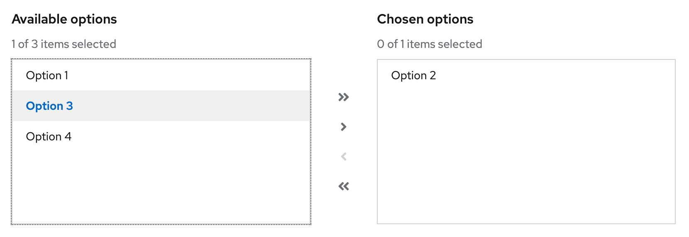
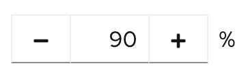
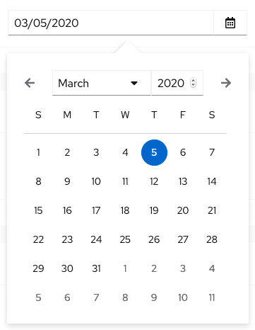
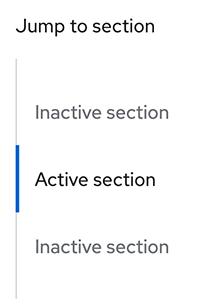

# PatternFly Release Highlights
## Release 2020.15
### New features and enhancements

#### [Menu component](https://www.patternfly.org/v4/components/menu)
Added a modular menu component that can be used independently of existing dropdown and select components. This supports most common action and option select menus as well as introducing fly-outs for supporting hierarchical menus. This component will form the basis of a composable dropdown approach to be delivered in future releases.

#### [Lightweight, composable table components](https://www.patternfly.org/v4/components/table#tablecomposable-examples)
This will enable developers to compose a PatternFly table from a set of lightweight components as an alternative to the existing PatternFly table component. The TableComposable component differs from the regular Table component, in that it allows you to compose the table by nesting the relevant `Thead`, `Tbody`, `Tr`, `Th` and `Td` components within it.

#### [Action List component](https://www.patternfly.org/v4/components/action-list)
The Action list positions a set of buttons with standard spacing.

#### [Dual list selector component](https://www.patternfly.org/v4/components/dual-list-selector)
You can use a Dual List Selector to make it easier to select multiple items from long lists.

#### [Touchspin component](https://www.patternfly.org/v4/components/touchspin)
The Touchspin component can be used for entering numeric values.

#### [Date picker with custom calendar](https://www.patternfly.org/v4/components/date-picker)
Flatpicker has been replaced with a custom calendar component that will provide keyboard accessibility and more flexibility moving forward.

#### [Jump links component](https://www.patternfly.org/v4/components/jump-links)
Jump links, including optional scrollspy functionality, allow for navigating inside of a long scrolling page. The basic component is available now. More follow-on work will take place during the next few releases to include subsections and the ability to place jumplinks navigation in a sticky page section.

See the [latest release notes](https://www.patternfly.org/v4/developer-resources/release-notes) for a more detailed list of changes.

### What we’re working on...

#### 2020.16 (December 11)
* [Horizontal/collapsible card](https://github.com/patternfly/patternfly/issues/3555) - introduce new card variants and demos to support horizontal card layouts.

* [Code editor](https://github.com/patternfly/patternfly-design/issues/836) - Edit blocks of code using the Monaco code editor. Can optionally be used as a read-only display with language appropriate syntax highlighting.

* [Resizable drawer with splitter](https://github.com/patternfly/patternfly-react/issues/5050) - The resizable drawer will provide a flexible, resizable container that can be attached to the right or bottom edge of the viewport.

* [Basic time picker](https://github.com/patternfly/patternfly-react/issues/4731) - introduce a basic time picker.

* [Date Range picker](https://github.com/patternfly/patternfly-react/issues/4732) - introduce a range picker to support picking multiple dates on the same calendar.

* [Custom alerts](https://github.com/patternfly/patternfly/issues/3257) - this will allow for inserting a custom icon into an alert in addition to the standard status icons defined by PatternFly.

* [Table favorities](https://github.com/patternfly/patternfly-react/issues/5020) - adds the ability to favorite rows in the Table component.

#### 2021.01 (January 29)

* [Expandable form sections](https://github.com/patternfly/patternfly/issues/3557) - these will be expandable nested sections useful for organizing information on long, complex forms.

* [Multi-level drill down menu](https://github.com/patternfly/patternfly-react/issues/5024) - introduces a drill-down menu component for displaying hierarchical data.

* [Slider component](https://github.com/patternfly/patternfly/issues/296) - provide basic slider capability for entering numeric data.

For a complete roadmap showing all items planned in future releases, see our [PatternFly Feature Roadmap](https://github.com/orgs/patternfly/projects/4?fullscreen=true) project board.
