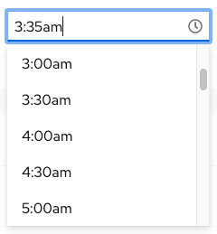
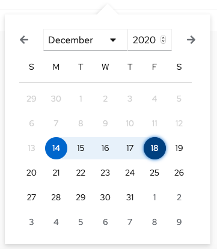
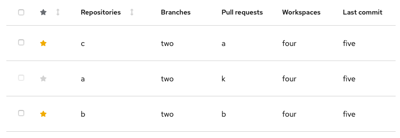
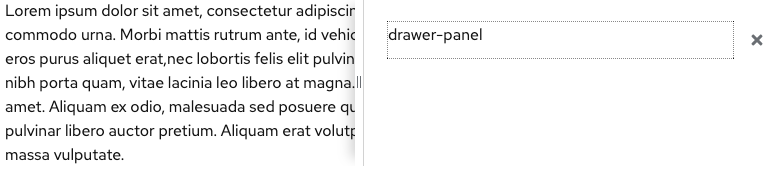
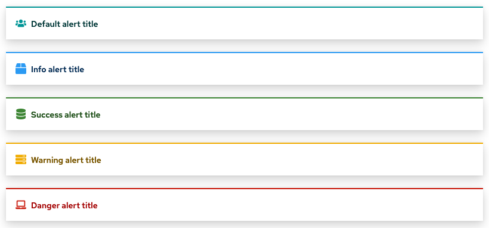

# PatternFly Release Highlights
## Release 2020.16
### New features and enhancements

#### [Basic time picker](https://www.patternfly.org/v4/components/time-picker)

The time picker allows the user to enter a time in either 12 or 24 hour format using the keyboard or by picking from a list.

#### [Date Range picker demo](https://www.patternfly.org/v4/components/date-picker/react-demos)

Shows how to use two date pickers together for selecting a date range on the calendar that can be used for filtering or similar use cases.

#### [Table favorities](https://www.patternfly.org/v4/components/table#favoritable)

Adds the ability to favorite rows in the Table component.

#### [Resizable drawer with splitter](https://www.patternfly.org/v4/components/drawer#resizable-on-right)

The resizable drawer provides a flexible, resizable container that can be attached to the right or bottom edge of the viewport.

#### [Custom alerts](https://www.patternfly.org/v4/components/alert#custom-icons)

Alerts can now be customized by substituting a custom icon.

See the [latest release notes](https://www.patternfly.org/v4/developer-resources/release-notes) for a more detailed list of changes.

### What we’re working on...

#### 2021.01 (January 29)
* [Horizontal/collapsible card](https://github.com/patternfly/patternfly/issues/3555) - introduce new card variants and demos to support horizontal card layouts.

* [Code editor](https://github.com/patternfly/patternfly-design/issues/836) - Edit blocks of code using the Monaco code editor. Can optionally be used as a read-only display with language appropriate syntax highlighting.

* [Expandable form sections](https://github.com/patternfly/patternfly/issues/3557) - these will be expandable nested sections useful for organizing information on long, complex forms.

* [Multi-level drill down menu](https://github.com/patternfly/patternfly-react/issues/5024) - introduces a drill-down menu component for displaying hierarchical data.

* [Slider component](https://github.com/patternfly/patternfly/issues/296) - provide basic slider capability for entering numeric data.

#### 2021.02 (February 19)

* [Jump links demo](https://github.com/patternfly/patternfly/issues/3560) - illustrate how jump links can be used in a sticky sidebar.

* [List component variants](https://github.com/patternfly/patternfly/issues/3743) - Introduce new list `<li>` variants with plain styling, horizontal separators, and icons.

* [Large/Marketing card variant](https://github.com/patternfly/patternfly/issues/3670) - introduce a card with larger spacing for marketing applications.

* [Attribute-value search input](https://github.com/patternfly/patternfly-design/issues/771) - add a new search input variant to support advanced searching or filtering use cases that require an attribute-value pair.

For a complete roadmap showing all items planned in future releases, see our [PatternFly Feature Roadmap](https://github.com/orgs/patternfly/projects/4?fullscreen=true) project board.
