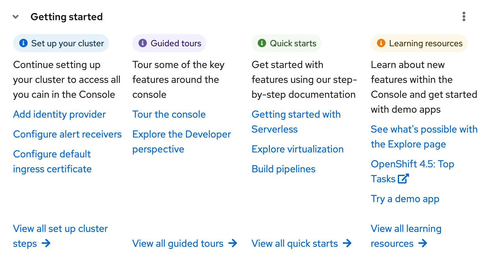
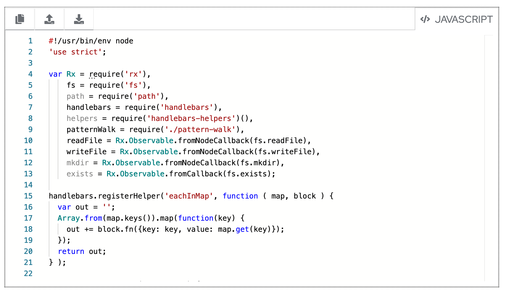
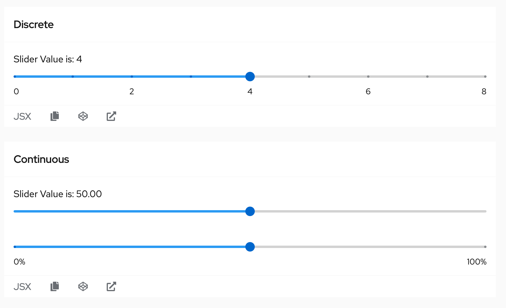
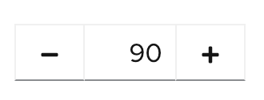

# PatternFly Release Highlights
## Release 2021.01
----------------------------------------------------------
## New features and enhancements

### [Horizontal collapsable Card](https://www.patternfly.org/v4/components/card/html-demos#horizontal-grid-expanded)

Demonstrates how to create a card layout with multiple columns and an expandable header. Additional examples include side-by-side layouts with an image and text. Currently available as an HTML/CSS demo, only.

### [Code editor](https://www.patternfly.org/v4/components/code-editor)

 Introduce native support for the Monaco code editor to format code for read-only display or for editing. Includes language appropriate syntax highlighting, a dark theme option, customizable actions.

 ### [Slider component](https://www.patternfly.org/v4/components/slider)

 The Slider provides basic slider capability for entering numeric data. Both discrete and continuous sliders are supported. An optional value input field supports either direct entry from the keyboard or manipulation of the slider using the mouse or keyboard.

### [Number input](https://www.patternfly.org/v4/components/number-input)

The Touchspin component has been renamed to Number input. This component is designed for easily entering numeric data.

-----------------------------------------------------------------------------

## What we’re working on...

### 2021.02 (February 19)

* [Multi-level drill down menu](https://github.com/patternfly/patternfly-react/issues/5024) - introduces a drill-down menu component for displaying hierarchical data.

* [Attribute-value search input](https://github.com/patternfly/patternfly-react/issues/5332) - add a new search input variant to support advanced searching or filtering use cases that require an attribute-value pair.

* [Updated Label styling](https://github.com/patternfly/patternfly/issues/3810) - Update label styles to have better visibility against any background.

* [Log viewer component](https://github.com/patternfly/patternfly-react/issues/5341) - introduce a native log viewer native beta component to display real-time streamed logs or static log data.

* [Large/Marketing card variant](https://github.com/patternfly/patternfly-react/issues/5334) - introduce a card with larger spacing for marketing applications.

* [SVG Spinner](https://github.com/patternfly/patternfly-react/issues/5343) - introduce a new SVG spinner variant for smoother rendering and performance.

### 2021.03 (March 12)

* [Jump links demo](https://github.com/patternfly/patternfly/issues/3560) - illustrate how jump links can be used in a sticky sidebar.

* [New List variants](https://github.com/patternfly/patternfly-react/issues/5336) - Introduce new variants of the [List](https://www.patternfly.org/v4/components/list) component that include plain lists, lists with horizontal separators, and lists with icons for communicating static information in a standard `<li>`element.

* [Expandable form sections](https://github.com/patternfly/patternfly-react/issues/5023) - these will be expandable nested sections useful for organizing information on long, complex forms.

* [Stacked form elements](https://github.com/patternfly/patternfly-react/issues/5286) - Allows stacking of checkboxes, radios, text inputs, etc. in a single group.

* [Show/Hide password](https://github.com/patternfly/patternfly/issues/3770) - Allow users to toggle visibility of the password entered on the Login page.

* [Tree table](https://github.com/patternfly/patternfly/issues/3809) - Introduce a tree table component to display hierarchical, tabular data.

For a complete roadmap showing all items planned in future releases, see our [PatternFly Feature Roadmap](https://github.com/orgs/patternfly/projects/4?fullscreen=true) project board.
