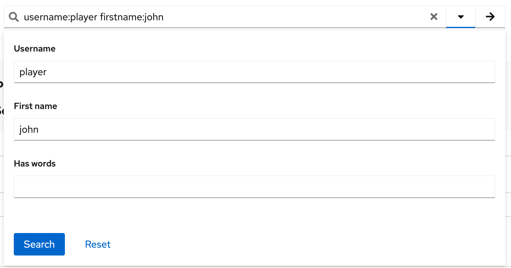
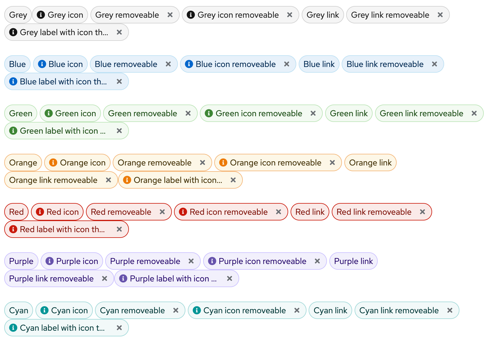
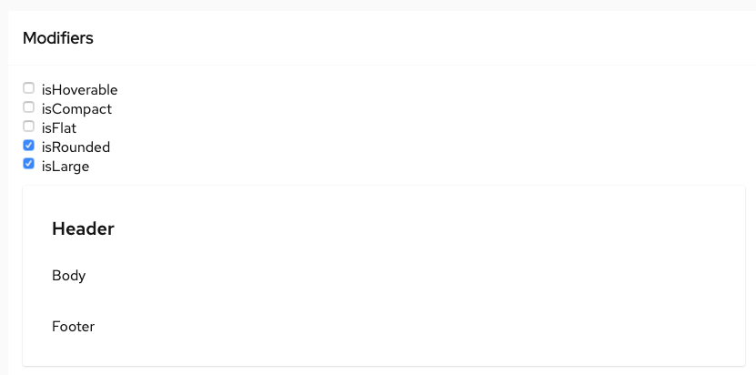
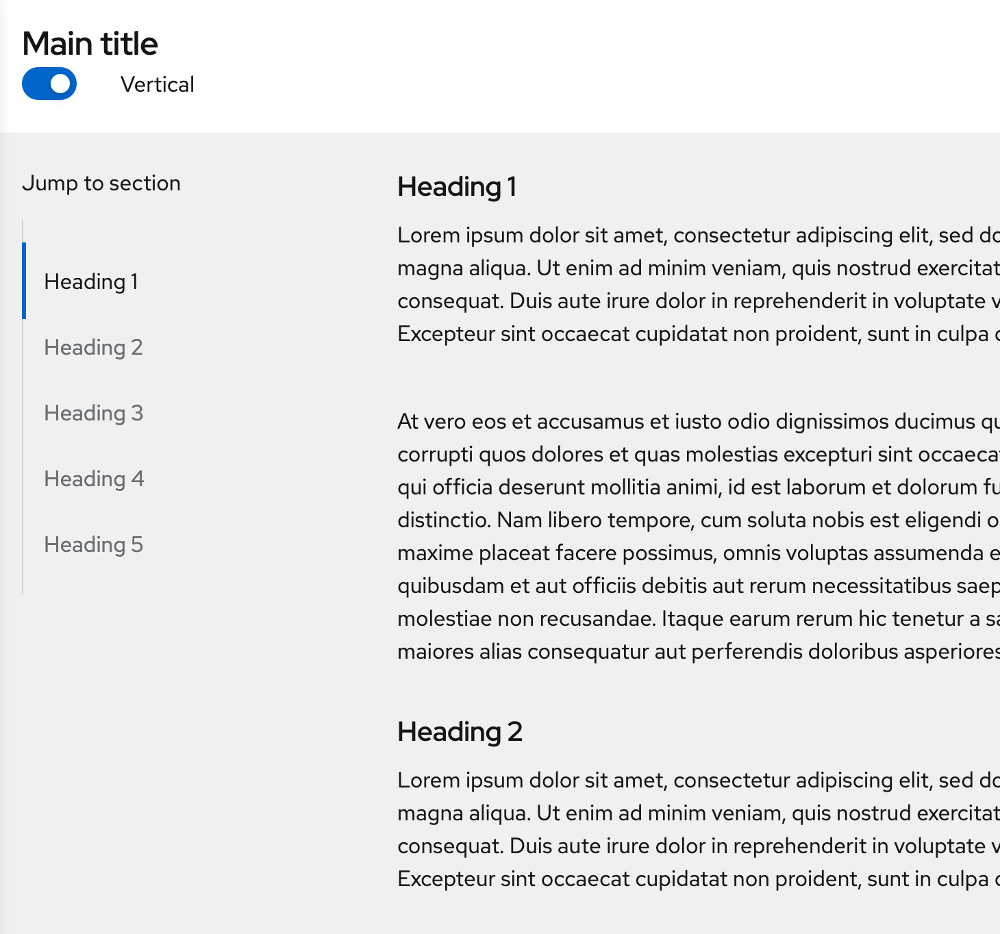
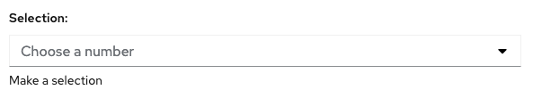

# PatternFly Release Highlights
## Release 2021.02
----------------------------------------------------------
## New features and enhancements

### [Advanced search input](https://www.patternfly.org/v4/components/search-input#advanced)

Adds a new search input variant to support attribute-value searching or filtering use cases by combining a search field with a customizable search form.

### [Updated label styling](https://www.patternfly.org/v4/components/label)

Borders were added to filled labels to ensure they work well against either white or gray backgrounds.

### [New card modifiers](https://patternfly-react-pr-5389.surge.sh/components/card#modifiers)

Support new modifiers to create a card with more spacing and rounder corners for marketing applications.

### [Jump links demo](https://www.patternfly.org/v4/components/jump-links/react-demos)

A fully functional jump links React demo is now available to illustrate how jump links can be placed in a sticky sidebar for navigating long pages.

### [Placeholder text in form select](https://www.patternfly.org/v4/components/form-select)

You can now apply placeholder text styling to the default item in a form select component.

### [SVG Spinner](https://www.patternfly.org/v4/components/spinner)
Introduce a new SVG-based spinner for smoother rendering and performance.

See the [latest release notes](https://www.patternfly.org/v4/developer-resources/release-notes) for a more detailed list of changes.

-----------------------------------------------------------------------------

## What we’re working on...

### 2021.03 (March 12)

* [Multi-level drill down menu](https://github.com/patternfly/patternfly-react/issues/5024) - introduces a drill-down menu component for displaying hierarchical data.

* [Log viewer component](https://github.com/patternfly/patternfly-react/issues/5341) - introduce a native log viewer native beta component to display real-time streamed logs or static log data.

* [Expandable field groups](https://github.com/patternfly/patternfly-react/issues/5023) - these will be expandable nested sections useful for organizing information on long, complex forms.

* [Show/Hide password](https://github.com/patternfly/patternfly/issues/3770) - Allow users to toggle visibility of the password entered on the Login page.

* [Tree table](https://github.com/patternfly/patternfly/issues/3809) - Introduce a tree table component to display hierarchical, tabular data.

* [Drawer with light gray background](https://github.com/patternfly/patternfly-react/issues/5423) - adds the option to make the background color of a drawer white or gray. A white background will still be the default.

### 2021.04 (April 2)

* [New List variants](https://github.com/patternfly/patternfly-react/issues/5336) - Introduce new variants of the [List](https://www.patternfly.org/v4/components/list) component that include plain lists, lists with horizontal separators, and lists with icons for communicating static information in a standard `<li>`element.

* [Stacked form elements](https://github.com/patternfly/patternfly-react/issues/5286) - Allows stacking of checkboxes, radios, text inputs, etc. in a single group.

* [Auto-sized text area](https://github.com/patternfly/patternfly/issues/3837) - Add an option to the Text Area component that allows the height to automatically size to its content.

* [Radio: add support for nested controls](https://github.com/patternfly/patternfly/issues/3717) - Make it easier to nest controls inside a radio button group.

* [Accordion for web used cases](https://github.com/patternfly/patternfly/issues/3865) - Introduce a variant of the Accordion component with larger spacing optimized for website presentation.

* [Add help text support to definition list](https://github.com/patternfly/patternfly-react/issues/5482) - Add the ability to open pop-up help to an item in a definition list by clicking on its underlined label.

* [Auto-complete search input](https://github.com/patternfly/patternfly/issues/3863) - Will introduce an option to add auto-complete behavior to the Search Input component.

For a complete roadmap showing all items planned in future releases, see our [PatternFly Feature Roadmap](https://github.com/orgs/patternfly/projects/4?fullscreen=true) project board.
