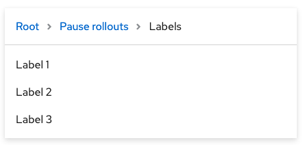
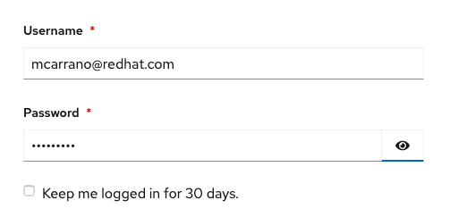
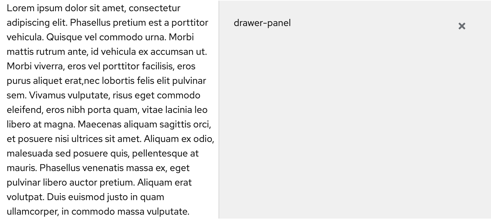

# PatternFly Release Highlights
## Release 2021.03
----------------------------------------------------------
## New features and enhancements

### [Multi-level drill down menu](https://www.patternfly.org/v4/components/menu#with-drilldown)

Introduces a drill-down menu component for displaying hierarchical data. An optional breadcrumb can be added to the header to make it easier to directly navigate back to higher levels in the tree.

### [Show/Hide password](https://www.patternfly.org/v4/components/login-page#showhide-password)

Allows users to toggle visibility of the password entered on the Login page.

### [Drawer with light gray background](https://www.patternfly.org/v4/components/drawer#panel-with-light-200-background)

Adds the option to make the background color of a drawer white or gray. A white background will still be the default.

### [Expand/collapse all capability in tree view](https://www.patternfly.org/v4/components/tree-view)

Enables an expand/collapse all action to be added to a tree-view menu.

See the [latest release notes](https://www.patternfly.org/v4/developer-resources/release-notes) for a more detailed list of changes.

-----------------------------------------------------------------------------

## What we’re working on...

### 2021.04 (April 1)

* [Log viewer component](https://github.com/patternfly/patternfly-react/issues/5341) - introduce a native log viewer native beta component to display real-time streamed logs or static log data.

* [Expandable field groups](https://github.com/patternfly/patternfly-react/issues/5023) - these will be expandable nested sections useful for organizing information on long, complex forms.

* [Tree table](https://github.com/patternfly/patternfly-react/issues/5016) - Introduce a tree table component to display hierarchical, tabular data.

* [Auto-sized text area](https://github.com/patternfly/patternfly-react/issues/5497) - Add an option to the Text Area component that allows the height to automatically size to its content.

* [Radio: add support for nested controls](https://github.com/patternfly/patternfly-react/issues/5519) - Make it easier to nest controls inside a radio button group.

* [Don't hide toast alert when hovering](https://github.com/patternfly/patternfly-react/issues/5489) - change the toast alert to not dismiss if the user is hovered over it.

### 2021.05 (April 23)

* [Stacked form elements](https://github.com/patternfly/patternfly-react/issues/5286) - Allows stacking of checkboxes, radios, text inputs, etc. in a single group.

* [Auto-complete search input](https://github.com/patternfly/patternfly-react/issues/5499) - Will introduce an option to add auto-complete behavior to the Search Input component.

* [Inline enhancement for Clipboard copy](https://github.com/patternfly/patternfly/issues/3906) - Add a thin variant to Clipboard copy for using inline with text.

* [Code block component](https://github.com/patternfly/patternfly/issues/3907) - introduce a read-only code block component that is lighter weight than the full code editor for displaying a block of code with optional actions.

* [Optional item counts in select menu](https://github.com/patternfly/patternfly/issues/3902) - want to add optional item counts for checkbox filtering use cases.

For a complete roadmap showing all items planned in future releases, see our [PatternFly Feature Roadmap](https://github.com/orgs/patternfly/projects/4?fullscreen=true) project board.
