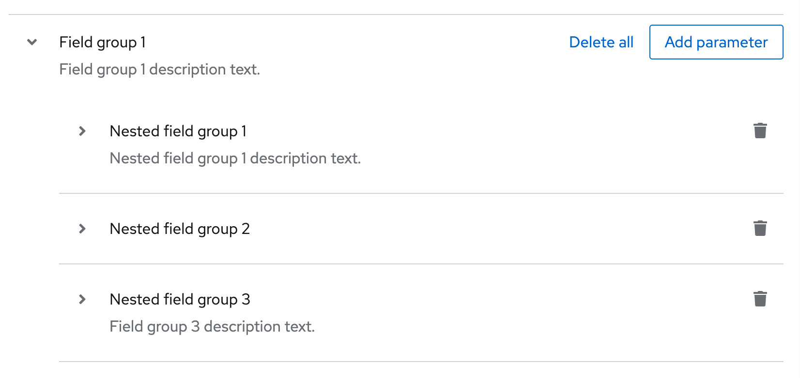
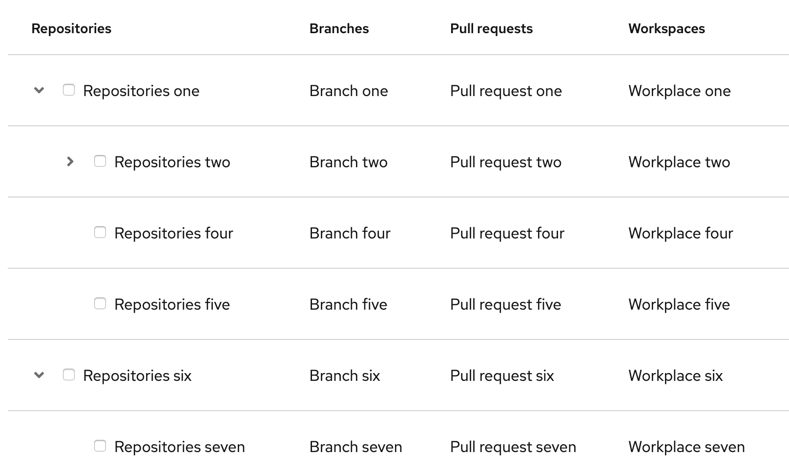
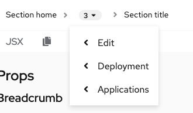
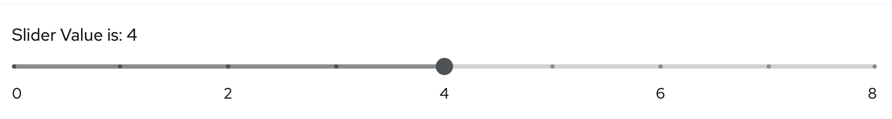

# PatternFly Release Highlights
## Release 2021.04
----------------------------------------------------------
## New features and enhancements

### [Expandable field groups](https://www.patternfly.org/v4/components/form#field-groups)

Introduced expandable nested sections to the Form component that are useful for organizing information on long, complex forms.

### [Tree table](https://www.patternfly.org/v4/components/table#tree-table)

 The tree table component allows for displaying hierarchical, tabular data in an expandable tree.

### [Support for nested content in Radio button group](https://www.patternfly.org/v4/components/radio#with-body)

 

You can now nest controls inside a radio button group with appropriate indentation and spacing.

### [Collapsible breadcrumb](https://www.patternfly.org/v4/components/breadcrumb#with-dropdown)  

Add collapsible nodes to a breadcrumb component. This can be useful for displaying long breadcrumbs in a constrained space or as part of the header of a drill-down menu.

### [Add disabled slider](https://www.patternfly.org/v4/components/slider#disabled)

You can now set a slider to be disabled and take on a "grayed-out" appearance.

### [Auto-sized text area](https://www.patternfly.org/v4/components/text-area#auto-resizing)
Adds an option to the Text Area component that allows the height to automatically size to its content.

### [Toast alerts no longer dismiss when hovering](https://github.com/patternfly/patternfly-react/pull/5566)
Updated the toast alert to not dismiss if the user is hovered over it. The alert will now dismiss 3 seconds after the user mouses away.

### [Make Pagination fully localizable](https://github.com/patternfly/patternfly-react/pull/5563)

Fix bug that prevented complete translation of pagination strings.

See the [latest release notes](https://www.patternfly.org/v4/developer-resources/release-notes) for a more detailed list of changes.

-----------------------------------------------------------------------------

## What we’re working on...

### 2021.05 (April 23)

* [Stacked form elements](https://github.com/patternfly/patternfly-react/issues/5286) - Allows stacking of checkboxes, radios, text inputs, etc. in a single group.

* [Inline enhancement for Clipboard copy](https://github.com/patternfly/patternfly-react/issues/5555) - Add a thin variant to Clipboard copy for using inline with text.

* [Code block component](https://github.com/patternfly/patternfly-react/issues/5556) - Introduce a read-only code block component that is lighter weight than the full code editor for displaying a block of code with optional actions.

* [Optional item counts in select menu](https://github.com/patternfly/patternfly-react/issues/5557) - Will add optional item counts for checkbox filtering use cases.

* [Slider: update API to match standard range input](https://github.com/patternfly/patternfly-react/issues/5464) - Make the slider component mimic the API of a standard HTML range input.

* [Date and time range picker demo](https://github.com/patternfly/patternfly-react/issues/4737) - Create a React demo to show how the Date picker and Time picker components can be used together to return a data and time range.

* [Add validation states to Select](https://github.com/patternfly/patternfly-react/issues/5579) - Allow showing validation states (e.g. error, warning, success) for a Select component. Visual appearance will be equivalent to the same states displayed for text inputs.

### 2021.06 (May 14)

* [Log viewer component](https://github.com/patternfly/patternfly-react/issues/5341) - Introduce a native log viewer native beta component to display real-time streamed logs or static log data.

* [Auto-complete search input](https://github.com/patternfly/patternfly-react/issues/5499) - Will introduce an option to add auto-complete behavior to the Search Input component.

* [Update toggle group styling](https://github.com/patternfly/patternfly/issues/3951) - Update selected color for a set of toggle buttons to use a lighter blue.

* [Add "view more" action to a Select menu](https://github.com/patternfly/patternfly/issues/3953) - Add a View more action at the button of a select menu to enable incremental loading of long option lists.

For a complete roadmap showing all items planned in future releases, see our [PatternFly Feature Roadmap](https://github.com/orgs/patternfly/projects/4?fullscreen=true) project board.
