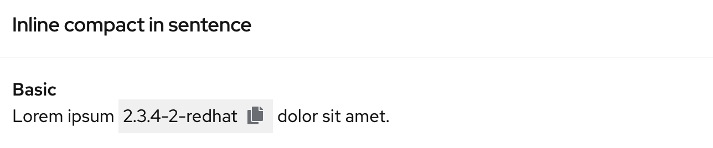
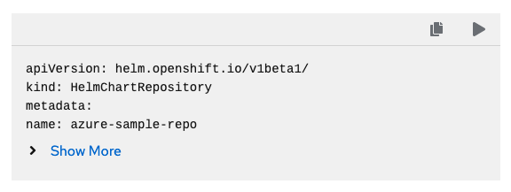
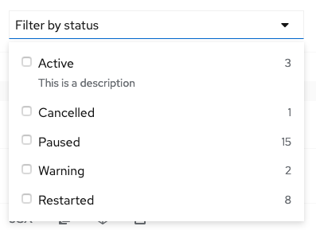
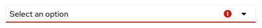
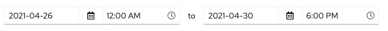

# PatternFly Release Highlights
## Release 2021.05
----------------------------------------------------------
## New features and enhancements

### [Stacked form elements](https://www.patternfly.org/v4/components/form#horizontal-stacked-no-padding-top)

Allows stacking of checkboxes, radios, text inputs, etc. in a single group.

### [Inline-compact Clipboard copy variant](https://www.patternfly.org/v4/components/clipboard-copy#inline-compact)

Adds a thin variant to Clipboard copy for using inline with text or anywhere a lighter weight treatment is desired.

### [Code block component](https://www.patternfly.org/v4/components/code-block)

Introduces a read-only code block component that is lighter weight than the full code editor for displaying a snippet of code with optional actions. The ability to show or hide lines is available for long code snippets.

### [Optional item counts in a Select menu](https://www.patternfly.org/v4/components/select#checkbox-input-with-counts)

Adds optional right-aligned item counts to a Select menu. This is useful for faceted filtering use cases where you may want to report the number of items matching each specific value.

### [Add validated states to Select](https://www.patternfly.org/v4/components/select#validated)

Allows showing validation states (e.g. error, warning, success) for a Select component. Visual appearance is equivalent to the same states displayed for text inputs.

### [Date and time range picker demo](https://www.patternfly.org/v4/components/date-picker/react-demos#date-and-time-range-picker)

Adds a React demo to show how the Date picker and Time picker components can be used together to return a data and time range.

### [Slider updated API to match standard range input](https://www.patternfly.org/v4/components/slider)

The slider component has been updated to mimic the API of a standard HTML range input with additional custom features.

See the [latest release notes](https://www.patternfly.org/v4/developer-resources/release-notes) for a more detailed list of changes.

-----------------------------------------------------------------------------

## What we’re working on...

### 2021.06 (May 14)

* [Log viewer component](https://github.com/patternfly/patternfly-react/issues/5341) - Introduce a native log viewer beta component to display real-time streamed logs or static log data.

* [Update toggle group styling](https://github.com/patternfly/patternfly/issues/3951) - Update selected color for a set of toggle buttons to use a lighter blue.

* [New List variants](https://github.com/patternfly/patternfly-react/issues/5336) - Add new variants of the List component to include horizontal separators, icons and 'pf-m-plain' modifier.

* [Composable dropdown menus](https://github.com/patternfly/patternfly-react/issues/5073) - Create a demo that shows how the Menu and Menu toggle components can be combined to create custom dropdown elements.

* [Uncontrolled behavior for tabs](https://github.com/patternfly/patternfly-react/issues/4458) - To be more developer friendly, the Tabs component will support uncontrolled behavior such that the developer does not need to control which tab is the active one.

### 2021.07 (June 4)

* [Auto-complete Search input](https://github.com/patternfly/patternfly-react/issues/5499) - Will introduce an option to add auto-complete behavior to the Search input component.

* [Add help text support to Description list items](https://github.com/patternfly/patternfly-react/issues/5482) - Add the ability to open help in a popover by clicking of a field label in a Description list.

* [Add "visited" styling for links](https://github.com/patternfly/patternfly/issues/3726) - Add visited styling to optionally apply to links on a page.

* [Add "view more" action to a Select menu](https://github.com/patternfly/patternfly-react/issues/5647) - Add a view more action to the bottom of a select menu to enable incremental loading of long option lists.

For a complete roadmap showing all items planned in future releases, see our [PatternFly Feature Roadmap](https://github.com/orgs/patternfly/projects/4?fullscreen=true) project board.
