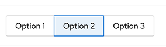

# PatternFly Release Highlights
## Release 2021.06
----------------------------------------------------------
## New features and enhancements

### [Toggle group re-styling](https://www.patternfly.org/v4/components/toggle-group)

 We updated the selected color for a set of toggle buttons to use a lighter blue. This better differentiates them from primary buttons when placed in a full page layout.

### [Composable dropdown menus](https://www.patternfly.org/v4/demos/composable-menu)

 Composable menus pair a [Menu toggle](https://www.patternfly.org/v4/components/menu-toggle) and a [Menu](https://www.patternfly.org/v4/components/menu) component to create flexible dropdown and select menu configurations. This provides a more modular solution for deploying menus. Existing dropdown and select components are still supported.

### [View more action added to Select](https://www.patternfly.org/v4/components/select#view-more)

We've added a view more action to the bottom of a select menu to enable incremental loading of long option lists.

### [Complex actions now supported in a table](https://www.patternfly.org/v4/components/table#actions-and-first-cell-in-body-rows-as-th)

We now support adding any type of actions to table rows. Formerly, only actions (kabob) menus were supported.

### [Log viewer component (beta)](https://www.patternfly.org/v4/components/log-viewer)

 Introduces a native log viewer component to display real-time streamed logs or static log data. The toolbar is fully customizable. This is currently work in progress with a number of enhancements and improvements to be introduced over upcoming releases. With that in mind, you are encouraged to use this and provide feedback.

See the [latest release notes](https://www.patternfly.org/v4/developer-resources/release-notes) for a more detailed list of changes.

-----------------------------------------------------------------------------

## What we’re working on...

### 2021.07 (June 4)

* [New List variants](https://github.com/patternfly/patternfly-react/issues/5336) - Add new variants of the List component to include horizontal separators, icons and 'pf-m-plain' modifier.

* [Uncontrolled behavior for tabs](https://github.com/patternfly/patternfly-react/issues/4458) - To be more developer friendly, the Tabs component will support uncontrolled behavior such that the developer does not need to control which tab is the active one.

* [Add help text support to Description list items](https://github.com/patternfly/patternfly-react/issues/5482) - Add the ability to open help in a popover by clicking of a field label in a Description list.

* [Add "visited" styling for links](https://github.com/patternfly/patternfly/issues/3726) - Add visited styling to optionally apply to links on a page.

* [Support disabled dropdown tooltip](https://github.com/patternfly/patternfly/issues/3680) - Allows a tooltip to be attached to a disabled dropdown menu item.

* [Add a "danger" variant for secondary and link buttons](https://github.com/patternfly/patternfly-react/issues/5578) - Allows danger (red button) styles for additional button types. Currently supported for primary buttons, only.

* [Allow wizard sub-steps to be collapsed](https://github.com/patternfly/patternfly-react/issues/5580) - Allows wizard sub-steps to be hidden and expanded on-demand to reduce clutter in wizards with many steps.

### 2021.08 (June 25)

* [Auto-complete Search input](https://github.com/patternfly/patternfly-react/issues/5499) - Will introduce an option to add auto-complete behavior to the Search input component.

* [Rich helper text for form elements](https://github.com/patternfly/patternfly/issues/4017) - Add the ability to include more complex elements attached to a form field. Will be useful for password and name validation.

* [Password strength meter](https://github.com/patternfly/patternfly/issues/4018) - Add a demo to show how to add a password strength indicator to the login page.

* [Expandable inline alert](https://github.com/patternfly/patternfly/issues/4056) - Add the option to hide the contents of an inline alert and expand it on-demand.

For a complete roadmap showing all items planned in future releases, see our [PatternFly Feature Roadmap](https://github.com/orgs/patternfly/projects/4?fullscreen=true) project board.
