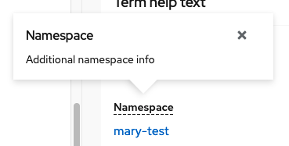
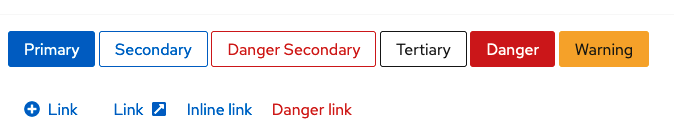
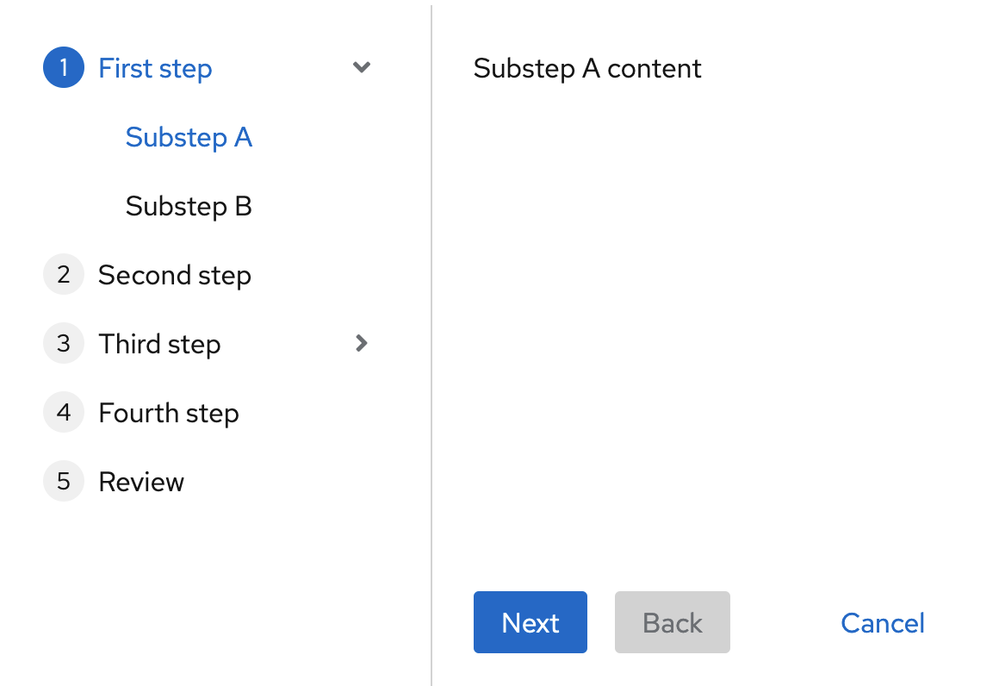
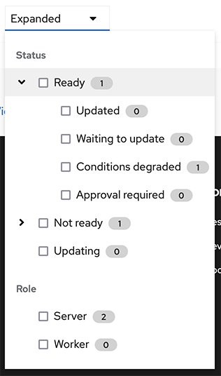

# PatternFly Release Highlights
## Release 2021.07
----------------------------------------------------------
## New features and enhancements

 ### [New list variants](https://www.patternfly.org/v4/components/list)

  Adds new variants of the List component to include horizontal separators, lists with icons, and 'pf-m-plain' modifier.

  ### [Optional help text on description list items](https://www.patternfly.org/v4/components/description-list#term-help-text)

  

   Added the ability to open help in a popover by clicking on a field label in a description list.

  ### [Added a "danger" variant for secondary and link buttons](https://www.patternfly.org/v4/components/button)

 

  Introduces danger (red button) styles for additional button types.

  ### [Wizard with expandable sub-steps](https://www.patternfly.org/v4/components/wizard#expandable-steps)

 

  Allows wizard sub-steps to be hidden and expanded on-demand to reduce clutter in wizards with many steps.

  ### [Filter-tree demo](https://www.patternfly.org/v4/demos/composable-menu#filter-tree-menu)

  

  Using the composable menu component, we demonstrate how to place a tree-view inside of a dropdown to create a "filter-tree" pattern.

 ### [Uncontrolled behavior for tabs](https://www.patternfly.org/v4/components/tabs#uncontrolled)
 The Tabs component now supports uncontrolled behavior so that the developer does not need to control which tab is the active one.

 ### [Tooltip: added entry delay](https://www.patternfly.org/v4/components/tooltip)

 Added a 300ms default entry delay to tooltips to prevent immediate firing when passing the mouse over a page. This value can be changed via a prop.

See the [latest release notes](https://www.patternfly.org/v4/developer-resources/release-notes) for a more detailed list of changes.

-----------------------------------------------------------------------------

## What we’re working on...

### 2021.08 (June 25)

* [Auto-complete Search input](https://github.com/patternfly/patternfly-react/issues/5499) - Introduce an option to add auto-complete behavior to the Search input component.

* [Helper text for component](https://github.com/patternfly/patternfly-react/issues/5818) - Add the ability to include lists and icons in help text attached to a form field. Will be useful for password and name validation.

* [Add "visited" styling for links](https://github.com/patternfly/patternfly-react/issues/5857) - Add visited styling to optionally apply to links on a page.

* [Support disabled dropdown tooltip](https://github.com/patternfly/patternfly-react/issues/5826) - Allows a tooltip to be attached to a disabled dropdown menu item.

* [Draggable rows in table](https://github.com/patternfly/patternfly-react/issues/5817) - Add the ability to drag rows in a composable table to support manual ordering of items.

### 2021.10 (August 6)

* [Password strength meter](https://github.com/patternfly/patternfly/issues/4018) - Add a demo to show how to add a password strength indicator to the login page.

* [Expandable inline alert](https://github.com/patternfly/patternfly/issues/4056) - Add the option to hide the contents of an inline alert and expand it on-demand.

* [Movable modal](https://github.com/patternfly/patternfly/issues/3789) - Support repositioning a modal by clicking and dragging in the header area.

* [Editable label group](https://github.com/patternfly/patternfly-react/issues/5875) - Allow inline editing of labels.

For a complete roadmap showing all items planned in future releases, see our [PatternFly Feature Roadmap](https://github.com/orgs/patternfly/projects/4?fullscreen=true) project board.
