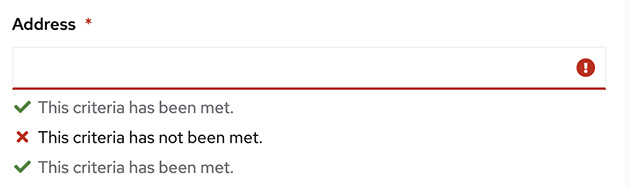

# PatternFly Release Highlights
## Release 2021.08
----------------------------------------------------------
## New features and enhancements

### [Helper text component](https://www.patternfly.org/v4/components/helper-text)

   

   Adds the ability to include lists and icons in help text attached to a form field. Will be useful for password and name validation.

### [Added "visited" styling for links](https://www.patternfly.org/v4/components/text#visited)

Adds option to apply visited styling to links on a page. Uses #40199a (purple-600) to indicate a visited link.

### [Draggable rows in table](https://www.patternfly.org/v4/components/table#composable-draggable-row-table)

 Adds the ability to drag rows in a composable table to support manual ordering of items.

 ### [Log viewer ehnacements](https://www.patternfly.org/v4/components/log-viewer)

 The log viewer is now responsive to changes in viewport sizing and includes updated search results styling per the design.

See the [latest release notes](https://www.patternfly.org/v4/developer-resources/release-notes) for a more detailed list of changes.

-----------------------------------------------------------------------------

## What we’re working on...

### 2021.10 (August 6)

* [Auto-complete Search input](https://github.com/patternfly/patternfly-react/issues/5499) - Introduce an option to add auto-complete behavior to the Search input component.

- [Disabled dropdown tooltip](https://github.com/patternfly/patternfly-react/issues/5826) - Allow a tooltip to be attached to a disabled dropdown menu item.

* [Password strength meter](https://github.com/patternfly/patternfly/issues/4018) - Add a demo to show how to add a password strength indicator to a password field.

* [Expandable inline alert](https://github.com/patternfly/patternfly/issues/4056) - Add the option to hide the contents of an inline alert and expand it on-demand.

* [Movable modal](https://github.com/patternfly/patternfly/issues/3789) - Support repositioning a modal by clicking and dragging in the header area.

* [Editable label group](https://github.com/patternfly/patternfly-react/issues/5875) - Allow inline editing of labels.

### 2021.11 (August 27)

* [Task drawer](https://github.com/patternfly/patternfly/issues/4186) and [task badge](https://github.com/patternfly/patternfly/issues/4185) - Extend the notification drawer component to report and manage tasks as well as alerts.

* [Compact tree-view](https://github.com/patternfly/patternfly/issues/4177) - Add a new variant of the tree view component that is better designed to work with dense content and confined spaces.

* [Expandable section: disclosure panel variant](https://github.com/patternfly/patternfly-react/issues/5931) - Add a new variant of the expandable section that includes a bordered panel (similar to an accordion) and is suitable for content-rich applications. 

For a complete roadmap showing all items planned in future releases, see our [PatternFly Feature Roadmap](https://github.com/orgs/patternfly/projects/4?fullscreen=true) project board.
