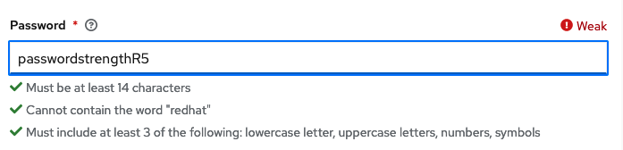
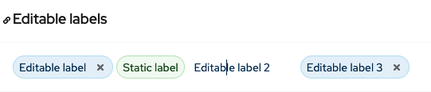
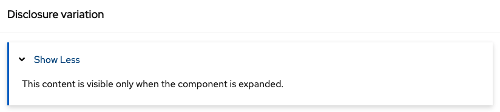
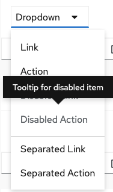

# PatternFly Release Highlights
## Release 2021.10
----------------------------------------------------------
## New features and enhancements

### [Password strength demo](https://www.patternfly.org/v4/demos/password-strength)

  

Adds a demo to show how to use the new Helper text component to add password validation and a strength indicator to a password field.

### [Editable label group](https://www.patternfly.org/v4/components/label-group#editable-labels)

Allows for inline editing of labels.

### [Disclosure panel](https://www.patternfly.org/v4/components/expandable-section#disclosure-variation)

This is a new variant of the Expandable section component that allows content to be enclosed within a bordered panel that is expandable. This is useful when you have a lot of content on a page and want to allow the user to show or hide information that might not be relevant.

### [Disabled dropdown tooltip](https://www.patternfly.org/v4/components/dropdown#basic)

Allows a tooltip to be attached to a disabled dropdown menu item.

### [Log viewer enhancements](https://www.patternfly.org/v4/extensions/log-viewer)

The log viewer extension has been updated to support a dark mode and full screen viewing. Note that log viewer has been moved from the Components to the new Extensions area on the PatternFly website.

See the [latest release notes](https://www.patternfly.org/v4/developer-resources/release-notes) for a more detailed list of changes.

-----------------------------------------------------------------------------

## What we’re working on...

### 2021.11 (August 27)

* [Compact tree-view](https://github.com/patternfly/patternfly-react/issues/6046) - Add a new variant of the tree view component that is better designed to work with dense content and confined spaces.

* [Enable multi-select rows in a table](https://github.com/patternfly/patternfly-react/issues/6032) - Add a new demo to show how to implement multi-selection of rows through the keyboard in a composable table.

* [Search input with submit button](https://github.com/patternfly/patternfly-react/issues/5963) - Adds a new search input variant that includes a submit button.

*  [Tree view: make the toolbar/header more flexible](https://github.com/patternfly/patternfly-react/issues/5933) - Make the toolbar/header area flexible to pass in anything you want including a search input, actions, or anything that makes sense.

* [Popover: support diagonal positioning](https://github.com/patternfly/patternfly-react/issues/6075) - Support diagonal positioning of a popover window.

* [Navigation: new horizontal sub-nav menu](https://github.com/patternfly/patternfly-react/issues/6045) - Introduce a new horizontal secondary navigation bar that will replace the legacy tertiary navigation for use when you want to support local navigation within a page. The new navigation bar is better differentiated from horizontal tabs.

### 2021.12 (September 17)

* [Horizontal table scrolling with sticky columns](https://github.com/patternfly/patternfly/issues/4218) - Allow a table to scroll horizontally while keeping some number of columns always visible.

* [Back to top component](https://github.com/patternfly/patternfly/issues/4255) - Introduce a new component that floats on top of content for long scrolling pages and navigates the user back to the top of the page in a single click.

* [Plain alert variant](https://github.com/patternfly/patternfly/issues/4220) - Adds a new variant of an inline alert that removes borders and background styling.

* [Expandable inline alert](https://github.com/patternfly/patternfly/issues/4056) - Adds a new alert type with an expandable header that allows body content to be hidden for a more compact appearance.

* [Disabled tabs](https://github.com/patternfly/patternfly/issues/4257) - Add a disabled variant for the tabs component. The user can place a tooltip on a disabled tab as they would for other disabled controls. 

For a complete roadmap showing all items planned in future releases, see our [PatternFly Feature Roadmap](https://github.com/orgs/patternfly/projects/4?fullscreen=true) project board.
