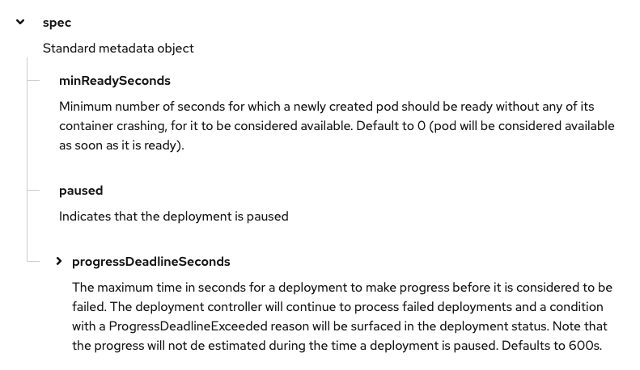
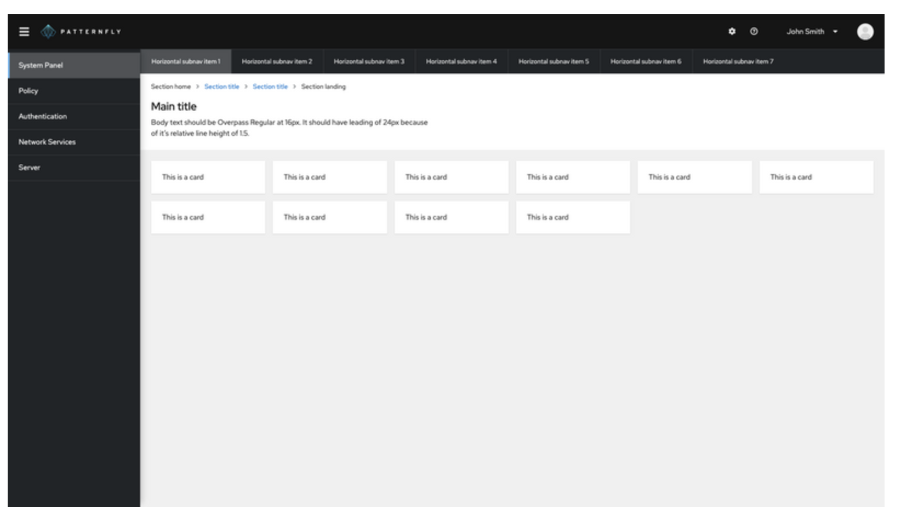

# PatternFly Release Highlights
## Release 2021.11
----------------------------------------------------------
## New features and enhancements

### [Tree-view enhancements](https://www.patternfly.org/v4/components/tree-view)

Adds new variants of the tree view component that are better designed to work with dense content and confined spaces. These include two compact variants and the ability to add guides to any tree view to better visualize the hierarchy. We have also made the toolbar/header area flexible to pass in anything you want including a search input, actions, or anything that makes sense.

### [Search input with submit button](https://www.patternfly.org/v4/components/search-input#with-submit-button)

 Adds a new search input variant that includes a submit button.

### [New horizontal sub-navigation](https://www.patternfly.org/v4/components/navigation#horizontal-subnav)

Introduces a new horizontal secondary navigation bar that will replace the legacy tertiary navigation to use for exposing local navigation within a page. The new navigation bar is better differentiated from horizontal tabs. See a [full page demo](https://www.patternfly.org/v4/components/navigation/react-demos#horizontal-subnav).

### [Multi-select rows in a table](https://www.patternfly.org/v4/components/table#composable-selectable)
Users can now use `shift+select` to select a range of rows in composable table component.

### [Popover diagonal positioning](https://www.patternfly.org/v4/components/popover/#advanced)
The popover component now supports diagonal as well as left, right, top, and bottom positioning.

See the [latest release notes](https://www.patternfly.org/v4/developer-resources/release-notes) for a more detailed list of changes.

-----------------------------------------------------------------------------

## What we’re working on...

### 2021.12 (September 17)

* [Back to top component](https://github.com/patternfly/patternfly-react/issues/6166) - Introduce a new component that floats on top of content for long scrolling pages and navigates the user back to the top of the page in a single click.

* [Plain alert variant](https://github.com/patternfly/patternfly-react/issues/6164) - Add a new variant of an inline alert that removes borders and background styling.

* [Expandable inline alert](https://github.com/patternfly/patternfly-react/issues/5820) - Add a new alert type with an expandable header that allows body content to be hidden for a more compact appearance.

* [Disabled tabs](https://github.com/patternfly/patternfly-react/issues/6162) - Add a disabled variant for the tabs component. The user can place a tooltip on a disabled tab as they would for other disabled controls.

* [Compact description list](https://github.com/patternfly/patternfly-react/issues/6181) - Add a more compact version of the description list with smaller text and tighter spacing.

* [Auto-complete search input](https://github.com/patternfly/patternfly-react/issues/6210) - Add auto-complete behavior to the search input component to expose a list of suggestions as the user types.

* [Refactor page to use new masthead](https://github.com/patternfly/patternfly-react/issues/6174) - Refactor our page demos to utilize the new masthead component. This will provide a more flexible and responsive [masthead](https://www.patternfly.org/v4/components/masthead) for future projects.

### 2021.13 (October 8)

* [Horizontal table scrolling with sticky columns](https://github.com/patternfly/patternfly/issues/4218) - Allow a table to scroll horizontally while keeping some number of columns always visible.

* [Progress stepper component](https://github.com/patternfly/patternfly/issues/4214) - Introduce a new component that tracks progress of a linear, step-wise task.

* [Dual list selector enhancements](https://github.com/patternfly/patternfly-design/issues/1033) - Add the ability to manually reorder the selected list in a dual list selector.

For a complete roadmap showing all items planned in future releases, see our [PatternFly Feature Roadmap](https://github.com/orgs/patternfly/projects/4?fullscreen=true) project board.
