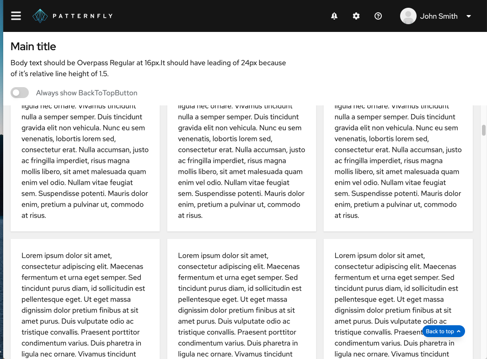
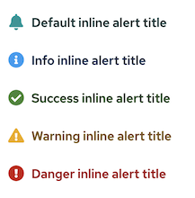

# PatternFly Release Highlights
## Release 2021.12
----------------------------------------------------------
## New features and enhancements

### [Back to top component](https://www.patternfly.org/v4/components/back-to-top)

Introduces a new component that floats on top of content for long scrolling pages. Back to top navigates the user back to the top of the page in a single click.

### [Plain alert variants](https://www.patternfly.org/v4/components/alert#inline-plain-types)

Adds a new variant of an inline alert that removes borders and background styling for use in the body of a page.

### [Expandable inline alert](https://www.patternfly.org/v4/components/alert#expandable)

Adds a new alert type with an expandable header that allows body content to be hidden for a more compact appearance.

### [Disabled tabs](https://www.patternfly.org/v4/components/tabs)

 Adds a disabled variant for the tabs component. The user can place a tooltip on a disabled tab as they would for other disabled controls to explain why the tab is disabled.

### [Auto-complete search input](https://www.patternfly.org/v4/components/search-input/react-demos#search-with-autocomplete)

Adds auto-complete behavior to the search input component to expose a list of suggestions as the user types.

### [Composable advanced search](https://www.patternfly.org/v4/components/search-input/react-demos#composable-advanced-search)

Demonstrates how to create an advanced search input with an attached form using a more composable flexible approach.

### [Refactor page to use new masthead](https://www.patternfly.org/v4/components/navigation/react-demos#default-nav)

Refactors our page demos to utilize the new masthead component. This will provide a more flexible and responsive for future projects. Note changes to the configuration of the user menu to better integrate the avatar.

### [Compact description list](https://www.patternfly.org/v4/components/description-list#compact)

Adds a more compact version of the description list with smaller text and tighter spacing.

See the [latest release notes](https://www.patternfly.org/v4/developer-resources/release-notes) for a more detailed list of changes.

-----------------------------------------------------------------------------

## What we’re working on...

### 2021.13 (October 8)

* [Progress stepper component](https://github.com/patternfly/patternfly-react/issues/6165) - Introduce a new component that tracks progress of a linear, step-wise task.

* [Dual list selector enhancements](https://github.com/patternfly/patternfly-react/issues/6265) - Add the ability to manually reorder the selected list in a dual list selector.

* [Flyout navigation](https://github.com/patternfly/patternfly-react/issues/6330) - Add a new flyout navigation variant to be added to a vertical navigation menu.

### 2021.14 (October 29)

* [Horizontal table scrolling with sticky columns](https://github.com/patternfly/patternfly/issues/4218) - Allow a table to scroll horizontally while keeping some number of columns always visible.

* [Link styling for banners](https://github.com/patternfly/patternfly/issues/4360) - Adds special visual styling for links inside a banner component.

* [Non-actionable card](https://github.com/patternfly/patternfly/issues/4359) - introduce special styling for "non-actionable" cards that are included inside a grid of actionable cards (e.g. in a catalog view).

* [Key-value filtering](https://github.com/patternfly/patternfly/issues/4374) - demonstrate how to create a Multi-select, key-value filter using existing components.

For a complete roadmap showing all items planned in future releases, see our [PatternFly Feature Roadmap](https://github.com/orgs/patternfly/projects/4?fullscreen=true) project board.
