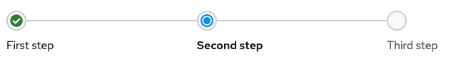
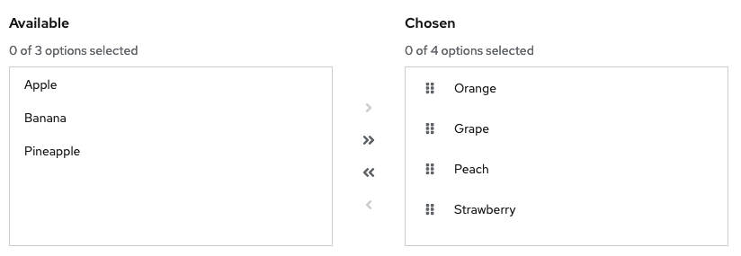
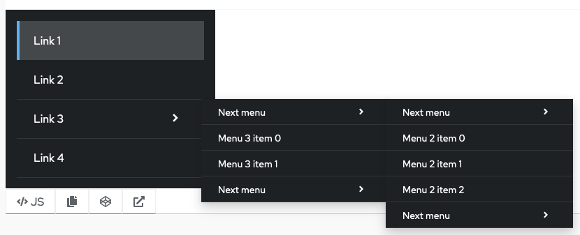

# PatternFly Release Highlights
## Release 2021.13
----------------------------------------------------------
## New features and enhancements

### [Progress stepper](https://www.patternfly.org/v4/components/progress-stepper)

The progress stepper is useful for tracking the progress of a linear, step-wise tasks.

### [Dual list selector with drag and drop](https://www.patternfly.org/v4/components/dual-list-selector#reordering-lists-using-drag-and-drop)

Adds the ability to manually reorder the selected list in a dual list selector.

### [Flyout navigation](https://www.patternfly.org/v4/components/navigation#flyout)

Adds a new flyout navigation variant that can be used to expose nested pages in a deep page hierarchy.

### [Link styling for banners](https://www.patternfly.org/v4/components/banner/html#banner-with-links)

Adds special visual styling for links that are embedded inside a banner component.

See the [latest release notes](https://www.patternfly.org/v4/developer-resources/release-notes) for a more detailed list of changes.

-----------------------------------------------------------------------------

## What we’re working on...

### 2021.14 (October 29)

* [Compact label](https://github.com/patternfly/patternfly-react/issues/6404) - adds a compact label variant that takes less vertical space to better fit inline with text of in a table cell.

* [Plain menu variant](https://github.com/patternfly/patternfly-react/issues/6367) - adds a "plain" variant of the Menu component that does not have borders for use inline within a form.

### 2021.15 (November 19)

* [Key-value filtering](https://github.com/patternfly/patternfly-react/issues/6393) - demonstrate how to create a Multi-select, key-value filter using existing components.

* [Update selected state visuals for Cards and Tiles](https://github.com/patternfly/patternfly/issues/4358) - introduce new visuals for selectable cards and tiles that are better differentiated from browser focus states.

* [Non-actionable card](https://github.com/patternfly/patternfly/issues/4359) - introduce special styling for "non-actionable" cards that are included inside a grid of actionable cards (e.g. in a catalog view).

* [Horizontal table scrolling with sticky columns](https://github.com/patternfly/patternfly-react/issues/6163) - Allow a table to scroll horizontally while keeping some number of columns always visible.

* [Allow control over default table sort direction](https://github.com/patternfly/patternfly-react/issues/5329) - will allow the consumer to select whether the default sort should be ascending or descending when initially clicking on a column header.

For a complete roadmap showing all items planned in future releases, see our [PatternFly Feature Roadmap](https://github.com/orgs/patternfly/projects/4?fullscreen=true) project board.
