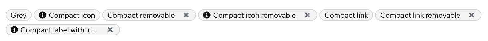
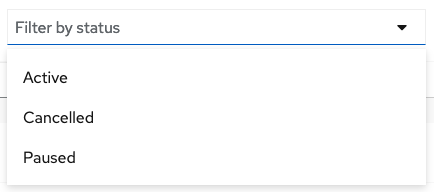

# PatternFly Release Highlights
## Release 2021.14
----------------------------------------------------------
## New features and enhancements

### [Compact label](https://staging.patternfly.org/v4/components/label#compact)

Adds a compact label variant that takes less vertical space to better fit inline with text in a table cell.

### [Plain menu variant](https://staging.patternfly.org/v4/components/menu)

Adds a "plain" variant of the Menu component that does not have borders for use inline within a page.

### [Add placeholder text to Select](https://staging.patternfly.org/v4/components/select#with-a-style-applied-to-the-placeholder-text)

Allows placeholder text styling to be applied to a Select component to differentiate a null selection from other options.

See the [latest release notes](https://www.patternfly.org/v4/developer-resources/release-notes) for a more detailed list of changes.

-----------------------------------------------------------------------------

## What we’re working on...

### 2021.15 (November 19)

* [Key-value filtering](https://github.com/patternfly/patternfly-react/issues/6393) - demonstrate how to create a multi-select, key-value filter using existing components.

* [Update selected state visuals for Cards and Tiles](https://github.com/patternfly/patternfly-react/issues/6465) - introduce new visuals for selectable cards and tiles that are better differentiated from browser focus states.

* [Horizontal table scrolling with sticky columns](https://github.com/patternfly/patternfly-react/issues/6163) - allow a table to scroll horizontally while keeping some number of columns always visible.

* [Allow control over default table sort direction](https://github.com/patternfly/patternfly-react/issues/5329) - will allow the consumer to select whether the default sort should be ascending or descending when initially clicking on a column header.

* [Support nested table headings](https://github.com/patternfly/patternfly-react/issues/6463) - support grouping multiple columns under one heading.

* [Pagination with indeterminate count](https://github.com/patternfly/patternfly-react/issues/6497) - allow substituting the word "Many" for the item count when the total count of items cannot be retrieved.

### 2021.16 (December 10)

* [Non-actionable card](https://github.com/patternfly/patternfly/issues/4359) - introduce special styling for "non-actionable" cards that are included inside a grid of actionable cards (e.g. in a catalog view).

* [Truncation component](https://github.com/patternfly/patternfly/issues/4129) - introduce the ability to truncate text in the middle of a string.

* [Secondary button styled dropdown](https://github.com/patternfly/patternfly/issues/4434) - add a new variant of the Dropdown component that has secondary button styling. This can be used together with a primary styled dropdown to present actions in an expandable menu.

For a complete roadmap showing all items planned in future releases, see our [PatternFly Feature Roadmap](https://github.com/orgs/patternfly/projects/4?fullscreen=true) project board.
