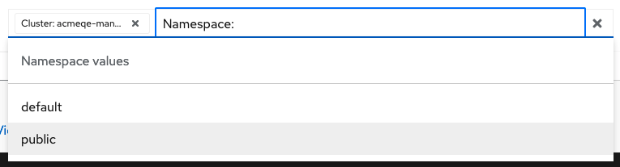
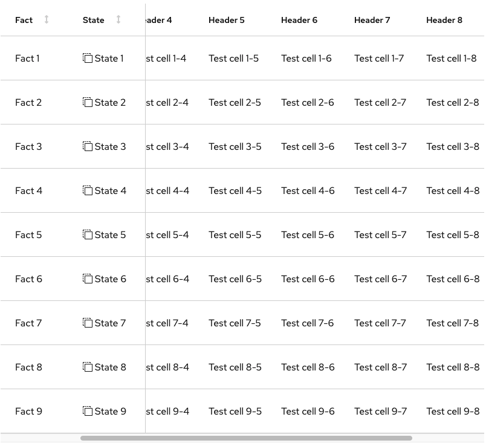
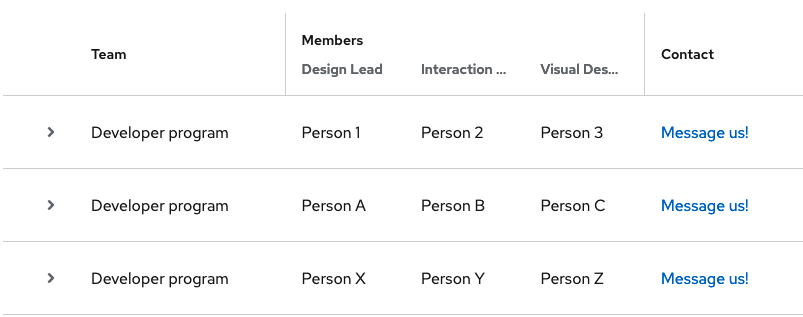

# PatternFly Release Highlights
## Release 2021.15
----------------------------------------------------------
## New features and enhancements

### [Attribute-value filtering](https://www.patternfly.org/v4/components/text-input-group/react-demos#attribute-value-filtering)

This demo shows how to use the new Text input group component to create a type-ahead filter for filtering a large data set using multiple key-value tags.

### [Horizontal table scrolling with sticky columns](https://www.patternfly.org/v4/components/table#composable-sticky-column)

 Allow a table to scroll horizontally while keeping some number of columns always visible from the left edge. This is currently implemented for the composable table, only. We will follow up with support for the legacy React table in a future release.

 ### [Nested table headings](https://www.patternfly.org/v4/components/table#composable-nested-column-headers-and-expandable-rows)

 You can now optionally nest multiple columns under one heading (composable table, only).

### [Default table sort direction](https://www.patternfly.org/v4/components/table#isortby)

Added a new prop to allow the consumer to select whether the default sort should be ascending or descending when initially clicking on a column header.

### [Pagination with indeterminate count](https://www.patternfly.org/v4/components/pagination#indeterminate)

This update allows for substituting the word "many" for the item count when the total count of items cannot be retrieved.

### [Dashboard design guidelines](https://www.patternfly.org/v4/guidelines/dashboards)

New documentation introduced to guide designers in best practices for designing dashboards using PatternFly.

See the [latest release notes](https://www.patternfly.org/v4/developer-resources/release-notes) for a more detailed list of changes.

-----------------------------------------------------------------------------

## What we’re working on...

### 2021.16 (December 10)

* [Non-actionable card](https://github.com/patternfly/patternfly-react/issues/6567) - introduce special styling for "non-actionable" cards that are included inside a grid of actionable cards (e.g. in a catalog view).

* [Truncation component](https://github.com/patternfly/patternfly-react/issues/6566) - introduce the ability to truncate text in the middle of a string.

* [Secondary button styled dropdown](https://github.com/patternfly/patternfly-react/issues/6559) - add a new variant of the Dropdown component that has secondary button styling. This can be used together with a primary styled dropdown to present actions in an expandable menu.

* [Red Hat font upgrade](https://github.com/patternfly/patternfly/issues/4021) - offer the latest Red Hat font version as an opt-in. This includes several new features including new monospace and tabular font faces.

### 2022.01 (January 28)

* [Multiple-file upload](https://github.com/patternfly/patternfly/issues/4521) - support uploading multiple files simultaneously.

* [Increase click-target size for table checkboxes](https://github.com/patternfly/patternfly/issues/4355) - will make selectable tables more usable by increasing the click target size around row select checkboxes.

* [Add support for seconds in the Time picker](https://github.com/patternfly/patternfly-react/issues/5998) - add support for entering seconds in the Time picker.

For a complete roadmap showing all items planned in future releases, see our [PatternFly Feature Roadmap](https://github.com/orgs/patternfly/projects/4?fullscreen=true) project board.
