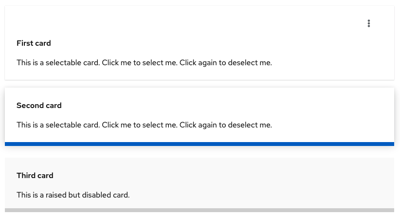
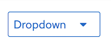
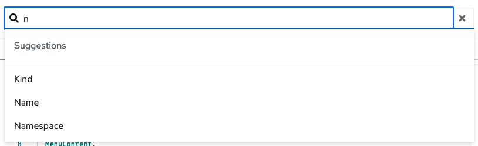

# PatternFly Release Highlights
## Release 2021.16
----------------------------------------------------------
## New features and enhancements

### [New selectable card variants](https://www.patternfly.org/v4/components/card#selectable-and-selected)

We've introduced new styling for selectable cards to better distinguish the selected state from the browser focus state and to add a non-actionable or disabled card. The new selected card has a think blue underline and a slightly raised appearance. Legacy selectable card styles are still available so if you are using selectable cards today, nothing will change unless you makes updates to opt into this new styling. However, we recommend use of this new styling moving forward for catalog views or other places with you might use selectable cards.

### [Secondary button styled dropdown](https://www.patternfly.org/v4/components/dropdown#secondary-toggle)

Adds a new variant of the Dropdown component that has secondary button styling. This complements the existing primary styled dropdown to present actions in an expandable menu when those actions are nor intended as the primary actions on a page.

### [Auto-complete search demo](https://www.patternfly.org/v4/components/text-input-group/react-demos#auto-complete-search)

This demo showcases how to use the [text input group component](https://www.patternfly.org/v4/components/text-input-group) to create a search input with suggestions, which filters possible selections based on the text you've entered. Unlike the attribute-value filtering demo, it allows creation of new chip items when the text entered is not available in the list of suggestions.

### [Red Hat font upgrade](https://www.patternfly.org/v4/developer-resources/red-hat-font)
PatternFly now supports the latest Red Hat font version (v4.0.2). This includes several new features including monospace and tabular font faces. To use the new font in your project, opt-in by adding the new classes as [documented here](https://www.patternfly.org/v4/developer-resources/red-hat-font#available-opt-ins).

See the [latest release notes](https://www.patternfly.org/v4/developer-resources/release-notes) for a more detailed list of changes.

-----------------------------------------------------------------------------

## What we’re working on...

### 2022.01 (January 28)

* [Truncation component](https://github.com/patternfly/patternfly-react/issues/6566) - introduce the ability to truncate text in the middle of a string.

* [Multiple-file upload](https://github.com/patternfly/patternfly-react/issues/6683) - support uploading multiple files simultaneously.

* [Increase click-target size for table checkboxes](https://github.com/patternfly/patternfly-react/issues/6695) - make selectable tables more usable by increasing the click target size around row select checkboxes.

* [Password generator demo](https://github.com/patternfly/patternfly-react/issues/6686) - adds a new demo that shows how to use existing components to build a password generator widget to use in creating user credentials.

* [Description list: optionally fill columns first](https://github.com/patternfly/patternfly-react/issues/6685) - in a multi-column description list values are filled in across rows first. This enhancement introduces the option to fill columns first rather than rows.

* [Progress button demo](https://github.com/patternfly/patternfly-react/issues/6684) - demonstrate how to use the [progress variation](https://www.patternfly.org/v4/components/button#progress) of the button component to reflect in progress and completion states.

### 2022.02 (February 18)

* [Support optional row striping in tables](https://github.com/patternfly/patternfly/issues/4564) - adds the option to provide a background fill to alternate table rows to improve the readability of dense tables.

* [Add support for seconds in the Time picker](https://github.com/patternfly/patternfly-react/issues/5998) - add support for entering seconds in the Time picker.

For a complete roadmap showing all items planned in future releases, see our [PatternFly Feature Roadmap](https://github.com/orgs/patternfly/projects/4?fullscreen=true) project board.
