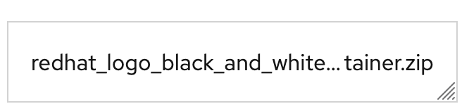
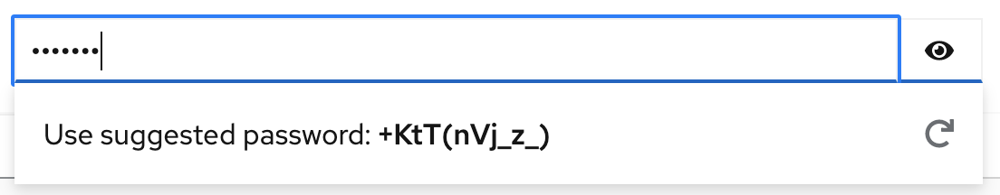
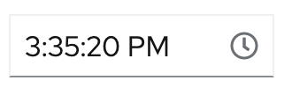

# PatternFly Release Highlights
## Release 2022.01
----------------------------------------------------------
## New features and enhancements

### [Truncate component](https://www.patternfly.org/v4/components/truncate)

Introduces the ability to truncate text in the middle or at the beginning of a string.

### [Password generator demo](https://www.patternfly.org/v4/demos/password-generator)

Added a new demo that shows how to use existing components to build a password generator field to use in creating user credentials.

### [Time picker enhancements](https://www.patternfly.org/v4/components/time-picker#with-seconds)

The time picker component was enhanced to add support for entering seconds. It also now includes optional `minTime` and `maxTime` props for constraining the time entered to being within a specified range.

### [Description list: optionally fill columns first](https://www.patternfly.org/v4/components/description-list#column-fill)
In a multi-column description list, this enhancement introduces the option to fill columns rather than rows first.

### [Increased click-target size for table checkboxes](https://www.patternfly.org/v4/components/table#composable-selectable-with-checkbox)
This update makes tables with selectable rows more usable by increasing the click target size around checkboxes used to select the row.

### [Progress button demo](https://www.patternfly.org/v4/components/button/react-demos)
Demonstrates how to use the [progress variation](https://www.patternfly.org/v4/components/button#progress) of the button component to reflect in-progress and completion states by substituting a success icon for the spinner when done.

See the [latest release notes](https://www.patternfly.org/v4/developer-resources/release-notes) for a more detailed list of changes.

-----------------------------------------------------------------------------

## What we’re working on...

### 2022.02 (February 18)

* [Multiple-file upload](https://github.com/patternfly/patternfly-react/issues/6683) - support uploading multiple files simultaneously.

* [Support optional row striping in tables](https://github.com/patternfly/patternfly-react/issues/6781) - adds the option to provide a background fill to alternate table rows to improve the readability of dense tables.

* [Support for icons on description list items](https://github.com/patternfly/patternfly-react/issues/6780) - allows for adding an optional icon in from of a description list item.

* [Move expand-all control from toolbar to table header](https://github.com/patternfly/patternfly-react/issues/6783) - based on user feedback, we are moving the expand-all control for expandable tables from the toolbar to the table header row.

### 2022.03 (March 11)

* [Adding an overflow feature to alert groups](https://github.com/patternfly/patternfly/issues/1181) - this enhancement will allow for better management of toast alerts. The overflow feature will allow users more control in viewing and acting on multiple alerts without alerts taking over the screen.

* [Date select demo](https://github.com/patternfly/patternfly-react/issues/6460) - show how a select component can be used to create a custom date select with predefined date ranges for use in filters and similar use cases.

For a complete roadmap showing all items planned in future releases, see our [PatternFly Feature Roadmap](https://github.com/orgs/patternfly/projects/4?fullscreen=true) project board.
