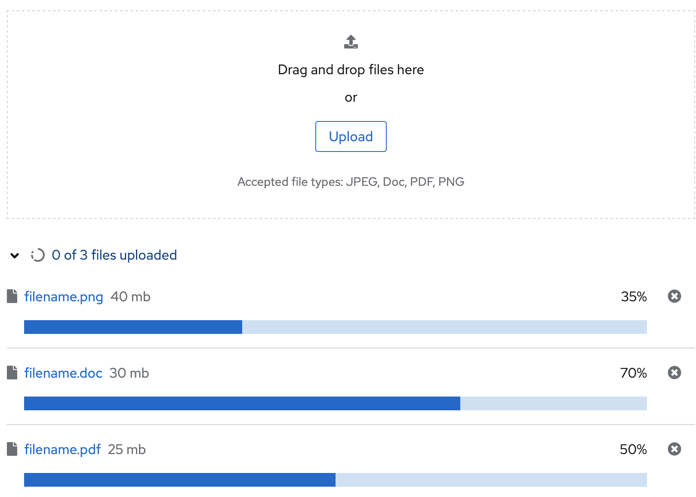
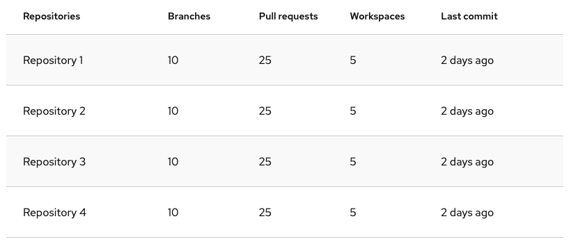
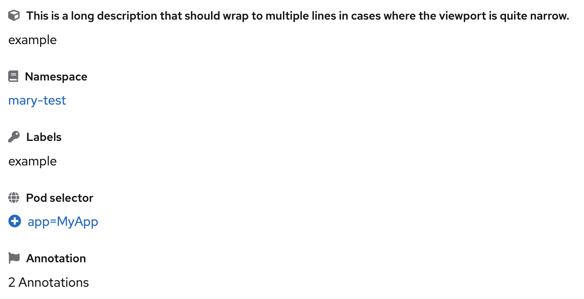
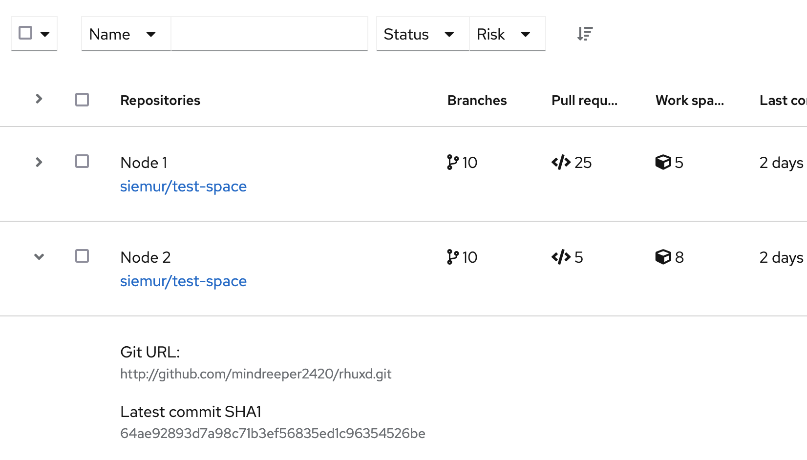
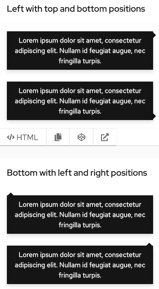
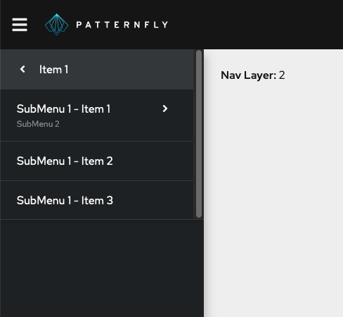

# PatternFly Release Highlights
## Release 2022.02
----------------------------------------------------------
## New features and enhancements

### [Multiple-file upload](https://www.patternfly.org/v4/components/file-upload---multiple)

This new component introduces support for uploading multiple files simultaneously. It is also useful for uploading a single large binary file where reporting status using a progress bar might be useful. The simple [file upload](https://www.patternfly.org/v4/components/file-upload) component is still available for uploading text files.

### [Optional row striping in tables](https://www.patternfly.org/v4/components/table#composable-striped)

Adds the option to provide a background fill to alternate table rows to improve the readability of dense tables.

### [Support for icons on description list items](https://www.patternfly.org/v4/components/description-list#with-icons)

An optional icon can now be added in front of a description list item.

### [Moved expand-all control from toolbar to table header](https://www.patternfly.org/v4/components/table/react-demos#expandcollapse-all)

Based on user feedback, we moved the expand-all control for expandable tables from the toolbar to the table header row.

### [Diagonal tooltip positioning](https://www.patternfly.org/v4/components/tooltip#options)

Tooltips can now be positioned diagonally relative to the element that triggers them (in addition to current top, bottom, left, and right positions).

### [Drill-down navigation](https://www.patternfly.org/v4/components/navigation#drilldown)

We now support a drill-down menu pattern in our navigation component which provides more flexibility in navigating information hierarchies that are more than two levels deep.

See the [latest release notes](https://www.patternfly.org/v4/developer-resources/release-notes) for a more detailed list of changes.

-----------------------------------------------------------------------------

## What we’re working on...

### 2022.03 (March 11)

* [Adding an overflow feature to alert groups](https://github.com/patternfly/patternfly-react/issues/6890) - this enhancement will allow for better management of toast alerts. The overflow feature will allow users more control in viewing and acting on multiple alerts without alerts taking over the screen.

* [Date select demo](https://github.com/patternfly/patternfly-react/issues/6460) - show how a select component can be used to create a custom date select with predefined date ranges for use in filters and similar use cases.

* Code editor enhancements - we're working on two enhancements to the code editor component. The [first](https://github.com/patternfly/patternfly-react/issues/6226) will enable the Monaco editor's "fit-to-height" option via a prop. The [second enhancement](https://github.com/patternfly/patternfly-react/issues/6663) will allow keyboard shortcuts hints to be displayed by adding a button in the toolbar area.

### 2022.04 (April 1)

* [Predefined sizes for the avatar](https://github.com/patternfly/patternfly-react/issues/6905) - support for predefined sizes from sm (24px) to xl (128px) will be supported.

* [Comma-separated values in attribute-value filter](https://github.com/patternfly/patternfly-react/issues/6795) - enhance the [attribute-value filter demo](https://www.patternfly.org/v4/components/text-input-group/react-demos/) to show how to assign multiple values to a single attribute via a comma-separated list (e.g., [cluster: name1, name2] instead of [cluster: name1] [cluster: name2]).

* [Allow for setting the column width of a horizontal description list](https://github.com/patternfly/patternfly-react/issues/6866) - allows for constraining the width of a column and forcing labels to wrap. This will be useful when terms in the list have very different lengths.

For a complete roadmap showing all items planned in future releases, see our [PatternFly Feature Roadmap](https://github.com/orgs/patternfly/projects/4?fullscreen=true) project board.
