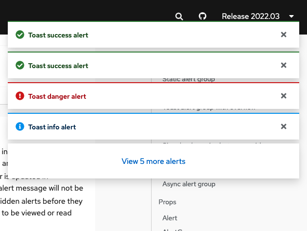
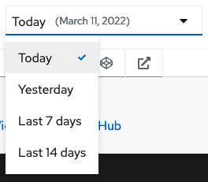
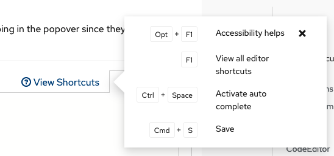

# PatternFly Release Highlights
## Release 2022.03
----------------------------------------------------------
## New features and enhancements

## [Overflow feature for alert groups](https://www.patternfly.org/v4/components/alert-group#toast-alert-group-with-overflow-capture)

The overflow feature will allow users more control in viewing and acting on multiple alerts without alerts taking over the screen. The number of alerts to display and the "view more" link are configurable.

### [Date select demo](https://www.patternfly.org/v4/demos/composable-menu#composable-date-select)

This demo shows how composable menu components can be used to create a custom date select with predefined date ranges for use in filters and similar use cases.

### [Code editor with keyboard shortcuts](https://www.patternfly.org/v4/components/code-editor#with-shortcut-menu-and-main-header-content.)

This enhancement adds the option to display keyboard shortcuts hints by clicking a button in the toolbar area.

See the [latest release notes](https://www.patternfly.org/v4/developer-resources/release-notes) for a more detailed list of changes.

-----------------------------------------------------------------------------

## What we’re working on...

### 2022.04 (April 1)

* [Fit code editor to height](https://github.com/patternfly/patternfly-react/issues/6226)  - enable the Monaco editor's "fit-to-height" option via a prop.

* [Predefined sizes for the avatar](https://github.com/patternfly/patternfly-react/issues/6905) - support for predefined sizes from sm (24px) to xl (128px) will be supported.

* [Comma-separated values in attribute-value filter](https://github.com/patternfly/patternfly-react/issues/6795) - enhance the [attribute-value filter demo](https://www.patternfly.org/v4/components/text-input-group/react-demos/) to show how to assign multiple values to a single attribute via a comma-separated list (e.g., [cluster: name1, name2] instead of [cluster: name1] [cluster: name2]).

* [Allow for setting the column width of a horizontal description list](https://github.com/patternfly/patternfly-react/issues/6866) - allows for constraining the width of a column and forcing labels to wrap. This will be useful when terms in the list have very different lengths.

* Calendar component enhancements - working on two issues to enhance the [calendar month](https://www.patternfly.org/v4/components/calendar-month) component.
  * [Make date prop optional](https://github.com/patternfly/patternfly-react/issues/7026)
  * [Add example for date range selection to match core examples](https://github.com/patternfly/patternfly-react/issues/7027)

### 2022.05 (April 22)

* [Tree view: add option to select parent nodes](https://github.com/patternfly/patternfly/issues/4724) - for some use cases, it makes sense for parent nodes in a tree view to nave select actions (e.g. for navigation) as well as being used to expand or collapse the node. This enhancement will introduce a new variant of the [tree view](https://www.patternfly.org/v4/components/tree-view) to support that behavior.

* [Add information panel to a wizard](https://github.com/patternfly/patternfly/issues/4611) - this will add an optional sidebar to the body of a wizard for holding more information about completing that step.

For a complete roadmap showing all items planned in future releases, see our [PatternFly Feature Roadmap](https://github.com/orgs/patternfly/projects/4?fullscreen=true) project board.
