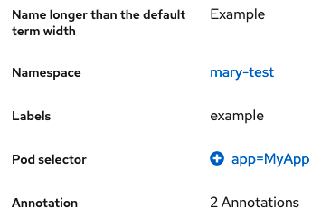

# PatternFly Release Highlights
## Release 2022.04
----------------------------------------------------------
## New features and enhancements

### [Fit code editor to height](https://www.patternfly.org/v4/components/code-editor#with-sizetofit-height-height-will-growshrink-with-content)  

Enables the Monaco editor's "fit-to-height" option via a prop.

### [Description list - set column width](https://www.patternfly.org/v4/components/description-list#horizontal-using-custom-term-width-modifier)

Allows for constraining the width of a column and forcing labels to wrap. This is useful when terms in the list have very different lengths.

### [Predefined sizes for the avatar](https://www.patternfly.org/v4/components/avatar)

The avatar component now supports predefined sizes from sm (24px) to xl (128px).

### [Calendar month enhancements](https://www.patternfly.org/v4/components/calendar-month)

The `date` prop is now optional which allows for opening the calendar without setting an initial date.

### [Website enhancements](https://www.patternfly.org/v4/components/about-modal)
This release also includes some PatternFly website updates including a new responsive table of contents on component pages.

See the [latest release notes](https://www.patternfly.org/v4/developer-resources/release-notes) for a more detailed list of changes.

-----------------------------------------------------------------------------

## What we’re working on...

### 2022.05 (April 22)

* [Brand enhancements](https://github.com/patternfly/patternfly-react/issues/5637) - update the brand component to allow images to be swapped by breakpoint. This will allow a product to support unique brand images per platform (e.g. mobile vs desktop)

* [Exposing onBlur events for select component](https://github.com/patternfly/patternfly-react/issues/6882) - will expose the onBlur event for the select component to make it easier to implement validation on the checkbox event variant.

### 2022.06 (May 13)

* [Tree view: add option to select parent nodes](https://github.com/patternfly/patternfly/issues/4724) - for some use cases, it makes sense for parent nodes in a tree view to nave select actions (e.g. for navigation) as well as being used to expand or collapse the node. This enhancement will introduce a new variant of the [tree view](https://www.patternfly.org/v4/components/tree-view) to support that behavior.

* [Add information panel to a wizard](https://github.com/patternfly/patternfly/issues/4611) - this will add an optional sidebar to the body of a wizard for holding more information about completing that step.

* [Switch enhancements](https://github.com/patternfly/patternfly/issues/4755) - the switch component will be enhanced to add an option to have both a checkmark and label when on. Off and disabled colors will also be updated for improved usability.

* [Add and remove tabs](https://github.com/patternfly/patternfly/issues/4757) - the tab component will be enhanced to introduced the ability to add and remove tabs within a horizontal group of tabs.

* [Search input - dark variant](https://github.com/patternfly/patternfly/issues/4705) - adding a dark variant of the search input that can be used in the masthead or above the vertical navigation menu.

For a complete roadmap showing all items planned in future releases, see our [PatternFly Feature Roadmap](https://github.com/orgs/patternfly/projects/4?fullscreen=true) project board.
