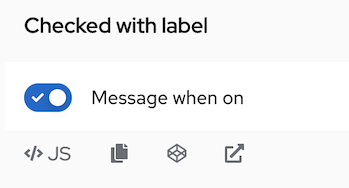
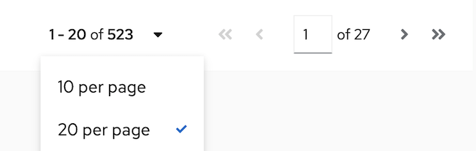

# PatternFly Release Highlights
## Release 2022.05
----------------------------------------------------------
## New features and enhancements

### [Switch enhancements](https://www.patternfly.org/v4/components/switch)

The switch component was enhanced to add an option to have both a checkmark and label when on. Off and disabled colors were also be updated for improved usability.

### [Pagination enhancement](https://www.patternfly.org/v4/components/pagination)

Based on user feedback, clicking either on the items per page text or the down caret will open the items per page menu allowing the user to change this setting.

### [Brand enhancements](https://www.patternfly.org/v4/components/brand)
The brand component was enhanced to allow images to be swapped by breakpoint. This will allow a product to support unique brand images per platform (e.g. mobile vs desktop).

### [Select enhancements](https://www.patternfly.org/v4/components/select#select)
We now expose the onBlur event for the select component via an `onBlur` callback to make it easier to implement validation on the checkbox event variant.

### Typescript conversions
We continue to make progress on converting our React examples from JS to Typescript with most of our components now using Typescript to present examples.

See the [latest release notes](https://www.patternfly.org/v4/developer-resources/release-notes) for a more detailed list of changes.

-----------------------------------------------------------------------------

## What we’re working on...

### 2022.06 (May 13)

* [Add information panel to a wizard](https://github.com/patternfly/patternfly-react/issues/7258) - this will add an optional sidebar to the body of a wizard for holding more information about completing that step.

* [Add and remove tabs](https://github.com/patternfly/patternfly-react/issues/7199) - the tab component will be enhanced to introduce the ability to add and remove tabs within a horizontal group of tabs.

* [Accessibility improvements](https://github.com/patternfly/patternfly-react/issues?q=is%3Aopen+is%3Aissue+label%3Aaccessibility+milestone%3A2022.06) - in this release we are focusing on a number of issues to improve accessibility of PatternFly components for both voice over performance and keyboard navigation.

### 2022.07 (June 3)

* [Tree view: add option to select parent nodes](https://github.com/patternfly/patternfly/issues/4724) - for some use cases, it makes sense for parent nodes in a tree view to have select actions (e.g. for navigation) as well as being used to expand or collapse the node. This enhancement will introduce a new variant of the [tree view](https://www.patternfly.org/v4/components/tree-view) to support that behavior.

* [Search input - dark variant](https://github.com/patternfly/patternfly/issues/4705) - adding a dark variant of the search input that can be used in the masthead or above the vertical navigation menu.

* [Editable label group](https://github.com/patternfly/patternfly/issues/4756) - introduce the ability for the user to add new labels to a label group.

For a complete roadmap showing all items planned in future releases, see our [PatternFly Feature Roadmap](https://github.com/orgs/patternfly/projects/4?fullscreen=true) project board.
