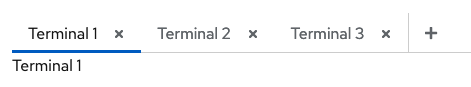

# PatternFly Release Highlights
## Release 2022.06
----------------------------------------------------------
## New features and enhancements

### [Add and remove tabs](https://www.patternfly.org/v4/components/tabs#dynamic)

The tab component has been enhanced to include the ability to dynamically add and remove tabs within a horizontal group of tabs.

See the [latest release notes](https://www.patternfly.org/v4/developer-resources/release-notes) for a more detailed list of changes.

-----------------------------------------------------------------------------

## What we’re working on...

### 2022.07 (June 3)

* [Add information panel to a wizard](https://github.com/patternfly/patternfly-react/issues/7258) - this will add an optional sidebar to the body of a wizard for holding more information about completing that step.

* [Allow expandable section toggle to be an arbitrary component](https://github.com/patternfly/patternfly-react/issues/6967) - currently, the toggle in the expandable section component is constrained to only contain a string. This update will allow an icon or any other non-interactive component to be placed in the toggle area.

### 2022.08 (June 24)

* [Tree view: add option to select parent nodes](https://github.com/patternfly/patternfly/issues/4724) - for some use cases, it makes sense for parent nodes in a tree view to have select actions (e.g. for navigation) as well as being used to expand or collapse the node. This enhancement will introduce a new variant of the [tree view](https://www.patternfly.org/v4/components/tree-view) to support that behavior.

* [Search input - dark variant](https://github.com/patternfly/patternfly/issues/4705) - adding a dark variant of the search input that can be used in the masthead or above the vertical navigation menu.

* [Editable label group](https://github.com/patternfly/patternfly/issues/4756) - introduce the ability for the user to add new labels to a label group.

For a complete roadmap showing all items planned in future releases, see our [PatternFly Feature Roadmap](https://github.com/orgs/patternfly/projects/4?fullscreen=true) project board.
