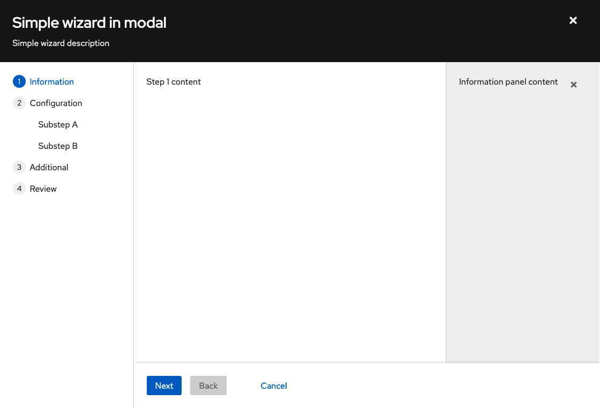
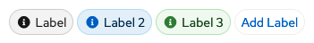
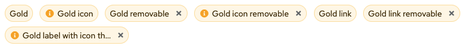

# PatternFly Release Highlights
## Release 2022.08
----------------------------------------------------------
## New features and enhancements

### [Wizard with optional drawer](https://www.patternfly.org/v4/components/wizard#wizard-with-drawer)

It is now possible to include a drawer inside a wizard. This can be useful for in-context help about a step or for displaying object details.

### [Editable label group](https://www.patternfly.org/v4/components/label-group#editable-labels-with-add-button)

This update introduces the ability for the user to dynamically add new labels to a label group. The Add button can be configured to add a new label directly inline or to implement a custom add function via a modal or similar interaction.

### [Gold label](https://www.patternfly.org/v4/components/label)

Adds a new label variant that uses our gold palette.

See the [latest release notes](https://www.patternfly.org/v4/developer-resources/release-notes) for a more detailed list of changes.

-----------------------------------------------------------------------------

## What we’re working on...

### 2022.09 (July 15 - No release)
* We will not do a feature release in July. Instead, we will use our 2022.09 milestone as a breakaway sprint to focus on process improvement and team driven initiatives.

### 2022.10 (August 5)

* [Secondary-styled split button](https://github.com/patternfly/patternfly-react/issues/7536) - adds a split button variant that has secondary button styling.

* [Description list with dashboard styling](https://github.com/patternfly/patternfly-react/issues/7535) - will introduce that ability to have alternate styling in a description list that makes it look like a dashboard card but appear semantically as a description list.

* [Tree view: add option to select parent nodes](https://github.com/patternfly/patternfly-react/issues/7378) - for some use cases, it makes sense for parent nodes in a tree view to have select actions (e.g. for navigation) as well as being used to expand or collapse the node. This enhancement will introduce a new variant of the [tree view](https://www.patternfly.org/v4/components/tree-view) to support that behavior.

### 2022.11 (August 26)

* [Search input - dark variant](https://github.com/patternfly/patternfly/issues/4705) - adding a dark variant of the search input that can be used in the masthead or above the vertical navigation menu.

* [Checkbox - add ability to indicate they are required](https://github.com/patternfly/patternfly/issues/4845) - want to add the ability to add the required indicator (red asterisk) to a checkbox label. This is useful when the user must acknowledge certain information (e.g. terms and conditions) before proceeding.

* [Truncation/disclosure box with inline "show more/less" action](https://github.com/patternfly/patternfly/issues/4881) - will create the ability to truncate a block of text and allow the user to display the full content upon clicking "Show more."

For a complete roadmap showing all items planned in future releases, see our [PatternFly Feature Roadmap](https://github.com/orgs/patternfly/projects/4?fullscreen=true) project board.
